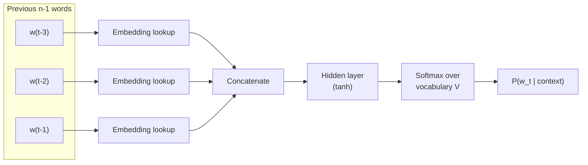

# Chapter 0 — Foundations

Before RNNs, "language modelling" already existed. Understanding the pre-neural and
early-neural methods makes it obvious *why* every later architecture was invented.

---

## 0.1 What is a language model?

A **language model (LM)** assigns a probability to a sequence of words, or equivalently
predicts the next word given the words so far.

$$P(w_1, w_2, \dots, w_T) = \prod_{t=1}^{T} P(w_t \mid w_1, \dots, w_{t-1})$$

If a model can estimate $P(w_t \mid \text{context})$ well, it can:

- **Score** sentences ("the cat sat" is more likely than "the cat sats").
- **Generate** text by sampling the next word repeatedly.
- **Represent** meaning, because predicting words well requires understanding them.

Everything in this guide is a different machine for computing that one conditional
probability.

---

## 0.2 n-gram models (the statistical era)

The oldest practical LM. It makes a **Markov assumption**: the next word depends only on
the previous $n-1$ words.

$$P(w_t \mid w_1, \dots, w_{t-1}) \approx P(w_t \mid w_{t-n+1}, \dots, w_{t-1})$$

Probabilities are just **counts** from a text corpus:

$$P(w_t \mid w_{t-1}) = \frac{\text{count}(w_{t-1}, w_t)}{\text{count}(w_{t-1})}$$

**Example (bigram, n=2):** to predict the word after "New", count how often each word
follows "New" in the corpus. "York" wins.

### Limitations of n-grams

| Limitation | Consequence |
|------------|-------------|
| **Fixed, tiny context** | A trigram cannot use anything older than 2 words back. |
| **Data sparsity** | Most valid n-grams never appear in training, giving probability 0 (patched with smoothing/back-off). |
| **No notion of similarity** | "cat" and "dog" are unrelated symbols; learning about one teaches nothing about the other. |
| **Exponential table growth** | Vocabulary $V$ with n-grams needs up to $V^n$ counts. |

These four problems are exactly what neural models set out to fix.

---

## 0.3 Feedforward Neural Network LM (Bengio, 2003)

The first neural LM replaced the count table with a small neural network. It still uses a
**fixed window** of the previous $n-1$ words, but each word is mapped to a learned dense
vector (an **embedding**) instead of a one-hot symbol.

**Data flow:**

1. Look up an embedding vector for each of the previous $n-1$ words.
2. Concatenate them into one long vector $x$.
3. Pass through a hidden layer: $h = \tanh(Wx + b)$.
4. Project to vocabulary size and apply softmax: $\hat{y} = \text{softmax}(Uh + d)$.
5. $\hat{y}$ is a probability distribution over the next word.

**What this fixed:** words now live in a continuous space, so "cat" and "dog" end up with
similar vectors. Learning about one word generalizes to similar words — solving n-gram
sparsity and the "no similarity" problem.

**What it did not fix:** the context is *still a fixed window*. It cannot handle
arbitrary-length history. That is the door RNNs walk through.

---

## 0.4 Word embeddings (Word2Vec, GloVe)

A refinement of the "words as vectors" idea, trained specifically to produce high-quality
vectors that can be reused everywhere.

- **Word2Vec (2013)** trains a shallow network on a simple task: predict a word from its
  neighbours (**CBOW**) or predict neighbours from a word (**Skip-gram**).
- **GloVe (2014)** factorizes a global word co-occurrence matrix.

The famous property that emerges:

$$\text{vec}(\text{king}) - \text{vec}(\text{man}) + \text{vec}(\text{woman}) \approx \text{vec}(\text{queen})$$

**Key limitation — embeddings are *static*.** Each word gets exactly one vector, so
"bank" (river) and "bank" (money) share a vector. Context cannot change the meaning.
Producing **contextual** representations is a major motivation for RNNs, and later the
whole point of BERT and GPT.

---

## 0.5 Activation functions (the non-linearities used everywhere)

Every model in this guide is built from linear operations ($Wx + b$) stacked together. But
a stack of linear operations is *itself just one linear operation* — no matter how many
layers you add, it can only draw straight-line decision boundaries. **Activation
functions** are the small non-linear functions applied after a linear layer; they are what
let neural networks approximate complex, curved functions and therefore learn the rich
patterns of language. This section defines each activation you will meet in later chapters,
its math, and why it is used.

### Sigmoid (logistic)

$$\sigma(x) = \frac{1}{1 + e^{-x}}$$

- **Shape / output range:** an S-curve that squashes any real number into $(0, 1)$.
- **Why it is used:** the output looks like a **probability** or a **soft on/off switch**.
  This is exactly why LSTM and GRU **gates** use it — a gate value near 1 means "let this
  through," near 0 means "block it." It is also used for binary classification outputs.
- **Derivative:** $\sigma'(x) = \sigma(x)\,(1 - \sigma(x))$, which is at most $0.25$.
- **Weakness:** for large $|x|$ the curve is flat, so its gradient is nearly 0
  (**saturation**). Multiplying many such small gradients is a direct cause of the
  **vanishing gradient problem** in RNNs (Chapter 1).

### Tanh (hyperbolic tangent)

$$\tanh(x) = \frac{e^{x} - e^{-x}}{e^{x} + e^{-x}}$$

- **Shape / output range:** an S-curve like sigmoid but squashing into $(-1, 1)$.
- **Why it is used:** it is **zero-centred**, so outputs can be positive or negative. This
  keeps the average signal near zero, which makes optimization more stable and faster than
  sigmoid. It is the default for producing a **hidden state / candidate value** in RNNs and
  LSTMs (the "how much and in which direction" of memory).
- **Derivative:** $\tanh'(x) = 1 - \tanh^2(x)$, at most $1$ (larger than sigmoid's, but
  still saturates toward 0 for large $|x|$ — so tanh also contributes to vanishing
  gradients over long sequences).

### ReLU (Rectified Linear Unit)

$$\text{ReLU}(x) = \max(0, x)$$

- **Shape / output range:** identity for positive inputs, flat zero for negatives; range
  $[0, \infty)$.
- **Why it is used:** it is **cheap** (a single comparison) and, crucially, its gradient is
  exactly **1** for positive inputs — it does **not saturate** on the positive side, so
  gradients flow well through deep networks. This is why it is the standard activation in
  the **feedforward sub-layers of the Transformer** (Chapter 5) and most deep nets.
- **Derivative:** $1$ if $x > 0$, else $0$.
- **Weakness:** the "**dying ReLU**" problem — neurons stuck at negative inputs output 0
  forever and stop learning. Variants fix this: **Leaky ReLU** ($\max(0.01x, x)$) and
  **GELU** (below).

### GELU (Gaussian Error Linear Unit)

$$\text{GELU}(x) = x \cdot \Phi(x)$$

where $\Phi(x)$ is the cumulative distribution function of the standard normal.

- **Why it is used:** a smooth, curved version of ReLU that weights inputs by their value
  rather than hard-gating at 0. This smoothness helps training, and it is the activation
  used inside **BERT and GPT** feedforward blocks.
- **Relation to ReLU:** behaves almost like ReLU for large $|x|$ but transitions gently
  near 0.

### Softmax (the output layer)

$$\text{softmax}(z)_i = \frac{e^{z_i}}{\sum_{j=1}^{V} e^{z_j}}$$

- **Shape / output:** converts a vector of raw scores (**logits**) into a **probability
  distribution** — all outputs are positive and sum to 1.
- **Why it is used:** language models must output $P(\text{next word})$ over a vocabulary of
  size $V$. Softmax is the final layer that turns the network's scores into those
  probabilities. It also appears **inside attention** (Chapters 4–5) to turn relevance
  scores into weights that sum to 1.
- **Note:** the exponential exaggerates differences — the largest logit dominates — which is
  why a **temperature** parameter is used at generation time (Chapter 7) to make the
  distribution sharper or flatter.

### Quick comparison

| Function | Formula | Output range | Primary use in this guide |
|----------|---------|:------------:|---------------------------|
| Sigmoid | $\dfrac{1}{1+e^{-x}}$ | $(0, 1)$ | LSTM/GRU gates; binary outputs |
| Tanh | $\dfrac{e^{x}-e^{-x}}{e^{x}+e^{-x}}$ | $(-1, 1)$ | RNN/LSTM hidden state & candidates |
| ReLU | $\max(0, x)$ | $[0, \infty)$ | Transformer feedforward layers |
| GELU | $x\,\Phi(x)$ | $\approx[-0.17, \infty)$ | BERT / GPT feedforward layers |
| Softmax | $\dfrac{e^{z_i}}{\sum_j e^{z_j}}$ | $(0,1)$, sums to 1 | Final next-word layer; attention weights |

**The through-line:** *saturating* activations (sigmoid, tanh) are great for gating and
bounded states but cause vanishing gradients, which motivates the LSTM (Chapter 2); *non-
saturating* activations (ReLU, GELU) keep gradients healthy in the very deep Transformer
stacks (Chapters 5–7); and *softmax* is the constant that turns scores into probabilities,
whether for the next word or for attention.

---

## 0.6 The scoreboard entering the neural sequence era

| Capability | n-gram | FF-NNLM | Word2Vec |
|------------|:------:|:-------:|:--------:|
| Word similarity / generalization | ✗ | ✓ | ✓ |
| Arbitrary-length context | ✗ | ✗ | ✗ |
| Contextual (word meaning changes with sentence) | ✗ | ✗ | ✗ |
| Sequential order modelling | partial | fixed window | ✗ |

The next big leap is a network that reads a sequence **one token at a time** and keeps a
**memory** of everything seen so far. That is the Recurrent Neural Network.

➡️ Continue to [Chapter 1 — RNN](02-rnn.md)
