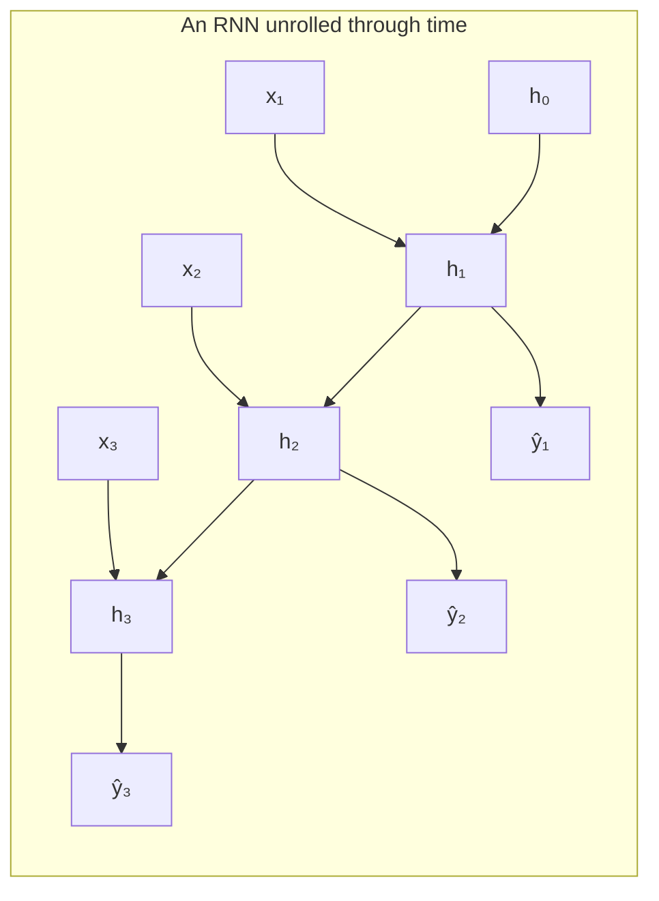
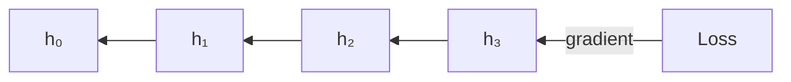

# Chapter 1 — Recurrent Neural Networks (RNN)

---

## 1.1 What it is

A **Recurrent Neural Network** is a network that reads a sequence **one element at a
time** and maintains a **hidden state** — a vector that acts as a running memory of
everything seen so far. At each step it combines the current input with the previous
memory to produce a new memory.

The core idea in one line:

$$h_t = f(h_{t-1}, x_t)$$

The new memory $h_t$ depends on the previous memory $h_{t-1}$ and the current input $x_t$.
Because the same function $f$ (the same weights) is applied at every step, an RNN can
process a sequence of **any length**.

---

## 1.2 Why it appeared (the limitation it fixed)

The feedforward NNLM from Chapter 0 could only look at a **fixed window** of previous
words. It cannot use information from far back, and it treats a sentence as a bag of a few
neighbours rather than an ordered stream.

The RNN fixes this by design:

- **Arbitrary-length context** — the hidden state can, in principle, carry information from
  the very first word to the last.
- **Order matters** — the state is updated sequentially, so word order is naturally encoded.
- **Parameter sharing** — one set of weights is reused at every time step, so the model
  size does not grow with sequence length.

---

## 1.3 Complete architecture

### The recurrence (folded and unrolled)

The "folded" view is a single cell with an arrow looping back to itself. The "unrolled"
view above shows the same cell copied once per time step — this is how you actually think
about training it.

### Components

| Component | Symbol | Role |
|-----------|--------|------|
| Input vector | $x_t$ | Embedding of the current token. |
| Hidden state | $h_t$ | The memory; a vector summarizing everything up to step $t$. |
| Input→hidden weights | $W_{xh}$ | How the new input influences the state. |
| Hidden→hidden weights | $W_{hh}$ | How the previous memory carries forward (the **recurrent** weights). |
| Hidden→output weights | $W_{hy}$ | How the state produces a prediction. |
| Biases | $b_h, b_y$ | Learnable offsets. |
| Activation | $\tanh$ | Non-linearity that keeps state values bounded in $[-1, 1]$. |

---

## 1.4 How it does language modelling (step by step)

At every time step $t$:

**1. Update the hidden state** from the previous state and current input:

$$h_t = \tanh(W_{hh} h_{t-1} + W_{xh} x_t + b_h)$$

**2. Produce output logits** from the new state:

$$z_t = W_{hy} h_t + b_y$$

**3. Convert to a probability distribution** over the vocabulary:

$$\hat{y}_t = \text{softmax}(z_t)$$

For language modelling, $\hat{y}_t$ is $P(w_{t+1} \mid w_1, \dots, w_t)$ — the predicted
next word given all previous words. To **generate** text you sample a word from $\hat{y}_t$,
feed it back in as $x_{t+1}$, and repeat.

**Concrete pass** for "the cat sat":

1. $x_1$ = embedding("the"), $h_1 = \tanh(W_{xh} x_1 + W_{hh} h_0 + b_h)$ → predict "cat".
2. $x_2$ = embedding("cat"), $h_2$ folds "the" *and* "cat" into memory → predict "sat".
3. $x_3$ = embedding("sat"), $h_3$ now summarizes the whole phrase → predict next word.

---

## 1.5 Training — Backpropagation Through Time (BPTT)

The loss is the **cross-entropy** between the predicted distribution and the true next
word, summed over all time steps:

$$L = -\sum_{t=1}^{T} \log \hat{y}_t[\,w_{t+1}\,]$$

### Why this loss makes sense (intuition)

Read the term $\hat{y}_t[\,w_{t+1}\,]$ first: it is the probability the model assigned to
the **word that actually came next**. A perfect model would give that word probability
$1$; a clueless model would give it something tiny. So this single number is a report card
for the prediction at step $t$ — "how much confidence did you put on the truth?"

Now walk through the pieces of the formula and *why each one is there*:

- **Why the log?** We want a penalty that is gentle when the model is right and brutal when
  it is confidently wrong. $-\log(p)$ does exactly that: if the model gives the true word
  $p = 1$, the penalty is $-\log(1) = 0$ (no complaint). As $p \to 0$, the penalty
  $-\log(p) \to \infty$ (a huge complaint). Being confidently wrong is punished far more
  than being merely unsure.

  | Prob. given to true word $p$ | Loss $-\log p$ | Meaning |
  |------------------------------|----------------|---------|
  | $1.0$ | $0$ | perfect, no penalty |
  | $0.5$ | $0.69$ | unsure |
  | $0.1$ | $2.30$ | wrong and fairly confident |
  | $0.01$ | $4.60$ | wrong and very confident → big push to fix |

- **Why the minus sign?** Probabilities are between $0$ and $1$, so their logs are
  **negative**. The minus flips the loss to be **positive**, so "lower loss = better" holds
  and gradient *descent* pushes in the right direction.

- **Why only the true word's probability, and not the others?** Because the softmax already
  ties all the probabilities together — they must sum to $1$. Pushing the true word's
  probability **up** automatically pulls the wrong words' probabilities **down**. So scoring
  just the correct word is enough to shape the whole distribution.

- **Why sum over all time steps $t$?** Every position in the sequence is its own next-word
  prediction ("the"→"cat", "cat"→"sat", …). Summing means the model is graded on **every**
  prediction it makes, so a single sentence gives $T$ separate learning signals instead of
  one.

**In one sentence:** the loss rewards the model for putting high probability on the word
that actually occurs, at every step, and grows sharply the more confidently it backs the
wrong word — which is exactly the behaviour we want a language model to learn.

To train, we **unroll** the network across the whole sequence and apply ordinary
backpropagation to the unrolled graph. Because the same weights appear at every step, the
gradient for each weight is the **sum of its contributions across all time steps**. This
algorithm is called **Backpropagation Through Time (BPTT)**.

The gradient at an early step must flow **backward through every intermediate step** — and
this is exactly where the fatal problem appears.

### How the loss propagates back into the weights

Backprop is just the chain rule applied along the unrolled graph. Follow the arrows in the
recurrence backwards, from the loss to each weight matrix.

**Step 1 — from loss to the output logits.** For the prediction at step $t$, the gradient
of cross-entropy through the softmax has a famously clean form:

$$\frac{\partial L}{\partial z_t} = \hat{y}_t - y_t$$

i.e. **predicted distribution minus the one-hot truth**. Intuitively: the probability mass
you put on wrong words is pushed **down** and the mass on the true word is pushed **up**.
The size of the error signal is literally "how wrong the distribution was."

**Step 2 — the output weights $W_{hy}$.** These sit between the hidden state and the logits,
so their gradient is just the local error times the state that produced it, summed over
every step:

$$\frac{\partial L}{\partial W_{hy}} = \sum_{t=1}^{T} (\hat{y}_t - y_t)\, h_t^\top$$

**Step 3 — from logits back into the hidden state.** Each state $h_t$ affects the loss in
**two** ways, and both paths must be added:

1. **Directly**, through its own prediction $z_t$.
2. **Indirectly**, through the next state $h_{t+1}$ (because $h_{t+1}$ was computed from
   $h_t$), which in turn affects *its* prediction and everything after it.

$$\frac{\partial L}{\partial h_t}
= \underbrace{W_{hy}^\top (\hat{y}_t - y_t)}_{\text{from this step's prediction}}
+ \underbrace{W_{hh}^\top \big(\text{grad from } h_{t+1}\big)\odot \tanh'(\cdot)}_{\text{carried back from the future}}$$

This is the recursion: the error at step $t$ is its own local error **plus** the error
handed back from step $t+1$. Computing it from the last step to the first is what "through
time" means.

**Step 4 — the recurrent and input weights $W_{hh}$, $W_{xh}$.** Since $W_{hh}$ and $W_{xh}$
are reused at **every** step, each step contributes a piece and we **sum** them all:

$$\frac{\partial L}{\partial W_{hh}} = \sum_{t=1}^{T} \delta_t\, h_{t-1}^\top,
\qquad
\frac{\partial L}{\partial W_{xh}} = \sum_{t=1}^{T} \delta_t\, x_t^\top$$

where $\delta_t = \dfrac{\partial L}{\partial h_t}\odot \tanh'(\cdot)$ is the error at the
state *before* the non-linearity. This summing is the concrete meaning of "**the gradient
for a shared weight is the sum of its contributions across all time steps**."

**Step 5 — update.** Once every gradient is accumulated, the weights take one step downhill:

$$W \leftarrow W - \eta\, \frac{\partial L}{\partial W}$$

with learning rate $\eta$. The same shared matrices then produce better predictions on the
next pass.

The key thing to notice is the term **carried back from the future** in Step 3: to reach an
early state $h_1$, the error must pass through $W_{hh}$ and $\tanh'$ once for **every** step
in between — and that repeated multiplication is exactly what breaks down next.

---

## 1.6 Limitations — vanishing and exploding gradients

When the gradient flows back through many steps, it gets **repeatedly multiplied** by the
recurrent weight matrix $W_{hh}$ and by the derivative of $\tanh$. Consider the chain that
connects a far-apart pair of steps:

$$\frac{\partial h_t}{\partial h_k} = \prod_{i=k+1}^{t} \frac{\partial h_i}{\partial h_{i-1}}$$

This is a **product of many terms**:

- If those terms are **< 1** on average, the product shrinks exponentially → the gradient
  **vanishes**. Early words contribute almost nothing to learning. The RNN effectively has
  a **short memory** (a few steps).
- If those terms are **> 1** on average, the product grows exponentially → the gradient
  **explodes**, and training becomes unstable (fixable with gradient clipping, but the
  vanishing case is not so easily patched).

### The practical consequences

| Limitation | Effect on language modelling |
|------------|------------------------------|
| **Vanishing gradients** | Cannot learn **long-range dependencies** (e.g. subject–verb agreement across a long clause). |
| **Short effective memory** | In practice remembers only ~5–10 steps well. |
| **Strictly sequential** | Step $t$ needs step $t-1$, so it **cannot be parallelized** across time — training is slow. |
| **Single state bottleneck** | All history is crushed into one fixed-size vector. |

---

## 1.7 How it gave rise to the next model

The RNN got the *shape* of the solution right — a recurrent memory — but the vanishing
gradient meant the memory was too short to be useful for real language.

The fix is not to remove recurrence, but to redesign the **cell** so that information can
flow across many steps **without being repeatedly squashed**. The key insight: add a
protected memory channel and use learnable **gates** to control what is remembered,
forgotten, and output. That redesign is the **Long Short-Term Memory (LSTM)** cell.

➡️ Continue to [Chapter 2 — LSTM & GRU](03-lstm-gru.md)
