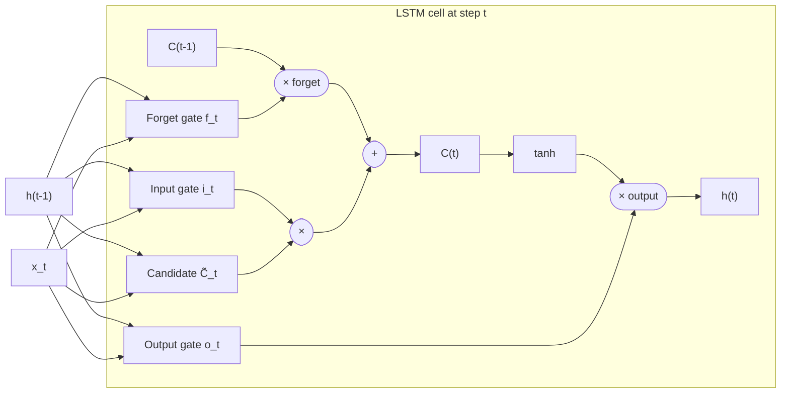

# Chapter 2 — LSTM & GRU

---

## 2.1 What it is

The **Long Short-Term Memory (LSTM)** network is an RNN with a redesigned cell. It keeps
the recurrence idea but adds two things:

1. A **cell state** $C_t$ — a protected "conveyor belt" of memory that runs straight
   through time with only minor, controlled edits.
2. **Gates** — small neural networks that decide, at each step, what to **forget**, what to
   **add**, and what to **output**.

The **GRU (Gated Recurrent Unit)** is a lighter, later simplification of the same idea.

The one-line intuition: instead of overwriting memory at every step (which is what causes
vanishing gradients), the LSTM *chooses* how much of the old memory to keep and how much
new information to write.

---

## 2.2 Why it appeared (the limitation it fixed)

Recall the RNN's fatal flaw: repeatedly multiplying gradients through $\tanh$ and $W_{hh}$
makes them vanish, so the network cannot learn dependencies more than a handful of steps
apart.

The LSTM fixes this with the **cell state and its additive update**. Instead of
transforming the whole memory every step (multiplicative, gradient-destroying), the cell
state is updated by **adding** information:

$$C_t = f_t \odot C_{t-1} + i_t \odot \tilde{C}_t$$

Because the path from $C_{t-1}$ to $C_t$ is mostly **addition** gated by $f_t$, gradients
can flow backward across many steps **without vanishing** — this protected path is often
called the **constant error carousel**. This is the single most important idea in the
chapter.

---

## 2.3 Complete architecture

### The three gates and the candidate

Each gate looks at the previous hidden state $h_{t-1}$ and the current input $x_t$, and
outputs values between 0 and 1 (via a **sigmoid** $\sigma$) that act as "how much to let
through" dials.

| Component | Formula | Role in plain language |
|-----------|---------|------------------------|
| **Forget gate** | $f_t = \sigma(W_f[h_{t-1}, x_t] + b_f)$ | How much of the old cell memory to **keep** (1 = keep all, 0 = erase). |
| **Input gate** | $i_t = \sigma(W_i[h_{t-1}, x_t] + b_i)$ | How much of the **new** candidate to write. |
| **Candidate** | $\tilde{C}_t = \tanh(W_C[h_{t-1}, x_t] + b_C)$ | The new information proposed for storage. |
| **Output gate** | $o_t = \sigma(W_o[h_{t-1}, x_t] + b_o)$ | How much of the cell state to expose as the hidden state. |

Here $[h_{t-1}, x_t]$ means the two vectors concatenated.

---

## 2.4 How it works — the update, step by step

**1. Decide what to forget.** The forget gate reads the context and outputs a keep/erase
value for each dimension of memory:

$$f_t = \sigma(W_f[h_{t-1}, x_t] + b_f)$$

**2. Decide what new information to store.** The input gate chooses *how much*, the
candidate proposes *what*:

$$i_t = \sigma(W_i[h_{t-1}, x_t] + b_i), \qquad \tilde{C}_t = \tanh(W_C[h_{t-1}, x_t] + b_C)$$

**3. Update the cell state** — forget some old, add some new (the crucial additive step):

$$C_t = f_t \odot C_{t-1} + i_t \odot \tilde{C}_t$$

**4. Produce the hidden state / output** — a filtered view of the cell state:

$$o_t = \sigma(W_o[h_{t-1}, x_t] + b_o), \qquad h_t = o_t \odot \tanh(C_t)$$

$\odot$ is element-wise multiplication. The hidden state $h_t$ is what gets passed to the
next step and used (through a softmax layer, just like an RNN) to predict the next word.

**Language-modelling example:** in "The clouds are in the ___", the cell state can carry
"clouds/sky context" across the intervening words because the forget gate keeps it and the
input gate does not overwrite it — so the model correctly predicts "sky". A vanilla RNN
would likely have lost that signal.

---

## 2.5 The GRU — a simpler alternative

The **Gated Recurrent Unit** merges ideas to use **two gates instead of three** and **no
separate cell state** (the hidden state carries memory directly). It is cheaper and often
performs comparably.

| Component | Formula | Role |
|-----------|---------|------|
| **Update gate** | $z_t = \sigma(W_z[h_{t-1}, x_t])$ | Balances keeping old state vs. taking new (combines LSTM's forget + input). |
| **Reset gate** | $r_t = \sigma(W_r[h_{t-1}, x_t])$ | How much past state to use when forming the candidate. |
| **Candidate** | $\tilde{h}_t = \tanh(W[r_t \odot h_{t-1}, x_t])$ | Proposed new state. |
| **Final state** | $h_t = (1 - z_t)\odot h_{t-1} + z_t \odot \tilde{h}_t$ | Interpolate between old and new. |

**LSTM vs GRU:** LSTM has more capacity and an explicit memory cell (often better on very
long or complex sequences); GRU has fewer parameters and trains faster. Both solve the
vanishing-gradient problem the same way — with gated, additive state updates.

---

## 2.6 Limitations

LSTMs and GRUs powered most of NLP from roughly 2014–2017, but they still carry deep
limitations:

| Limitation | Why it hurts |
|------------|--------------|
| **Still sequential** | Step $t$ depends on step $t-1$. Cannot parallelize across the time axis → slow training on modern hardware. |
| **Very long dependencies still fade** | Gates *mitigate* but do not fully eliminate signal loss over hundreds of steps. |
| **Single fixed-size state** | The entire past is still compressed into one vector — a bottleneck for long or information-dense sequences. |
| **No direct access to the past** | To use word 3 at step 100, the info must survive 97 sequential updates; there is no way to "jump back" and read it directly. |

That last point becomes critical the moment we ask an RNN/LSTM to do a **sequence-to-
sequence** task like translation.

---

## 2.7 How it gave rise to the next model

LSTMs made recurrent memory *usable*. The next question was structural, not about the cell:
**how do you map one whole sequence to a different sequence** — English to French,
question to answer, article to summary — when the input and output can have different
lengths?

The answer was to connect two LSTMs: one to **read** (encode) the input into a summary
vector, and one to **write** (decode) the output from it. That is the **Sequence-to-
Sequence (Seq2Seq)** architecture — and its central weakness (the single summary vector)
is what directly motivates attention.

### Why LSTMs struggle at sequence-to-sequence

When you force an LSTM to turn one whole sequence into another (e.g. translate a sentence),
these problems show up in plain terms:

- **One tiny vector must hold the whole input.** The encoder squeezes the entire sentence
  into a single fixed-size vector. Long sentences don't fit — early words get "squeezed out"
  before the decoder ever starts writing.
- **Beginning of the sentence gets forgotten.** By the time the encoder reaches the last
  word, the first few words have faded, so translations of long inputs drift or lose detail.
- **The decoder can't look back at specific words.** It only sees the one summary vector —
  it cannot "re-read" the exact input word it needs while producing each output word.
- **Fixed-size memory, variable-size meaning.** A 5-word and a 50-word sentence are both
  crammed into the same-size vector, so more content means more information loss.
- **Errors pile up (exposure bias).** The decoder generates one word at a time feeding on
  its own previous outputs; one early mistake can cascade into the rest of the sentence.
- **No alignment between input and output.** Translation needs to know *which* source word
  maps to *which* target word; a single summary vector throws that word-to-word alignment
  away.
- **Still strictly sequential.** Both reading and writing happen step-by-step, so it is slow
  to train and can't exploit parallel hardware.
- **A plain encoder can't look forward (softer, solvable).** A unidirectional LSTM encodes
  word *t* having only seen the words before it, so it misses future context (e.g. "bank" in
  "river bank" vs "bank account"). This one *can* be fixed within LSTMs by using a
  **Bidirectional LSTM (BiLSTM)** — one pass left→right, one right→left, concatenated — so
  unlike the points above, it isn't what forced the move to attention.

Every one of these points is exactly what **attention** was invented to fix — by letting the
decoder look back at *all* encoder states and focus on the relevant ones for each output word.

➡️ Continue to [Chapter 3 — Seq2Seq](04-seq2seq.md)
