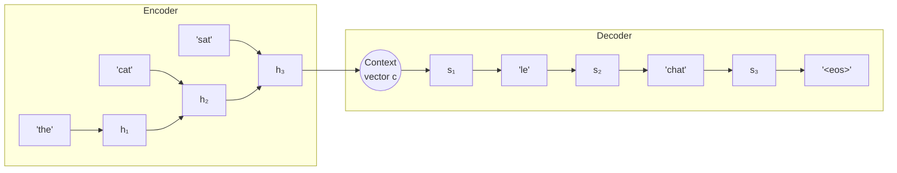
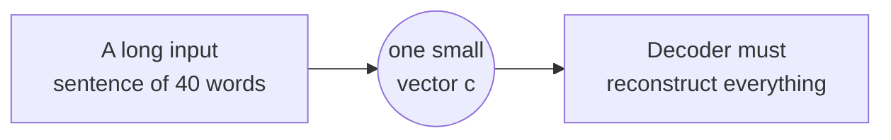
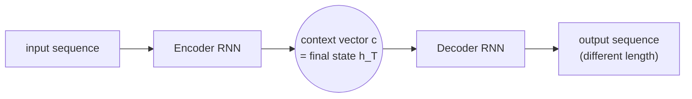

# Chapter 3 — Sequence-to-Sequence (Seq2Seq)

---

## 3.1 What it is

**Seq2Seq** (Sutskever et al., 2014) is an architecture for mapping an **input sequence** to
an **output sequence** of possibly different length. It joins two recurrent networks:

- An **Encoder** reads the entire input sequence and compresses it into a single fixed-size
  vector called the **context vector** (or "thought vector").
- A **Decoder** takes that context vector and generates the output sequence one token at a
  time.

This is the architecture that first made neural machine translation, summarization, and
conversational response generation practical.

---

## 3.2 Why it appeared (the limitation it fixed)

A plain RNN/LSTM produces **one output per input step** — the input and output are locked to
the same length and the same positions. But many of the most important language tasks are
**many-to-many with different lengths**:

- Translation: 5 English words → 8 French words.
- Summarization: 500-word article → 30-word summary.
- Dialogue: a question → an answer of unrelated length.

A single LSTM cannot do this. Seq2Seq solves it by **separating reading from writing**:
first fully read the input (encoder), *then* start writing the output (decoder). The
context vector is the handoff between the two.

---

## 3.3 Complete architecture

### Components

| Component | Role |
|-----------|------|
| **Encoder RNN/LSTM** | Reads input tokens $x_1 \dots x_T$, updating its hidden state each step. |
| **Context vector $c$** | The encoder's **final** hidden state $h_T$ — a fixed-size summary of the whole input. |
| **Decoder RNN/LSTM** | Initialized with $c$; generates output tokens autoregressively. |
| **`<sos>` / `<eos>` tokens** | Special markers telling the decoder when to start and stop. |
| **Softmax output layer** | Turns each decoder state into a probability distribution over the target vocabulary. |

---

## 3.4 How it works — step by step

### Encoding

The encoder runs like a normal LSTM over the input, but we **only keep the final state**:

$$h_t = \text{LSTM}(h_{t-1}, x_t), \qquad c = h_T$$

All the meaning of the input sentence is now packed into the single vector $c$.

### Decoding

The decoder is itself a language model, but **conditioned on $c$**. Its first state is set
from $c$, and it generates one word at a time, feeding each generated word back in as the
next input:

$$s_t = \text{LSTM}(s_{t-1}, y_{t-1}), \qquad P(y_t \mid y_{<t}, c) = \text{softmax}(W s_t + b)$$

It starts from the `<sos>` token and continues until it emits `<eos>`.

### Two decoding-time details

- **Teacher forcing (training):** during training the decoder is fed the *true* previous
  target word (not its own prediction), which stabilizes and speeds up learning.
- **Beam search (inference):** instead of greedily taking the single most likely word at
  each step, keep the top-$k$ partial sequences and expand them, which finds higher-
  probability overall outputs.

### Training objective

Maximize the probability of the correct output sequence (equivalently, minimize
cross-entropy) over the whole target:

$$L = -\sum_{t=1}^{T'} \log P(y_t \mid y_{<t}, c)$$

---

## 3.5 Limitations — the fixed-vector bottleneck

Seq2Seq has one dominant, well-known weakness that defines the next chapter:

> **Everything about the input — no matter how long — must be crammed into a single
> fixed-size context vector $c$.**

| Limitation | Consequence |
|------------|-------------|
| **Information bottleneck** | A fixed vector cannot hold all details of a long sentence; quality drops sharply as input length grows. |
| **Recency bias** | The final state $h_T$ remembers the *end* of the input better than the beginning. |
| **No alignment** | When generating the French word for "cat", the decoder cannot point back to *where* "cat" was in the input — it only has the blurred summary. |
| **Still sequential** | Inherits the RNN's inability to parallelize across time. |

The empirical signature: translation BLEU scores fell off a cliff for long sentences.

> **What is a BLEU score?** BLEU (Bilingual Evaluation Understudy) is the standard automatic
> metric for machine translation. It measures how much the machine's output overlaps with one
> or more human reference translations by counting matching word sequences (n-grams), then
> applies a penalty for outputs that are too short. It ranges from **0 to 100** — higher is
> better, with human-quality translations typically scoring in the 30–50 range. "Fell off a
> cliff" means the score dropped sharply as sentences got longer, confirming the bottleneck.

---

## 3.6 How it gave rise to the next model

The problem is the **single** context vector. The obvious fix: instead of forcing the
decoder to rely on one summary, let it **look back at all the encoder's hidden states**
$h_1, \dots, h_T$ and, at each output step, **focus on the most relevant ones**.

When generating "chat", the decoder should be able to pay most of its attention to the
encoder state for "cat". This mechanism — a learned, weighted look-back over the entire
input — is called **Attention**, and it removes the bottleneck entirely.

---

## 3.7 The one-page recap

**Core idea.** **Separate reading from writing.** An **encoder** LSTM reads the whole input and
compresses it into one fixed context vector $c = h_T$; a **decoder** LSTM, initialized from $c$,
generates the output autoregressively until `<eos>`:

$$c = h_T, \quad s_t = \text{LSTM}(s_{t-1}, y_{t-1}), \quad P(y_t \mid y_{<t}, c) = \text{softmax}(Ws_t+b)$$

| Aspect | Detail |
|--------|--------|
| **Why it appeared** | Enables **many-to-many, different-length** tasks: translation, summarization, dialogue |
| **Components** | Encoder · **context vector** · decoder · `<sos>`/`<eos>` · softmax output |
| **Teacher forcing** | Train by feeding the *true* previous target word (stabilizes, speeds learning) |
| **Beam search** | Inference: keep top-$k$ partial sequences instead of greedy picks |
| **Objective** | $L = -\sum_t \log P(y_t \mid y_{<t}, c)$ |

**The fatal flaw — the fixed-vector bottleneck:**

| Limitation | Consequence |
|------------|-------------|
| **Information bottleneck** | One vector can't hold a long sentence; quality drops sharply with length |
| **Recency bias** | $h_T$ remembers the *end* of the input better than the beginning |
| **No alignment** | Decoder can't point back to *where* a word was in the input |
| **Still sequential** | Inherits the RNN's non-parallelism |

*(**BLEU** — n-gram overlap vs human references, 0–100, higher better — "fell off a cliff" on long
sentences, the empirical signature of the bottleneck.)*

**The bridge:** let the decoder look back at **all** encoder states and focus on the relevant
ones each step → attention.

---

➡️ Continue to [Chapter 4 — Attention](05-attention.md)
