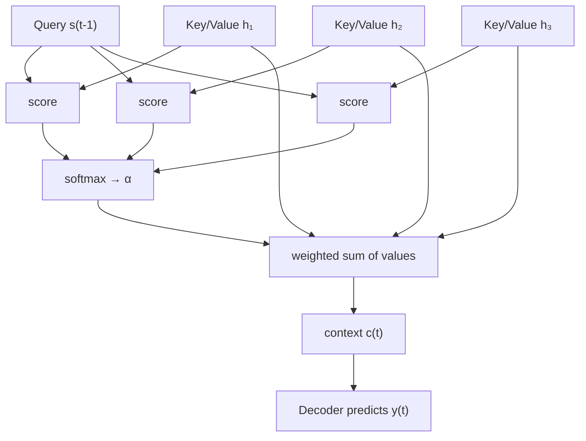
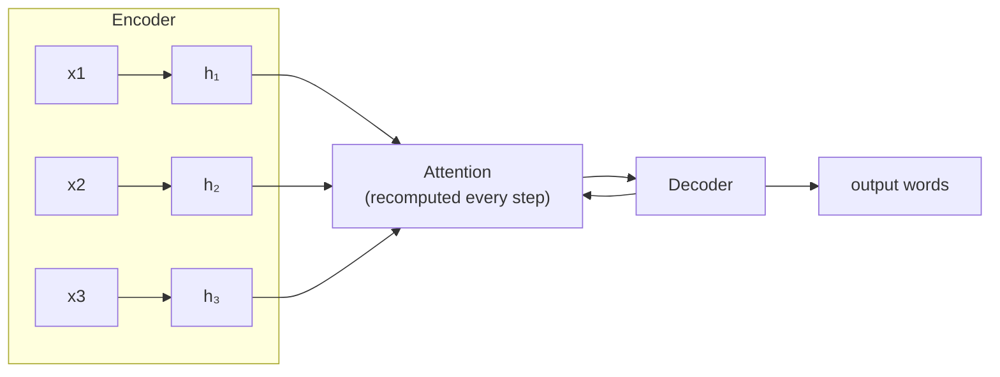
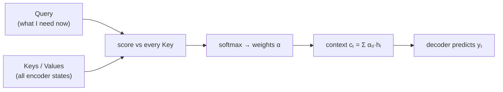

# Chapter 4 — Attention

---

## 4.1 What it is

**Attention** is a mechanism that lets a model, at each output step, **look back over all
the input representations and take a weighted average of them**, where the weights say "how
relevant is each input position to what I am producing right now."

Instead of the decoder relying on a single frozen context vector, attention builds a
**fresh, custom context vector for every output token**, assembled on demand from the parts
of the input that matter most at that moment.

First introduced by Bahdanau et al. (2014) for translation, attention is the conceptual
bridge to the Transformer.

---

## 4.2 Why it appeared (the limitation it fixed)

Seq2Seq forced the entire input through one fixed-size bottleneck vector $c$. Long inputs
overflowed it, and the decoder had no way to align its output with specific input words.

Attention removes the bottleneck directly:

- **No single summary** — the decoder keeps access to *all* encoder states $h_1, \dots, h_T$.
- **Dynamic focus** — for each output word it computes new weights, focusing on the
  relevant input words.
- **Alignment for free** — the attention weights literally show which input word each
  output word is "looking at" (interpretable alignment).

---

## 4.3 The core mechanism — Query, Key, Value

Attention is best understood through three roles. Think of it as a **soft dictionary
lookup**:

| Role | Meaning | In Seq2Seq attention |
|------|---------|----------------------|
| **Query ($q$)** | What I am looking for right now. | The current decoder state $s_{t-1}$. |
| **Key ($k$)** | A label for each stored item, used for matching. | Each encoder state $h_i$. |
| **Value ($v$)** | The actual content returned when a key matches. | Each encoder state $h_i$. |

The process every output step:

**1. Score** — compare the query against every key to get a relevance score:

$$e_{ti} = \text{score}(s_{t-1}, h_i)$$

**2. Normalize** — turn scores into weights that sum to 1 with a softmax:

$$\alpha_{ti} = \frac{\exp(e_{ti})}{\sum_{j=1}^{T} \exp(e_{tj})}$$

**3. Aggregate** — take the weighted sum of the values to form the context vector:

$$c_t = \sum_{i=1}^{T} \alpha_{ti} \, h_i$$

**What the symbols mean:**

| Symbol | Meaning |
|--------|---------|
| $t$ | The current **output** (decoder) step — the word being generated right now. |
| $i$ | An index over **input** positions ($1 \dots T$) — which encoder word we are looking at. |
| $T$ | The number of words in the input sequence. |
| $s_{t-1}$ | The decoder's hidden state from the previous step — the **query** ("what I need now"). |
| $h_i$ | The encoder's hidden state for input word $i$ — used as both **key** and **value**. |
| $\text{score}(\cdot)$ | A function measuring how relevant input word $i$ is to the current step (e.g. dot product). |
| $e_{ti}$ | The raw **relevance score** between output step $t$ and input word $i$. |
| $\alpha_{ti}$ | The normalized **attention weight** (0–1, all summing to 1) — how much focus word $i$ gets at step $t$. |
| $\exp(\cdot)$ | The exponential function, used by softmax to turn scores into positive weights. |
| $c_t$ | The **context vector** for step $t$: a weighted blend of encoder states, emphasizing the relevant ones. |

This $c_t$ is now **specific to output step $t$**, and is fed to the decoder together with
its state to predict the next word.

---

## 4.4 Scoring functions

The **score** function measures query–key similarity. The two classic forms:

| Name | Formula | Notes |
|------|---------|-------|
| **Additive / Bahdanau** | $\text{score}(s, h) = v^\top \tanh(W_1 s + W_2 h)$ | A small neural network; the original 2014 form. |
| **Multiplicative / Luong (dot)** | $\text{score}(s, h) = s^\top h$ | Cheaper; just a dot product. Basis of the Transformer. |

The dot-product form is important because it is fast and parallelizable — a property the
Transformer exploits fully.

---

## 4.5 How attention changes Seq2Seq

Compared to plain Seq2Seq, the only change is that the decoder, at each step, computes
$c_t$ by attending over **all** encoder states rather than reusing a single $c$. The
encoder and decoder are still LSTMs.

The alignment weights $\alpha_{ti}$ can be plotted as a heatmap and reveal sensible
word-to-word correspondences (e.g. an English word lighting up under its French
translation) — the first time neural translation became *interpretable*.

---

## 4.6 Self-attention — the pivotal generalization

Bahdanau attention connected a **decoder to an encoder**. The decisive next idea: apply
attention of a sequence **to itself**.

In **self-attention**, the queries, keys, and values all come from the *same* sequence.
Every word attends to every other word in the same sentence, directly modelling relations
like "which noun does this pronoun refer to" — regardless of distance.

$$\text{each word } x_i \text{ builds } q_i, k_i, v_i \text{ from itself, then attends over all } x_j$$

This is transformative because:

- It connects any two positions in **one step** (no long chain of recurrence) → **no
  vanishing gradient over distance**.
- All positions are computed **simultaneously** → **fully parallelizable**.

At this point a natural question arises: *if attention alone can relate any two positions
directly and in parallel, do we even need recurrence anymore?*

---

## 4.7 Limitations of attention *added onto RNNs*

| Limitation | Consequence |
|------------|-------------|
| **Recurrence still present** | The encoder/decoder are still LSTMs, so training is still **sequential and slow**. |
| **Attention is a bolt-on** | It fixes the bottleneck but sits on top of an architecture that fundamentally cannot parallelize. |
| **Complexity** | Two mechanisms (recurrence + attention) to build, tune, and reason about. |

---

## 4.8 How it gave rise to the next model

The 2017 paper title says it all: **"Attention Is All You Need."** The insight was to
**throw away recurrence entirely** and build the whole model out of (self-)attention plus
simple feedforward layers. This removes the sequential bottleneck, enables massive
parallel training on GPUs/TPUs, and connects distant words directly.

That architecture is the **Transformer** — the foundation of every model that follows.

---

## 4.9 The one-page recap

**Core idea.** A **soft dictionary lookup**. Instead of one frozen $c$, build a **fresh context
vector per output step** by weighting all encoder states by relevance. Three steps:

$$e_{ti} = \text{score}(s_{t-1}, h_i), \quad \alpha_{ti} = \frac{\exp(e_{ti})}{\sum_j \exp(e_{tj})}, \quad c_t = \sum_i \alpha_{ti}\, h_i$$

| Role | Meaning | In Seq2Seq attention |
|------|---------|----------------------|
| **Query** $q$ | What I'm looking for now | Decoder state $s_{t-1}$ |
| **Key** $k$ | Label used for matching | Each encoder state $h_i$ |
| **Value** $v$ | Content returned | Each encoder state $h_i$ |

| Aspect | Detail |
|--------|--------|
| **Fixes** | Removes the single-vector bottleneck; **dynamic focus**; **interpretable alignment** (heatmap) |
| **Scoring** | Additive/Bahdanau $v^\top\tanh(W_1 s + W_2 h)$ · Multiplicative/Luong dot $s^\top h$ (fast, parallel) |
| **Self-attention** | Q, K, V from the **same** sequence → any two positions connected in **one step**, fully parallel, no vanishing over distance |
| **Still limited by** | Bolted onto **LSTMs** → training still sequential/slow; two mechanisms to build and tune |

**The bridge:** *"Attention Is All You Need"* — if attention relates any two positions directly
and in parallel, **drop recurrence entirely** → the Transformer.

---

➡️ Continue to [Chapter 5 — Transformer](06-transformer.md)
