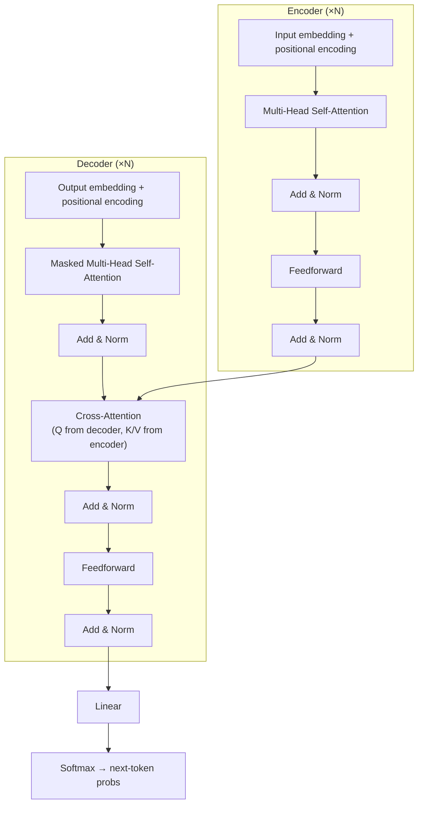
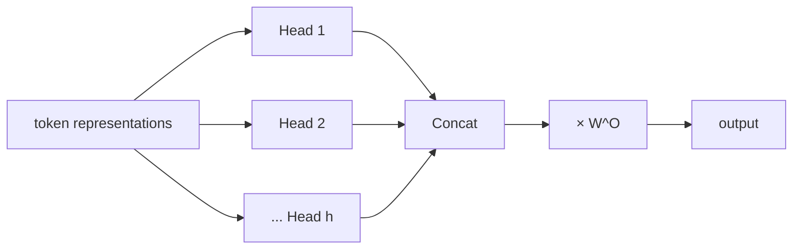
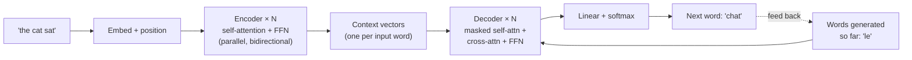

# Chapter 5 — The Transformer

The single most important architecture in modern NLP. Introduced in *"Attention Is All You
Need"* (Vaswani et al., 2017). Every model after this chapter is a Transformer variant.

---

## 5.1 What it is

The **Transformer** is a sequence model built **entirely from attention and feedforward
layers — with no recurrence and no convolution**. It processes all tokens of a sequence
**in parallel**, and uses **self-attention** so that every token can directly attend to
every other token.

It keeps the encoder–decoder shape of Seq2Seq but replaces the LSTMs with stacks of
attention-based blocks.

---

## 5.2 Why it appeared (the limitation it fixed)

RNN/LSTM-based models — even with attention bolted on — had two unavoidable problems:

1. **They are sequential.** Step $t$ needs step $t-1$, so training cannot be parallelized
   across the sequence, wasting modern hardware.
2. **Distant tokens are hard to relate.** Information must survive many recurrent steps.

The Transformer fixes both at once:

| Problem | Transformer's fix |
|---------|-------------------|
| Sequential, slow | Self-attention processes **all positions simultaneously** → full GPU/TPU parallelism. |
| Long-range dependencies | Any two tokens are connected in **one attention step**, path length $O(1)$. |
| Fixed bottleneck | Every token keeps its own representation; no single summary vector. |

---

## 5.3 Complete architecture

The original Transformer stacks $N=6$ identical encoder blocks and $N=6$ decoder blocks.
Let us build up every component.

---

## 5.4 Component 1 — Input embeddings + Positional Encoding

Since there is **no recurrence**, the model has no inherent sense of word order — feeding
tokens in parallel loses position information. The fix is to **add a positional signal** to
each token embedding.

The original paper uses fixed sinusoids:

$$PE_{(pos, 2i)} = \sin\!\left(\frac{pos}{10000^{2i/d}}\right), \qquad PE_{(pos, 2i+1)} = \cos\!\left(\frac{pos}{10000^{2i/d}}\right)$$

- $pos$ = position in the sequence, $i$ = dimension index, $d$ = embedding size.
- Each position gets a unique pattern; the sinusoidal form lets the model generalize to
  relative positions and to lengths unseen in training.

The final input to the first layer is $\text{embedding}(w) + PE(pos)$. (Modern models often
use learned or rotary positional encodings instead, but the purpose is identical.)

---

## 5.5 Component 2 — Scaled Dot-Product Attention

This is the engine. For each token we form a **query**, **key**, and **value** by
multiplying its embedding by learned matrices $W^Q, W^K, W^V$. Stacking all tokens into
matrices $Q, K, V$:

$$\text{Attention}(Q, K, V) = \text{softmax}\!\left(\frac{QK^\top}{\sqrt{d_k}}\right) V$$

Reading the formula piece by piece:

| Piece | Meaning |
|-------|---------|
| $QK^\top$ | Every query dotted with every key → an $n \times n$ matrix of raw relevance scores. |
| $\div \sqrt{d_k}$ | **Scaling**. Without it, large dot products push softmax into tiny-gradient regions; dividing by $\sqrt{d_k}$ keeps values stable. |
| $\text{softmax}$ | Turns each row of scores into weights that sum to 1. |
| $\times V$ | Weighted sum of value vectors → the new, context-aware representation of each token. |

Because this is pure matrix multiplication, **all tokens are processed at once**.

---

## 5.6 Component 3 — Multi-Head Attention

One attention "head" can only capture one type of relationship. **Multi-head attention**
runs $h$ attentions in parallel, each with its own $W^Q_i, W^K_i, W^V_i$, then concatenates
and projects the results:

$$\text{head}_i = \text{Attention}(QW^Q_i, KW^K_i, VW^V_i)$$

$$\text{MultiHead}(Q,K,V) = \text{Concat}(\text{head}_1, \dots, \text{head}_h)\,W^O$$

Intuition: different heads learn different relationships — one head might track
subject–verb agreement, another might track pronoun references, another positional
proximity. The original model uses $h = 8$ heads.

---

## 5.7 Component 4 — Position-wise Feedforward Network

After attention mixes information *across* tokens, each token is independently transformed
by a small 2-layer MLP (the same weights applied at every position):

$$\text{FFN}(x) = \max(0,\ xW_1 + b_1)\,W_2 + b_2$$

It expands to a larger inner dimension (e.g. 4×), applies a non-linearity, and projects
back. This adds representational capacity and non-linear processing per token.

---

## 5.8 Component 5 — Residual connections + Layer Normalization

Every sub-layer (attention and FFN) is wrapped as:

$$\text{output} = \text{LayerNorm}\big(x + \text{Sublayer}(x)\big)$$

- **Residual connection** ($x + \dots$): lets gradients flow straight through deep stacks,
  making it possible to train many layers (echoing why the LSTM's additive path worked).
- **Layer normalization**: stabilizes and speeds up training by normalizing each token's
  features.

---

## 5.9 Encoder vs. Decoder — and the three kinds of attention

The Transformer uses attention in **three distinct places**:

| Location | Query from | Key/Value from | Masked? | Purpose |
|----------|-----------|----------------|---------|---------|
| **Encoder self-attention** | encoder | encoder | No | Each input token sees the whole input (bidirectional context). |
| **Decoder masked self-attention** | decoder | decoder | **Yes** | Each output token sees only tokens **before** it (preserves autoregression). |
| **Encoder–decoder cross-attention** | decoder | encoder | No | Each output token attends over the full input (this replaces Seq2Seq attention). |

### Why the decoder mask matters

When generating text, the model must not "peek" at future words. The **causal mask** sets
the attention scores for future positions to $-\infty$ before the softmax, so their weights
become 0:

$$\text{mask}_{ij} = \begin{cases} 0 & j \le i \\ -\infty & j > i \end{cases}$$

This single design choice — mask or no mask — is exactly what later splits the family tree
into **BERT** (no mask, bidirectional) and **GPT** (masked, autoregressive).

---

## 5.10 How the Transformer does language modelling — full data flow

Let's trace a full pass end-to-end using a translation example: input **"the cat sat"** →
output **"le chat"**. The same machinery underlies every Transformer-based language model.

### Step 1 — From text to vectors

1. **Tokenize.** The text is split into tokens (roughly sub-words). "the cat sat" might
   become `["the", "cat", "sat"]`.
2. **Embed.** Each token id is looked up in an embedding table, giving a vector (say 512
   numbers) that captures its meaning.
3. **Add position.** Self-attention has *no inherent sense of order*, so a **positional
   encoding** is added to each embedding to stamp in "I am word 1, 2, 3…". Now each vector
   encodes both *what* the word is and *where* it sits.

### Step 2 — The Encoder reads the whole input (all at once)

The encoder is a stack of **N identical blocks**. Each block does two things, each followed
by an *add & norm* (a residual shortcut plus normalization that keeps training stable):

- **Multi-head self-attention** — every input word looks at *every other* input word
  (including itself) and pulls in relevant context. "cat" can attend to "the" and "sat"
  simultaneously. Multiple "heads" let it capture several kinds of relationships at once
  (grammar, meaning, position…).
- **Feed-forward network (FFN)** — a small per-word neural net that further transforms each
  vector independently.

Crucially, all input words flow through this **in parallel** (no step-by-step recurrence).
After N blocks, the encoder outputs one **context-rich vector per input word** — a deep,
bidirectional understanding of "the cat sat".

### Step 3 — The Decoder writes the output (one word at a time)

The decoder is also a stack of **N blocks**, but each block has *three* sub-layers (each with
add & norm):

- **Masked self-attention** — the decoder attends to the words it has *already produced*,
  but a **mask** hides future positions so it can't "cheat" by seeing words it hasn't
  generated yet. When producing word 2, it may look at word 1 only.
- **Cross-attention** — this is the bridge to the encoder. The decoder's current state acts
  as the **query**, and the encoder's outputs are the **keys and values**. So while
  generating "chat", the decoder looks back at *all* the input words and focuses on "cat".
  This is the attention mechanism from Chapter 4, now built into the architecture.
- **Feed-forward network** — same per-word transformation as in the encoder.

### Step 4 — Turn the top vector into a next-word prediction

The decoder's final vector for the current position goes through a **linear layer + softmax**,
producing a probability distribution over the *entire vocabulary*. The highest-probability
token is the model's prediction for the next word (e.g. "chat" after "le").

### Step 5 — Training vs. generation

- **Training** minimizes **cross-entropy** against the correct next tokens. A trick called
  **teacher forcing** feeds the *real* previous word (not the model's guess) during training.
  Because the mask lets every position be scored simultaneously, **one forward pass scores an
  entire sentence at once** — this parallelism is what makes Transformers train so fast
  compared to RNNs.
- **Generation** (inference) is done one token at a time: predict a word, append it to the
  output, feed it back in, and repeat until an end-of-sequence token.

**One-line summary:** the **encoder** builds a deep understanding of the input in parallel,
the **decoder** generates the output word-by-word while using **cross-attention** to look
back at that understanding, and a **linear + softmax** turns each decoder state into the next
word.

---

## 5.11 Limitations

| Limitation | Explanation |
|------------|-------------|
| **Quadratic cost** | Self-attention compares every token with every other → compute and memory scale as $O(n^2)$ with sequence length $n$. Long documents are expensive. |
| **No built-in notion of order** | Position must be injected artificially; getting this right (especially for long/extrapolated lengths) is an active research area. |
| **Data and compute hungry** | Its power is unlocked only with large datasets and large models. |
| **Fixed context window** | Can only attend within its trained window length. |

Note these are limitations of *scale and cost*, not of *capability* — which is why the
next step was not a new architecture but a new **training paradigm** on top of the
Transformer.

---

## 5.12 How it gave rise to the next models

The Transformer is a general engine. The breakthrough realization of 2018 was about **how
to train it**: rather than training from scratch on one task, **pre-train** a Transformer on
enormous unlabeled text to learn language in general, then **fine-tune** it on specific
tasks. Two complementary ways to do this pre-training emerged, split precisely along the
masking choice from §5.9:

- Use only the **encoder** with bidirectional context, trained to fill in blanks →
  **BERT** (great for *understanding*).
- Use only the **decoder** with causal masking, trained to predict the next word →
  **GPT** (great for *generation*).

➡️ Continue to [Chapter 6 — BERT](07-bert.md)  ·  then [Chapter 7 — GPT](08-gpt.md)
