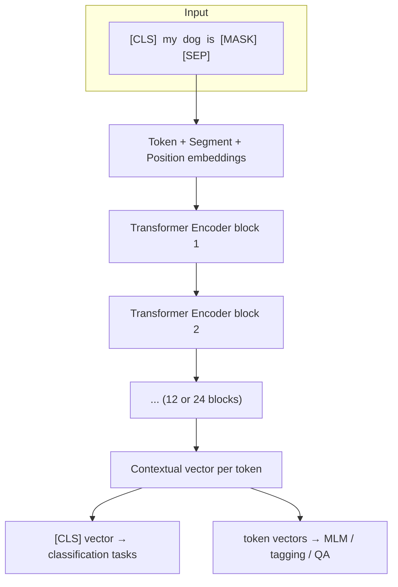
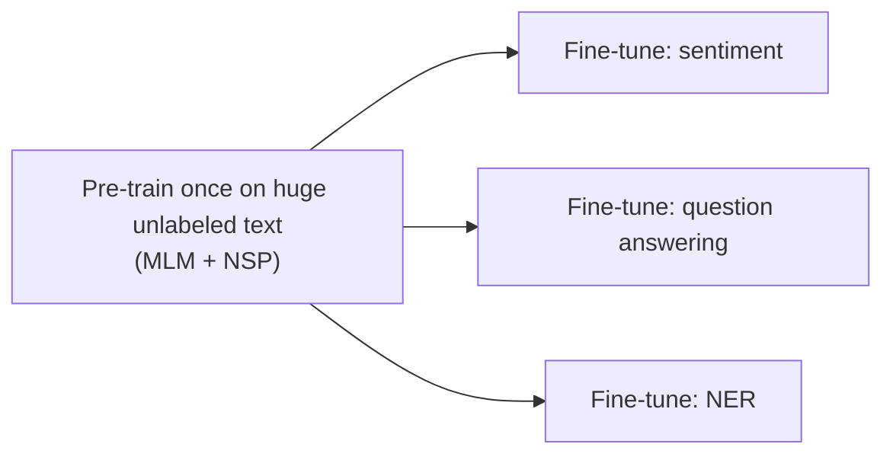

# Chapter 6 — BERT

**BERT** = **B**idirectional **E**ncoder **R**epresentations from **T**ransformers
(Devlin et al., 2018, Google).

---

## 6.1 What it is

BERT is a **stack of Transformer encoders** (the decoder is discarded) that is pre-trained
on massive unlabeled text to produce **deeply bidirectional, contextual** representations of
words. After pre-training once, it is **fine-tuned** with a small task-specific head for
many downstream tasks (classification, question answering, named-entity recognition, etc.).

BERT is an **understanding** model, not a text generator. Its job is to read text and build
rich representations of it.

Two sizes from the original paper:

| Model | Layers | Hidden size | Heads | Parameters |
|-------|:------:|:-----------:|:-----:|:----------:|
| BERT-Base | 12 | 768 | 12 | 110M |
| BERT-Large | 24 | 1024 | 16 | 340M |

---

## 6.2 Why it appeared (the limitation it fixed)

Before BERT, contextual models were **unidirectional** — they read left-to-right (or ran
two separate left-to-right and right-to-left models and concatenated them, as in ELMo). A
left-to-right model representing "bank" in "the river bank" has not yet seen "river" if it
reads forward, or misses later context.

But true understanding needs **both directions at once**. In "He went to the **bank** to
withdraw money," the word "withdraw/money" *after* "bank" is what disambiguates it.

BERT's key move: use the Transformer **encoder**, whose self-attention is naturally
bidirectional (no causal mask), and design a pre-training task that *forces* the model to
use context from **both sides simultaneously**. That task is masked language modelling.

---

## 6.3 Complete architecture

Each encoder block is exactly the one from Chapter 5: multi-head **bidirectional**
self-attention → add & norm → feedforward → add & norm.

### The input representation

BERT sums **three** embeddings for every token:

| Embedding | Purpose |
|-----------|---------|
| **Token embedding** | The word/subword itself (WordPiece tokenization). |
| **Segment embedding** | Marks whether a token belongs to sentence A or sentence B (for sentence-pair tasks). |
| **Position embedding** | Encodes position (learned, not sinusoidal). |

### Special tokens

- **`[CLS]`** — prepended to every input; its final vector is used as an aggregate
  representation of the whole sequence for classification.
- **`[SEP]`** — separates two sentences (and marks the end).
- **`[MASK]`** — the placeholder used by the masked language modelling task.

---

## 6.4 Pre-training task 1 — Masked Language Modelling (MLM)

This is the heart of BERT. Randomly **mask 15%** of the input tokens and train the model to
**predict the original token** from the surrounding context on **both sides**.

Because self-attention sees the whole sentence, predicting the masked word forces the model
to fuse left and right context — this is what makes BERT **deeply bidirectional**.

To avoid a mismatch (the `[MASK]` token never appears at fine-tuning time), of the chosen
15%:

- 80% are replaced with `[MASK]`,
- 10% are replaced with a **random** word,
- 10% are **left unchanged**.

The loss is cross-entropy computed **only on the masked positions**.

---

## 6.5 Pre-training task 2 — Next Sentence Prediction (NSP)

To help with tasks about **relationships between two sentences** (question answering,
entailment), BERT is also trained to predict whether sentence B actually **follows**
sentence A.

- 50% of the time B is the true next sentence (label `IsNext`).
- 50% of the time B is a random sentence (label `NotNext`).

The `[CLS]` token's final vector feeds a small classifier for this binary decision.

(Later research — e.g. RoBERTa — found NSP to be largely unnecessary and dropped it, but it
was part of the original design.)

---

## 6.6 The pre-train → fine-tune paradigm

This two-stage recipe is BERT's lasting contribution.

1. **Pre-train** the full encoder once, expensively, on billions of words (BooksCorpus +
   English Wikipedia). This learns general language.
2. **Fine-tune** by attaching a tiny task-specific head and training briefly on a small
   labeled dataset. All BERT weights are updated, but cheaply.

How different tasks attach a head:

| Task type | What is used |
|-----------|--------------|
| Single-sentence classification (e.g. sentiment) | The `[CLS]` vector → linear classifier. |
| Sentence-pair classification (e.g. entailment) | `[CLS]` vector over the A `[SEP]` B input. |
| Token classification (e.g. NER) | Each token's final vector → per-token classifier. |
| Question answering (SQuAD) | Predict start/end span positions over the passage tokens. |

This paradigm meant practitioners no longer needed to design and train a bespoke
architecture per task — a single pre-trained model plus a light head reached
state-of-the-art across the board.

---

## 6.7 Limitations

| Limitation | Explanation |
|------------|-------------|
| **Cannot generate text naturally** | It is an encoder trained to fill blanks, not to produce fluent left-to-right sequences. Not a language generator. |
| **Pre-train/fine-tune mismatch** | `[MASK]` appears in pre-training but never at inference/fine-tuning. |
| **Only 15% of tokens give signal** | Each MLM example trains on a small fraction of positions → sample-inefficient, needs lots of data. |
| **Fixed length & quadratic attention** | Inherits the Transformer's $O(n^2)$ cost and a capped context (512 tokens). |
| **Needs fine-tuning per task** | Out of the box it cannot follow instructions or do a task zero-shot; each task needs labeled data and a training run. |

That last point is the key philosophical contrast with the model in the next chapter.

---

## 6.8 How it relates to the next model

BERT took the Transformer **encoder** and optimized for **understanding** via bidirectional
masked prediction. Its sibling took the Transformer **decoder** and optimized for
**generation** via left-to-right next-word prediction — and, by scaling that idea
enormously, discovered that a single generative model could perform many tasks **without
task-specific fine-tuning at all**.

That model family is **GPT**.

➡️ Continue to [Chapter 7 — GPT](08-gpt.md)
