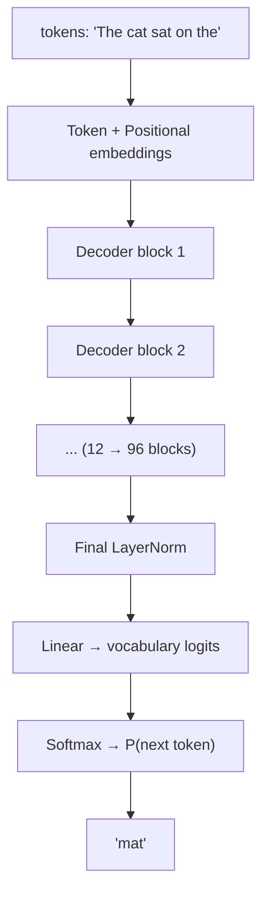
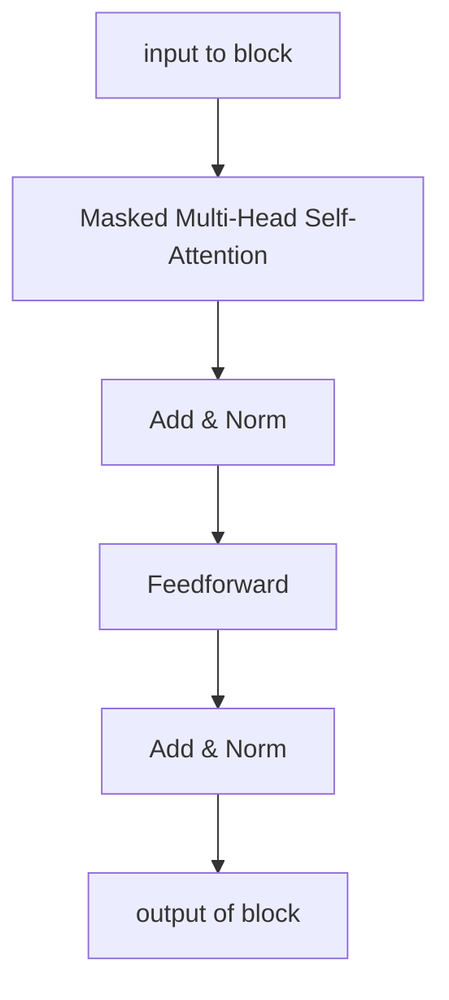
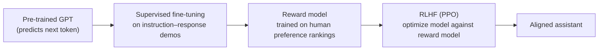

# Chapter 7 — GPT

**GPT** = **G**enerative **P**re-trained **T**ransformer (OpenAI, 2018 onward).

---

## 7.1 What it is

GPT is a **stack of Transformer decoders** (the encoder and cross-attention are discarded)
trained on a single, simple objective: **predict the next token** given all previous
tokens. It is an **autoregressive language model** — it generates text one token at a time,
each new token conditioned on everything generated so far.

Where BERT reads and understands, GPT **writes**. And by scaling this simple idea to
enormous models and datasets, GPT became a general-purpose system that can perform many
tasks from a natural-language prompt alone.

The lineage:

| Model | Year | Parameters | Headline idea |
|-------|:----:|:----------:|---------------|
| GPT-1 | 2018 | 117M | Generative pre-training + fine-tuning works. |
| GPT-2 | 2019 | 1.5B | Scale enables **zero-shot** task performance. |
| GPT-3 | 2020 | 175B | **In-context / few-shot** learning from the prompt. |
| GPT-3.5 / ChatGPT / GPT-4 | 2022+ | — | Instruction tuning + RLHF → aligned assistants. |

---

## 7.2 Why it appeared (the limitation it fixed)

BERT is bidirectional and superb at *understanding*, but it **cannot generate** coherent
text, and it **requires task-specific fine-tuning** with labeled data for every new task.

GPT takes the opposite, generation-first stance:

- Use the **decoder** with **causal masking** so the model is a proper left-to-right
  generator — it can produce fluent, arbitrarily long text.
- Train on plain next-word prediction, which needs **no labels at all** — any text is
  training data.
- Discover (at scale) that a single generative model can do translation, summarization,
  Q&A, and more **just by being prompted**, removing the need to fine-tune per task.

---

## 7.3 Complete architecture



Each **decoder block** is a trimmed Transformer decoder — there is no encoder, so the
**cross-attention sub-layer is removed**. What remains:



### The critical component — masked (causal) self-attention

This is what makes GPT a valid generator. When computing the representation of token $i$,
attention is allowed to look only at tokens $1 \dots i$, never at future tokens. Future
scores are set to $-\infty$ before the softmax:

$$\text{mask}_{ij} = \begin{cases} 0 & j \le i \\ -\infty & j > i \end{cases}$$

Contrast with BERT: BERT's encoder self-attention is **unmasked** (sees both sides); GPT's
decoder self-attention is **masked** (sees only the past). This one difference is the whole
distinction between the two branches of the Transformer family.

---

## 7.4 How it does language modelling

GPT directly optimizes the autoregressive factorization from Chapter 0:

$$P(w_1, \dots, w_T) = \prod_{t=1}^{T} P(w_t \mid w_1, \dots, w_{t-1})$$

The training objective is to maximize the log-likelihood of the next token across a huge
corpus:

$$L = \sum_{t} \log P(w_t \mid w_{<t}; \theta)$$

**Data flow for one step:** the token sequence is embedded, passed through the masked
decoder stack, and the final state at the last position is projected to vocabulary logits
and softmaxed to give $P(\text{next token})$.

**Generation** repeats this: predict a token, append it to the input, predict the next,
and so on. Sampling strategies control the style of output:

| Strategy | Effect |
|----------|--------|
| **Greedy** | Always take the highest-probability token (deterministic, can be dull). |
| **Temperature** | Scales logits before softmax; higher = more random/creative. |
| **Top-k / Top-p (nucleus)** | Sample only from the most probable tokens, balancing coherence and diversity. |

---

## 7.5 The paradigm shift — from fine-tuning to prompting

The most consequential discovery of the GPT line is that **scale changes how you use the
model**.

- **GPT-1** still followed BERT's recipe: pre-train, then fine-tune per task.
- **GPT-2** showed that a big enough model can do tasks **zero-shot** — just describe the
  task in text.
- **GPT-3** demonstrated **in-context (few-shot) learning**: put a few examples *in the
  prompt* and the model infers the pattern, **without any weight updates**.

```text
Prompt:
  English: sea otter   → French: loutre de mer
  English: cheese      → French: fromage
  English: hello       → French:
Model completes: bonjour
```

Nothing was retrained — the model learned the task from the context window at inference
time. This is qualitatively new and only emerges at large scale.

---

## 7.6 From raw model to assistant — instruction tuning and RLHF

A raw next-token predictor is not automatically helpful or safe; it just continues text.
Turning GPT-3 into ChatGPT added two alignment stages:



1. **Supervised fine-tuning (SFT):** train on human-written examples of following
   instructions, so the model responds to requests rather than merely continuing text.
2. **Reward modelling:** humans rank multiple model outputs; a reward model learns to
   predict those preferences.
3. **RLHF (Reinforcement Learning from Human Feedback):** the model is optimized (e.g. with
   PPO) to produce outputs the reward model scores highly — making it more helpful,
   honest, and harmless.

---

## 7.7 Limitations

| Limitation | Explanation |
|------------|-------------|
| **Hallucination** | Being a fluent next-token predictor, it can state false information confidently. |
| **Unidirectional** | Only left context per position; for pure understanding/tagging tasks, bidirectional encoders can be stronger. |
| **Quadratic attention & finite context** | Inherits $O(n^2)$ cost; limited (though growing) context window. |
| **Enormous cost** | Training and serving very large models is extremely expensive. |
| **No true grounding/reasoning guarantees** | Statistical pattern completion, not verified logic; can fail at multi-step reasoning or arithmetic. |
| **Static knowledge** | Knowledge is frozen at training time unless augmented (e.g. retrieval/tools). |

---

## 7.8 How it gave rise to what comes next

GPT established the dominant modern recipe — **a decoder-only Transformer, pre-trained
autoregressively at scale, then aligned**. The frontier since then has been about pushing
each axis of this recipe: more scale (with predictable **scaling laws**), longer context,
better alignment, multimodality, and efficiency. That is the subject of the final chapter.

➡️ Continue to [Chapter 8 — Beyond](09-beyond.md)
