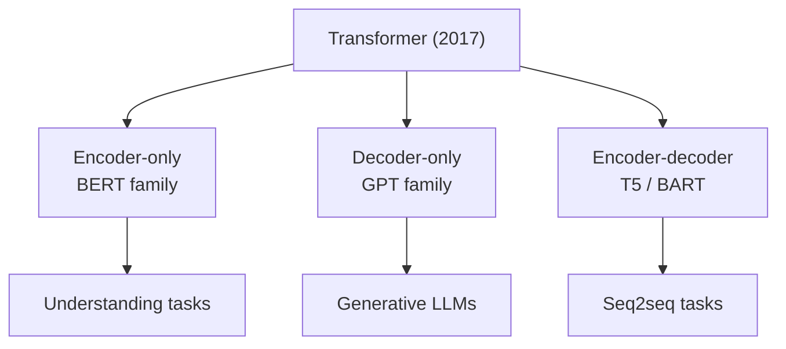
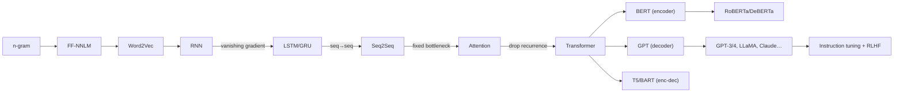
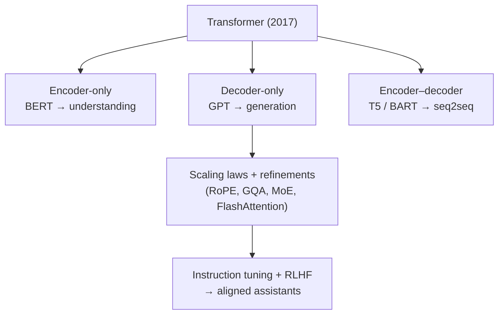

# Chapter 8 — Beyond: Modern LLMs

The models in Chapters 6–7 defined two branches of the Transformer family. This chapter
places them side by side and surveys the ideas that followed, so the evolution feels
complete.

---

## 8.1 The three Transformer families

Every large model today is one of three configurations of the Transformer:

| Family | Blocks used | Attention | Best at | Examples |
|--------|-------------|-----------|---------|----------|
| **Encoder-only** | Encoder | Bidirectional | Understanding: classification, NER, retrieval | BERT, RoBERTa, DeBERTa |
| **Decoder-only** | Decoder | Causal (masked) | Generation, general-purpose prompting | GPT, LLaMA, Mistral, Claude, Gemini |
| **Encoder–decoder** | Both | Bi + cross | Seq-to-seq: translation, summarization | T5, BART |

---

## 8.2 Key models and ideas after BERT/GPT

- **RoBERTa (2019)** — BERT trained better: more data, longer, larger batches, and NSP
  removed. Showed BERT was under-trained; recipe matters as much as architecture.
- **T5 (2019)** — "Text-to-Text Transfer Transformer." Casts **every** NLP task as
  text→text ("translate English to German: ..."), unifying tasks under one
  encoder–decoder model and objective.
- **BART (2019)** — Encoder–decoder trained as a denoising autoencoder; strong at
  generation tasks like summarization.
- **GPT-3 (2020)** — Few-shot in-context learning at 175B parameters (Chapter 7).
- **Scaling laws (Kaplan 2020; Chinchilla 2022)** — Performance improves predictably with
  model size, data, and compute. Chinchilla showed most large models were **under-trained
  on data**: for a fixed compute budget, smaller models trained on more tokens win.
- **InstructGPT / ChatGPT (2022)** — Instruction tuning + RLHF turned raw LLMs into usable
  assistants (Chapter 7).
- **LLaMA / Mistral / Falcon (2023+)** — Efficient, open-weight decoder-only models;
  strong performance at smaller sizes, democratizing LLMs.
- **GPT-4, Claude, Gemini (2023+)** — Frontier multimodal models (text + images and more),
  stronger reasoning, much longer context.

---

## 8.3 Architectural refinements you will encounter

Modern decoder-only LLMs keep the Chapter 5 skeleton but swap in improved components:

| Refinement | Replaces | Why |
|------------|----------|-----|
| **Rotary Positional Embeddings (RoPE)** | Sinusoidal/learned positions | Better relative-position modelling and length extrapolation. |
| **RMSNorm** | LayerNorm | Cheaper normalization with equal or better stability. |
| **SwiGLU / GeGLU** | ReLU FFN | Gated activations improve quality. |
| **Grouped-Query Attention (GQA)** | Multi-head attention | Fewer key/value heads → faster, cheaper inference. |
| **FlashAttention** | Naive attention kernel | Exact attention computed with far less memory traffic. |
| **Mixture-of-Experts (MoE)** | Dense FFN | Route each token to a few "expert" sub-networks → more capacity at similar compute. |

---

## 8.4 Tackling the quadratic-attention limitation

The $O(n^2)$ cost of self-attention is the main barrier to long context. Directions:

- **Efficient/sparse attention** (Longformer, BigBird): attend to a local window plus a few
  global tokens → near-linear cost.
- **Linear attention / state-space models** (Mamba): reformulate sequence mixing to scale
  linearly with length; a partial return of recurrence-like ideas, but parallelizable.
- **Retrieval-augmented generation (RAG)**: fetch relevant documents at query time and put
  them in the context, extending effective knowledge without enlarging the model.

---

## 8.5 The full evolution, at a glance

---

## 8.6 The recurring pattern of every leap

Reading the whole guide, one pattern repeats at every step:

1. A model works but has a **specific structural limitation**.
2. The next model **isolates that limitation** and redesigns exactly that part — keeping
   what worked.

| From → To | Limitation removed |
|-----------|--------------------|
| n-gram → NNLM | No word similarity; sparse counts |
| NNLM → RNN | Fixed context window |
| RNN → LSTM | Vanishing gradients / short memory |
| LSTM → Seq2Seq | Can't map different-length sequences |
| Seq2Seq → Attention | Single fixed-vector bottleneck |
| Attention → Transformer | Sequential, non-parallel recurrence |
| Transformer → BERT | No bidirectional pre-training for understanding |
| Transformer → GPT | No scalable autoregressive generation / prompting |
| GPT → aligned LLMs | Not helpful/safe out of the box |

Understanding *why* each arrow exists is the real goal of this guide — architectures will
keep changing, but this problem-then-fix reasoning is what lets you understand whatever
comes next.

---

## 8.7 The one-page recap

**Three Transformer families** — every large model is one of these configurations:

| Family | Attention | Best at | Examples |
|--------|-----------|---------|----------|
| **Encoder-only** | Bidirectional | Understanding (classification, NER, retrieval) | BERT, RoBERTa, DeBERTa |
| **Decoder-only** | Causal | Generation, prompting (dominant today) | GPT, LLaMA, Mistral, Claude, Gemini |
| **Encoder–decoder** | Bi + cross | Seq2seq (translation, summarization) | T5, BART |

**Key ideas after BERT/GPT:** RoBERTa (better-trained BERT, NSP dropped) · **T5** (everything
text→text) · BART (denoising autoencoder) · GPT-3 (few-shot) · **scaling laws / Chinchilla**
(most models under-trained on data; ~20 tokens/param) · InstructGPT/ChatGPT (RLHF) ·
LLaMA/Mistral/Falcon (efficient open weights) · GPT-4/Claude/Gemini (multimodal, long context).

**Architectural refinements:** **RoPE** (positions) · **RMSNorm** · **SwiGLU/GeGLU** (FFN) ·
**GQA** (smaller KV cache) · **FlashAttention** (memory-efficient exact attention) · **MoE**
(sparse experts — more capacity at similar compute).

**Tackling the $O(n^2)$ barrier:** sparse/efficient attention (Longformer, BigBird) ·
linear/state-space models (Mamba) · **RAG** (retrieve into context).

**The recurring pattern:** each leap **isolates one structural limitation** of the prior model
and redesigns exactly that part, keeping what worked — n-gram → NNLM → RNN → LSTM → Seq2Seq →
Attention → Transformer → BERT/GPT → aligned LLMs.

---

## 8.8 A compact glossary

- **Autoregressive** — generates output one token at a time, each conditioned on the
  previous ones.
- **Context vector** — a vector summarizing input, passed from encoder to decoder.
- **Attention weights** — normalized relevance scores deciding how much each position
  contributes.
- **Query / Key / Value** — the three projections underlying attention (search term /
  index label / stored content).
- **Self-attention** — attention of a sequence to itself.
- **Causal mask** — prevents a position from attending to future positions.
- **Pre-training / fine-tuning** — learn general language once, then specialize cheaply.
- **In-context learning** — learning a task from examples in the prompt, with no weight
  updates.
- **RLHF** — aligning a model to human preferences via a learned reward signal.

⬅️ Back to the [guide index](README.md)
