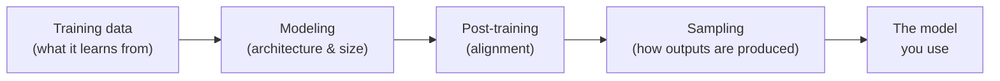
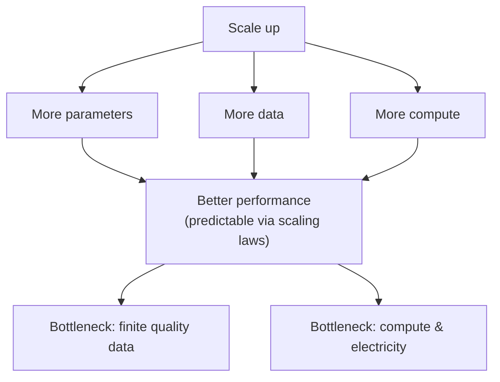
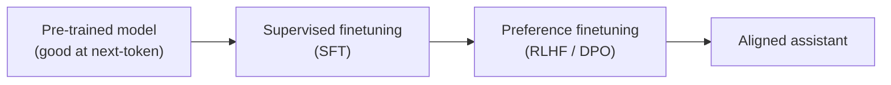
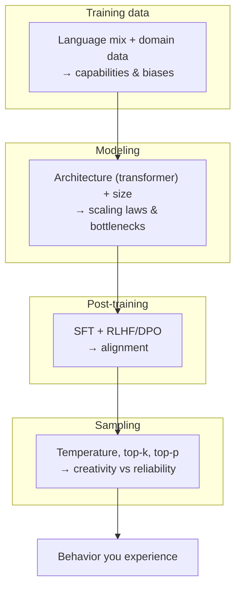

# Module 10 — Understanding Foundation Models

> A summary of **Chapter 2, "Understanding Foundation Models"** (Chip Huyen, *AI Engineering*).
>
> Chapters 0–8 explained *how* we arrived at large language models. This module steps up a
> level to the choices that make one **foundation model** behave differently from another.
> A model builder makes decisions across four areas, and each one leaves a fingerprint on
> the model you eventually use:

Even though you rarely train a foundation model yourself, understanding these four levers
explains **why** a model is good at some tasks, biased in some directions, and
occasionally wrong with confidence.

---

## 10.1 Training data

A model can only learn from what it sees. Its capabilities, blind spots, and biases are
inherited from the distribution of its training data.

### Language distribution

- Most large models are trained on **web-scale English-dominant** corpora (e.g. Common
  Crawl). English hugely dominates, so models are strongest in English and weaker in
  **under-represented (low-resource) languages**.
- Under-representation compounds through **tokenization**: low-resource languages are split
  into more tokens per word, which makes them **more expensive** (more tokens billed),
  **slower**, and **lower quality** (longer sequences, more chances to err).

### General vs domain-specific data

| Data source | Good for | Weak at |
|-------------|----------|---------|
| **General web data** | Broad, everyday knowledge and language | Specialized domains under-represented online |
| **Domain-specific data** | Biomedicine, law, code, protein/DNA sequences | Requires curated corpora most builders lack |

> **Key idea:** to get strong performance in a specialized domain (drug discovery, cancer
> screening, chip design), you often need a model trained or fine-tuned on **domain-specific
> data**, because such data is scarce in general web crawls.

---

## 10.2 Modeling

Two decisions dominate: the **architecture** and the **size**.

### 10.2.1 Architecture

- The **transformer** (Module 6) is still the dominant architecture. Its power comes from
  the **attention** mechanism, which lets the model weigh the relevance of every previous
  token when producing the next one.
- **Inference has two phases**, with very different cost profiles:

| Phase | What happens | Bottleneck |
|-------|--------------|------------|
| **Prefill** | Process all input tokens in parallel | Compute-bound |
| **Decode** | Generate output tokens one at a time | Memory-bandwidth-bound |

- The transformer's weakness is the **$O(n^2)$** cost of attention in sequence length,
  which makes long context expensive. This motivates alternative architectures:

| Alternative | Idea |
|-------------|------|
| **State Space Models (SSMs) / Mamba** | Sequence mixing that scales ~linearly with length; recurrence-like but parallelizable |
| **RWKV** | RNN-style model trainable in parallel, with no fixed context-length limit |

> No alternative has yet dethroned the transformer at scale, but they target its single
> biggest limitation — long-context efficiency.

### 10.2.2 Model size

Three numbers describe a model's scale:

- **Parameters** — the learnable weights (capacity to store patterns).
- **Training tokens** — how much data it was trained on.
- **FLOPs** — total compute used for training.

**Sparse models (Mixture-of-Experts).** A model can have a huge *total* parameter count but
only activate a fraction per token by routing each token to a few "expert" sub-networks.
This buys capacity without paying full compute for every token.

**The scaling law (Chinchilla).** For a fixed compute budget, model size and data should
grow **together**. The compute-optimal rule of thumb is roughly:

$$\text{training tokens} \approx 20 \times \text{number of parameters}$$

Many early large models were **under-trained on data** — a smaller model trained on more
tokens can beat a larger one trained on fewer. Training compute scales approximately as:

$$\text{FLOPs} \approx 6 \times N_{\text{params}} \times N_{\text{tokens}}$$

**Emergent abilities & scaling extrapolation.** Some capabilities appear only past a certain
scale, and predicting downstream ability from scale alone is hard. Because a full training
run is so expensive, builders tune hyperparameters at smaller scale and **extrapolate**.

**Scaling bottlenecks.** Two walls limit "just make it bigger":

- **Training data** — the supply of high-quality public text is finite; the field is
  approaching the limit of readily available human-generated data.
- **Compute / electricity** — cost, hardware availability, and energy set a hard ceiling.

---

## 10.3 Post-training

A model that has only been **pre-trained** predicts the next token well, but it is **not**
a helpful assistant — it can be rambling, unsafe, or ignore instructions. **Post-training**
aligns the model to human expectations, in two stages:

### 10.3.1 Supervised finetuning (SFT)

- Train on **(instruction, high-quality response)** demonstration pairs.
- Teaches the model the **format and behavior** of following instructions and holding a
  conversation — turning a raw text predictor into something that *responds*.
- Demonstration data is often written or curated by humans and is the main cost/quality
  lever here.

### 10.3.2 Preference finetuning (RLHF)

- SFT teaches *a* good answer; preference tuning teaches which of several answers humans
  **prefer** (more helpful, more honest, safer).
- Classic pipeline (**RLHF**):
  1. Collect human comparisons: "response A is better than response B."
  2. Train a **reward model** to predict that preference.
  3. Optimize the LLM against the reward model (e.g. with **PPO**).
- **DPO (Direct Preference Optimization)** achieves the same goal by optimizing directly on
  preference pairs, skipping the separate reward-model + RL loop.

> **Why it matters:** alignment is what separates a raw base model from ChatGPT-like
> assistants. Two models with identical architectures can behave very differently purely
> because of post-training.

---

## 10.4 Sampling

Sampling is *how* a model turns its internal probabilities into actual text. It is the
source of both a model's **creativity** and its **unreliability**.

### 10.4.1 Sampling fundamentals

At each step the model outputs a **logit** for every token in its vocabulary. **Softmax**
converts logits into a probability distribution:

$$P(\text{token}_i) = \frac{e^{z_i}}{\sum_j e^{z_j}}$$

The model then **samples** the next token from this distribution rather than always taking
the single most likely one — which is exactly why the same prompt can yield different
outputs.

### 10.4.2 Sampling strategies

| Strategy | Knob | Effect |
|----------|------|--------|
| **Greedy / argmax** | — | Always pick the highest-probability token; deterministic but repetitive |
| **Temperature** | $T$ | Rescales logits ($z/T$): $T<1$ sharpens (safer, more focused); $T>1$ flattens (more diverse/creative) |
| **Top-k** | $k$ | Sample only from the $k$ most likely tokens |
| **Top-p (nucleus)** | $p$ | Sample from the smallest set of tokens whose probabilities sum to $\ge p$ |

- **Stopping condition** — generation ends at a stop token (e.g. end-of-sequence), a max
  length, or a custom stop string. Getting this wrong causes truncated or runaway outputs.

### 10.4.3 Test-time compute

Instead of trusting a single sample, spend more compute at inference to raise quality:

- Generate **multiple candidate outputs** and pick the best (e.g. **best-of-N** using a
  scorer or the model's own probabilities). Generate more samples using beam-search at each token prediction step.
- More samples → higher chance at least one is correct, at higher cost. This trades
  **inference compute for accuracy** without changing the model.

### 10.4.4 Structured outputs

Many applications need outputs in a strict format (JSON, a specific schema, valid code).
Techniques to get them:

- **Prompting** for the format (weakest guarantee).
- **Constrained / guided decoding** — mask out tokens that would violate the grammar during
  sampling.
- **Finetuning** the model to reliably emit the target structure.

### 10.4.5 The probabilistic nature of AI

Because outputs are **sampled**, foundation models have two characteristic failure modes:

| Failure | What it is | Why it happens |
|---------|-----------|----------------|
| **Inconsistency** | Same input → different outputs (or different inputs → same output) | Sampling introduces randomness at each step |
| **Hallucination** | Confident, fluent, but **false** output | The model optimizes plausibility, not truth |

**Two leading hypotheses for hallucination:**

1. **Self-delusion** — the model cannot distinguish between data it was *given* and text it
   *generated itself*, so it treats its own confident guesses as fact.
2. **Knowledge mismatch** — during training, the model is rewarded for producing answers a
   labeler would give even when the *model* doesn't actually "know" them, teaching it to
   answer confidently beyond its knowledge.

> **Practical takeaway:** inconsistency and hallucination are not bugs to be fully patched
> away — they are inherent to how these models sample. Applications must **design around
> them** (verification, retrieval, structured output, lower temperature, human review).

---

## 10.5 The one-page recap

| Lever | Decides | Main trade-off |
|-------|---------|----------------|
| **Training data** | What the model knows | Coverage vs curation cost; English vs low-resource |
| **Architecture** | Efficiency & context length | Transformer quality vs $O(n^2)$ cost |
| **Model size** | Raw capability | Bigger is better vs data/compute limits (Chinchilla) |
| **Post-training** | Helpfulness & safety | Base capability vs aligned behavior |
| **Sampling** | Output style & reliability | Creativity (high $T$) vs consistency (low $T$) |

---

## 10.6 Compact glossary

- **Foundation model** — a large model pre-trained on broad data, adaptable to many
  downstream tasks.
- **Low-resource language** — a language with little training data available; costlier and
  weaker to model.
- **Prefill / decode** — the parallel input-processing phase vs the one-token-at-a-time
  generation phase of inference.
- **Mixture-of-Experts (MoE)** — a sparse model that activates only a few expert
  sub-networks per token.
- **Scaling law** — the empirical relationship linking model size, data, and compute to
  performance (Chinchilla: ~20 tokens per parameter).
- **Emergent ability** — a capability that appears only beyond a certain scale.
- **SFT** — supervised finetuning on demonstration (instruction, response) pairs.
- **RLHF / DPO** — methods to align a model to human preferences.
- **Logit → softmax** — raw model score converted into a token probability.
- **Temperature / top-k / top-p** — knobs controlling how randomly tokens are sampled.
- **Test-time compute** — spending extra inference compute (e.g. best-of-N) to improve
  quality.
- **Hallucination** — a confident but false output; **inconsistency** — different outputs
  for the same input.

⬅️ Back to the [guide index](README.md)
