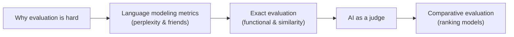
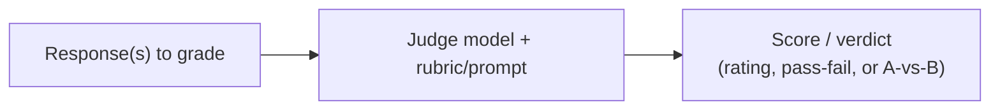
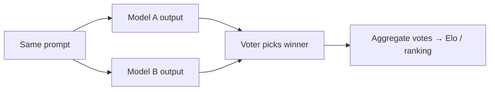
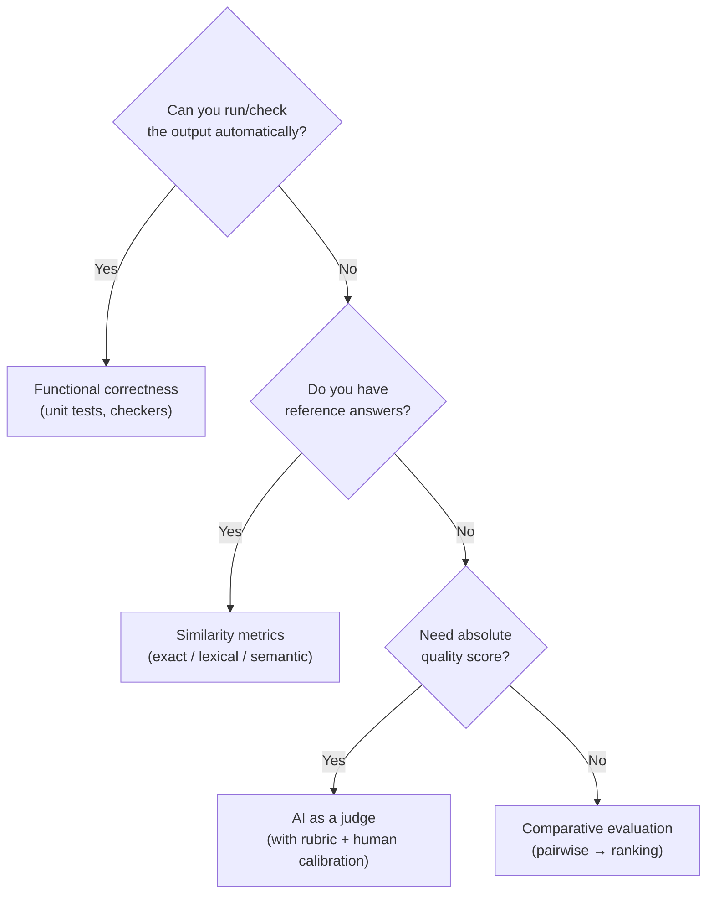

# Module 11 — Evaluation Methodology

> A summary of **Chapter 3, "Evaluation Methodology"** (Chip Huyen, *AI Engineering*).
>
> Module 10 explained what shapes a foundation model. This module answers the harder
> question that follows: **how do you tell whether a model is any good?** As models become
> more capable and more open-ended, evaluation becomes *the* bottleneck — it is easy to
> build something impressive-looking and very hard to prove it actually works.

---

## 11.1 Why evaluating foundation models is hard

Traditional ML had it easy: a spam classifier is right or wrong, and accuracy/F1 settle it.
Foundation models break these assumptions.

| Old ML | Foundation models |
|--------|-------------------|
| Fixed, narrow task | **Open-ended**, general-purpose tasks |
| One correct answer | **Many valid answers** (summaries, code, essays) |
| Clear ground truth | Ground truth often **missing or subjective** |
| Public benchmarks stay meaningful | Benchmarks **saturate** or leak into training data |

Key challenges:

- **Open-endedness** — for "write a poem about the sea," there is no single reference to
  compare against.
- **Benchmark saturation & contamination** — models reach ceiling on popular benchmarks, and
  test data frequently **leaks into training data**, inflating scores.
- **Capability breadth** — a general model must be evaluated across many dimensions
  (reasoning, safety, factuality, style), not one metric.
- **Cost and reproducibility** — stronger evaluators (humans or big models) are expensive
  and not perfectly repeatable.

> **Investing in evaluation is investing in reliability.** The teams that ship trustworthy
> AI are usually the ones with the best evaluation pipelines, not the fanciest models.

---

## 11.2 Language modeling metrics

A language model's quality can be measured by how well it **predicts text**. Four metrics
capture this — **cross entropy**, **perplexity**, **bits-per-character (BPC)**, and
**bits-per-byte (BPB)** — and they are all just different views of the *same* underlying
quantity. They are cheap, need no labels, and are what a model is actually optimized to
minimize during pre-training. To understand them, start with entropy.

### Entropy

**Entropy** measures how much information, on average, a token carries — equivalently, how
**hard the next token is to predict**. The higher the entropy, the more information each
token carries and the more bits are needed to represent it.

$$H(P) = -\sum_i P(i)\,\log_2 P(i)$$

Intuition via a made-up language:

- If the language has only **2 possible tokens**, both equally likely, you need **1 bit** to
  say which one comes next → entropy = 1. Plugging $P(i)=\tfrac12$ into the formula:
  $H = -(\tfrac12\log_2\tfrac12 + \tfrac12\log_2\tfrac12) = -(-\tfrac12-\tfrac12) = 1$ bit.
  In general, $N$ equally likely tokens give $H = \log_2 N$ (4 tokens → 2 bits, 8 → 3 bits).
- If it has **1 token** that always appears, the next token is fully predictable → **0 bits**,
  entropy = 0.
- If it has many equally likely tokens, entropy is high — each token is a genuine surprise.

So entropy is a property of the **data / language itself**: predictable languages have low
entropy, unpredictable ones have high entropy.

### Cross entropy

When a model learns to predict the tokens in a dataset, we measure how well it does with
**cross entropy**. A model's cross entropy on the data depends on **two** things: the true
distribution $P$ of the data and the model's predicted distribution $Q$.

$$H(P, Q) = -\sum_i P(i)\,\log_2 Q(i)$$

The crucial decomposition (this is the intuition the book emphasizes):

$$H(P, Q) = H(P) + D_{KL}(P \parallel Q)$$

Cross entropy is the sum of two parts:

1. $H(P)$ — the data's **own entropy**, which is fixed and cannot be reduced no matter how
   good the model is (the inherent unpredictability of the language).
2. $D_{KL}(P \parallel Q)$ — the **KL divergence**, how far the model's predictions diverge
   from reality.

Training a model = **pushing $Q$ toward $P$**, shrinking the KL term. In the ideal case the
model's distribution perfectly matches the data ($Q = P$), the divergence goes to zero, and
cross entropy bottoms out at the data's entropy $H(P)$. A model can therefore never do better
than the language's own entropy.

### Bits-per-character and bits-per-byte

Cross entropy above is measured **per token**, but different models use **different
tokenizers** — one model's "token" may be a whole word, another's a few characters — so
their per-token numbers aren't comparable. To fix this, normalize by a unit every model
shares:

- **Bits-per-character (BPC)** — bits of cross entropy divided by the number of **characters**.
- **Bits-per-byte (BPB)** — divided by the number of **bytes**, which is tokenizer- *and*
  language-independent (handles Unicode/non-English text).

These let you compare models fairly regardless of vocabulary.

### Perplexity

**Perplexity (PPL)** is the **exponential of cross entropy** — a rescaling into a more
intuitive unit.

$$\text{PPL} = 2^{H(P, Q)} \quad\text{(or } e^{H} \text{ if entropy is measured in nats)}$$

Intuitively, perplexity is a measure of **how much uncertainty** the model has when
predicting the next token — the *effective number of equally likely choices* it is deciding
among. A perplexity of 3 means the model is, on average, as uncertain as if it had to pick
uniformly among 3 tokens. **Lower perplexity = more confident, better-fitting model.**

What a "good" perplexity value depends on:

- **More structured / predictable data → lower perplexity.** HTML or code is easier to
  predict than free-form prose, so it yields lower perplexity.
- **Bigger vocabulary → higher perplexity.** More possible tokens means more to choose among
  at each step.
- **Longer context length → lower perplexity.** More preceding text gives the model more to
  condition on, making the next token easier to predict.

Because of these dependencies, perplexity is only comparable **on the same data with the
same tokenizer**.

**Use cases for perplexity:**

- **Measuring a model's language-modeling ability** and tracking pre-training progress.
- **Detecting whether text was in the training data.** A model tends to have **low perplexity
  on text it has seen**, so unusually low perplexity is a signal of possible data
  contamination — and is used in **data deduplication**.
- **Flagging unusual or abnormal text.** For a given model, text it finds surprising shows up
  as **high perplexity**, useful for spotting out-of-distribution or noisy data.

**Caveat:** perplexity is most meaningful for **pre-trained (base) models**. Post-training
(supervised finetuning, RLHF) reshapes the model's distribution toward being a helpful
assistant, which can actually *raise* perplexity on general text even as the model becomes
more useful. So low perplexity ≠ better assistant — which is why the task-level metrics below
are needed.
**Why this happens:** perplexity just checks how well a model can guess the
next word in *ordinary* text. A base model is trained to sound like the whole internet, so it's
good at guessing ordinary text → low perplexity. Post-training then trains it to sound like a
polite assistant instead of "the internet." Now, when you show it ordinary text, that text looks
a bit foreign to it, so its guesses are worse → higher perplexity. Think of someone who trains
hard to be a great customer-service agent: they get *more* useful, but they'd be *worse* at
guessing how friends chat at a party. The model didn't get dumber — it just specialized, and
perplexity only measures the old skill.

---

## 11.3 Exact evaluation

**Exact evaluation** produces a judgment with **no ambiguity** — no second model or human
opinion needed. Two families:

### 11.3.1 Functional correctness

Does the output actually **do the job**? This is the gold standard when it can be applied.

- **Code generation** — run the generated code against **unit tests** (e.g. pass@k: the
  fraction of problems solved within $k$ samples).
- **Math / tasks with checkable answers** — verify the final result programmatically.
- **Agents / tool use** — did the task succeed (booking made, query returned right rows)?

> When you *can* measure functional correctness, prefer it — it is objective and
> tamper-resistant.

### 11.3.2 Similarity against reference data

When there is a **reference answer**, measure how close the output is to it. Three levels,
from strict to flexible:

| Method | Measures | Example metrics | Weakness |
|--------|----------|-----------------|----------|
| **Exact match** | Identical string? | accuracy | Too strict; misses valid paraphrases |
| **Lexical similarity** | Word/n-gram overlap | BLEU, ROUGE, METEOR | Rewards surface overlap, not meaning |
| **Semantic similarity** | Meaning overlap via embeddings | cosine similarity, BERTScore | Depends on embedding quality; still approximate |

- **Lexical similarity** (n-gram overlap) is fast but penalizes correct answers worded
  differently and can reward wrong answers that share words.
- **Semantic similarity** embeds both texts into vectors and compares them, capturing
  meaning beyond exact wording — but is only as good as the underlying embedding model.

> All reference-based methods share one limit: they need **high-quality references**, which
> are exactly what open-ended tasks lack.

---

## 11.4 AI as a judge

When there is no reference and no automatic check, use a **strong model to evaluate
outputs** — *LLM-as-a-judge* (also called *AI as a judge*). This has become one of the most
popular evaluation methods because it scales, handles open-ended tasks, is fast and cheap
relative to humans, and often correlates well with human raters.

### Why use it

- **Scales** far cheaper and faster than human raters.
- Handles **open-ended** quality (helpfulness, coherence, tone) that exact metrics can't.
- **Flexible** — you define criteria in the prompt and can change them instantly, without
  building a new metric or collecting reference data.
- **No reference needed** — it can judge a response on its own merits.
- Correlates reasonably well with human judgment on many tasks, and comes with an
  **explanation** you can inspect, unlike a bare number from a similarity metric.

### How to prompt a judge

An AI judge is only as good as its prompt. A solid evaluation prompt spells out:

- **The task** the response was supposed to accomplish.
- **The criteria** to judge on (e.g. relevance, factuality, coherence, safety) — as
  unambiguously as possible.
- **The scoring system** and what each score *means* (see below).
- **Examples** of good and bad responses at each score, when possible (few-shot).
- A request for the judge to **explain its reasoning before giving a score**
  (chain-of-thought), which usually improves reliability and lets you audit its verdict.

**Scoring systems** vary in granularity:

- **Classification** — a label such as good/bad or relevant/irrelevant.
- **Discrete numeric** — an integer on a scale, e.g. 1–5.
- **Continuous** — a score in a range, e.g. 0.0–1.0 (often for similarity/certainty).

> Numeric scores from a judge are convenient but slippery: the model has no fixed notion of
> what "4 out of 5" means, so scores drift unless the rubric pins each level down with
> examples.

### Three ways to use a judge

| Approach | The judge is asked… | Best for |
|----------|--------------------|----------|
| **Evaluate one response** | "Given the question, score this answer's quality." | Absolute quality on open-ended tasks with no reference |
| **Compare to a reference** | "Given the reference answer, how good is this response?" | When you *do* have a ground-truth answer |
| **Compare two responses** | "Which of these two answers is better?" | Ranking models / picking between candidates (pairwise) |

Pairwise comparison is often the **most reliable**, because models (like humans) are better
at judging *relative* quality than at assigning a consistent absolute score.

### What model to use as the judge

The judge does **not** have to be more powerful than the model being evaluated:

- **A strong general-purpose model** (e.g. a frontier model) — the most common choice; good
  quality but the most expensive and slowest.
- **The same model that generated the answer** ("self-evaluation") — cheap and useful for
  quick self-consistency checks, but prone to **self-bias**.
- **A specialized judge** — a smaller, cheaper model **fine-tuned specifically to score
  outputs** (e.g. **reward models** used in RLHF, or dedicated evaluators like reference-based
  and comparative scorers). These trade generality for lower cost and often better calibration
  on their target criterion.

> **The judge paradox:** if the judge is smarter than the model it grades, why not just serve
> the judge instead? Because judging is easier than generating, judging can use a slower/more
> expensive model that would be impractical to serve to every user, and specialized judges can
> be *cheaper* than the model being judged. Evaluation and generation are different jobs.

### Limitations of AI judges

| Bias / issue | What it is |
|--------------|-----------|
| **Increased cost & latency** | Every evaluation is an extra model call; grading at scale adds real cost and slows pipelines |
| **Criteria ambiguity** | Vague rubrics → inconsistent, unreproducible scores; a "7/10" has no shared meaning |
| **Lack of standardization** | Judges, prompts, and model versions differ across teams, so scores aren't comparable and change silently when providers update models |
| **Inconsistency** | Same input can get different scores (it's probabilistic) |
| **Self-bias** | A judge tends to prefer outputs from **itself** or its own model family |
| **Position bias** | In pairwise comparison, it favors whichever answer is shown **first** (or last) |
| **Verbosity bias** | It favors **longer**, more elaborate answers even when worse |
| **Drift** | Models change over time, so a judge's scores aren't a stable reference across dates |

### Making judges more reliable

- **Write clear, example-backed rubrics** so each score level is unambiguous.
- **Mitigate position bias** — swap the order of answers and average both runs.
- **Mitigate verbosity bias** — control for length, or instruct the judge to ignore it.
- **Reduce inconsistency** — sample the judge multiple times and take a majority vote
  (self-consistency), or use **multiple different judges** (a jury) and aggregate.
- **Calibrate against human labels** — measure the judge's agreement with a trusted human set
  before you trust it, and re-check when models are updated.
- **Pin the model version** so results stay reproducible over time.

> Treat the judge as a **useful but imperfect instrument** — validate it against humans before
> trusting it, and keep the evaluation prompt and model version under version control.

---

## 11.5 Ranking models with comparative evaluation

Instead of scoring models on an absolute scale, **compare them head-to-head** and ask users
or judges which output they prefer. Aggregating many pairwise votes produces a **ranking**
(e.g. via **Elo** ratings, as in Chatbot Arena).

**Why comparative:** humans are far better at saying **"A is better than B"** than at
assigning an absolute score, and comparison sidesteps the need for reference answers.

### Challenges of comparative evaluation

- **Preferences are subjective** and depend on the prompt distribution and the voters.
- **Scale** — reliable rankings need **many** comparisons across diverse prompts.
- **Not diagnostic** — a ranking tells you *which* model wins overall, not *why* or on which
  specific capabilities; it can hide weaknesses on rare-but-critical cases.
- **Gaming & bias** — verbosity/position biases apply here too, and leaderboards can be
  gamed or fail to reflect *your* particular use case.

### The future of comparative evaluation

- Comparative, **live** leaderboards resist benchmark saturation and contamination better
  than static test sets, so they are likely to grow in importance.
- The open problem is turning aggregate preference rankings into **actionable, per-capability
  insight** for a specific application.

---

## 11.6 Choosing an evaluation method

| Method | Needs | Best for | Watch out for |
|--------|-------|----------|---------------|
| **Perplexity** | Just text | Pre-training progress, anomaly detection | Not a usefulness measure |
| **Functional correctness** | Executable check | Code, math, agents | Only where outputs are checkable |
| **Similarity to reference** | Reference answers | Translation, summarization | Needs good references |
| **AI as a judge** | A strong judge + rubric | Open-ended quality | Judge biases; calibrate to humans |
| **Comparative** | Many votes | Ranking models overall | Not diagnostic; subjective |

---

## 11.7 Compact glossary

- **Entropy** — average uncertainty of the next token, in bits.
- **Cross entropy** — how far the model's predicted distribution is from the true one (the
  training loss).
- **Bits-per-character / bits-per-byte** — tokenizer-independent versions of cross entropy.
- **Perplexity** — exponentiated cross entropy; the model's average branching factor (lower
  is better).
- **Functional correctness** — did the output actually accomplish the task (e.g. pass unit
  tests, pass@k).
- **Exact match / lexical / semantic similarity** — increasingly flexible ways to compare an
  output to a reference (string equality → n-gram overlap → embedding distance).
- **BLEU / ROUGE** — n-gram-overlap metrics for generation.
- **BERTScore** — embedding-based semantic similarity metric.
- **AI as a judge (LLM-as-a-judge)** — using a strong model to grade outputs.
- **Reward model** — a model fine-tuned specifically to score outputs; a common specialized
  judge (also used in RLHF).
- **Self-consistency / jury** — sampling a judge multiple times, or using multiple judges, and
  aggregating votes to reduce inconsistency.
- **Position / verbosity / self-bias** — systematic biases of AI judges.
- **Comparative evaluation** — ranking models via pairwise preference votes (e.g. Elo).
- **Benchmark contamination** — test data leaking into training data, inflating scores.

⬅️ Back to the [guide index](README.md)
