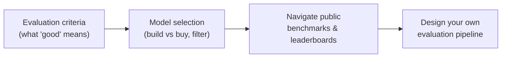
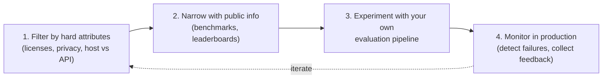
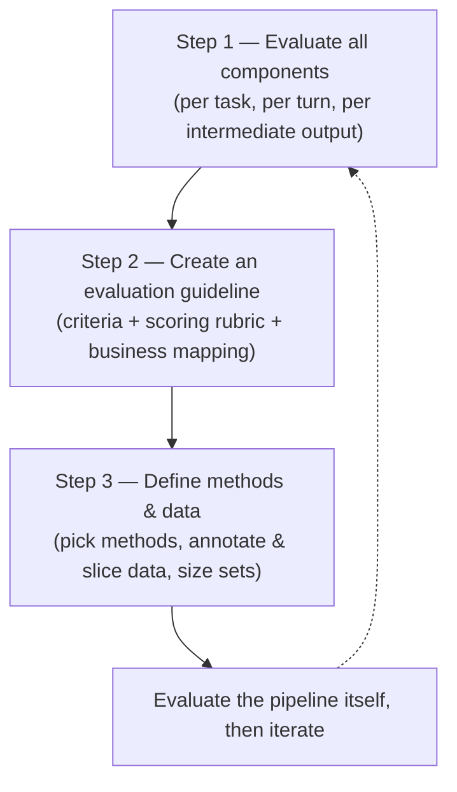
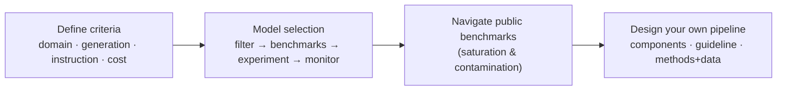

# Module 12 — Evaluate AI Systems

> A summary of **Chapter 4, "Evaluate AI Systems"** (Chip Huyen, *AI Engineering*).
>
> Module 11 gave you the *toolbox* of evaluation methods (perplexity, exact match,
> AI-as-a-judge, comparative ranking). This module answers the practical question that
> follows: **how do you use those methods to pick and ship a model for *your* application?**
> A model is only useful if it works for its intended purpose — so evaluation must always
> happen **in the context of your application**, not in the abstract.

The chapter (and this module) has three parts, plus a design section:

1. **Evaluation criteria** — how to define and measure what you care about.
2. **Model selection** — narrowing thousands of models to the right one, including the
   build-vs-buy question.
3. **Navigate public benchmarks** — why leaderboards help but can't be fully trusted.
4. **Design your evaluation pipeline** — a repeatable process to guide development over time.

---

## 12.1 Evaluation-driven development

> **Which is worse — an application that was never deployed, or one that is deployed but
> nobody knows whether it works?** Most practitioners say the second: it costs money to run,
> and taking it down might cost even more.

**Evaluation-driven development** (inspired by *test-driven development*) means **defining
evaluation criteria *before* you build**. The most common enterprise AI applications in
production are exactly the ones with **clear evaluation criteria**:

- **Recommender systems** — success = higher engagement / purchase-through rates.
- **Fraud detection** — success = money saved from prevented fraud.
- **Coding** — success = **functional correctness** of generated code.
- **Close-ended tasks** (intent classification, sentiment analysis) — easy to score.

> **The catch (the "lamppost" problem):** focusing *only* on measurable applications is like
> looking for lost keys under the lamppost because that's where the light is. Many
> game-changing applications are hard to evaluate — and **evaluation is the biggest
> bottleneck to AI adoption.** Building reliable evaluation pipelines unlocks new applications.

Every application should start with a list of criteria, which fall into **four buckets**:

| Bucket | Question it answers | Example (summarize a legal contract) |
|--------|--------------------|--------------------------------------|
| **Domain-specific capability** | Does the model understand the *domain*? | Does it understand legal contracts? |
| **Generation capability** | Is the output well-formed and faithful? | Is the summary coherent and factual? |
| **Instruction-following capability** | Did it do what was *asked*? | Did it meet the length/format constraints? |
| **Cost and latency** | Is it affordable and fast enough? | How much does it cost, how long to wait? |

Module 11 started from a *method* and asked what it can evaluate. This module flips it:
**given a criterion, which methods can measure it?**

---

## 12.2 Evaluation criteria

### 12.2.1 Domain-specific capability

A model's **domain-specific capabilities** (coding, Latin, math, law…) are constrained by its
**configuration** (architecture, size) and its **training data**. If a model never saw Latin,
it can't translate Latin — no prompt will fix that. These are evaluated with **domain-specific
benchmarks**, public or private, and usually via **exact evaluation**.

- **Coding** → **functional correctness** (run against unit tests). But also consider
  **efficiency** (runtime/memory — e.g. **BIRD-SQL** scores an SQL query's runtime vs the
  ground-truth query) and **readability** (no exact metric — fall back to AI judges).
- **Non-coding knowledge/reasoning** → usually **close-ended tasks** like **multiple-choice
  questions (MCQs)**, because they are easy to verify and reproduce.

**Why MCQs dominate:** they're easy to create, verify, and compare against a **random
baseline** (4 options, 1 correct → 25% baseline). In April 2024, **75%** of tasks in
Eleuther's `lm-evaluation-harness` were multiple-choice (MMLU, AGIEval, ARC-C). AGIEval's
authors deliberately excluded open-ended tasks to **avoid inconsistent assessment**.

**Limits of MCQs:**

- **Fragile** — an extra space or an added phrase like "Choices:" can flip the model's answer.
- **Tests discrimination, not generation** — MCQs measure the ability to *pick* a good answer
  (classification), which is different from *producing* one. They suit **knowledge** ("is Paris
  the capital of France?") and **reasoning**, but **not** summarization, translation, or essay
  writing.

> Metrics: **accuracy** (fraction right), or a **point system** for harder / multi-answer
> questions. **Classification** is a special MCQ where every question shares the same options
> (metrics: accuracy, F1, precision, recall).

### 12.2.2 Generation capability

Evaluating open-ended text long predates generative AI — the subfield is **NLG (natural
language generation)**. Its classic metrics:

| Metric | Measures |
|--------|----------|
| **Fluency** | Grammatically correct and natural-sounding? |
| **Coherence** | Well-structured, follows a logical flow? |
| **Faithfulness** | (Translation) faithful to the original? |
| **Relevance** | (Summarization) focuses on the important parts? |

**These older metrics matter less now.** Modern models are so fluent and coherent that
AI-generated text is nearly indistinguishable from human text — so fluency/coherence only
still matter for **weaker models, creative writing, and low-resource languages**. They can be
measured with **AI-as-a-judge** or **perplexity**.

The *new* pressing issues are **hallucination (factual consistency)** and **safety**.

#### Factual consistency

Checked under two settings:

| Setting | Compared against | Used for |
|---------|------------------|----------|
| **Local factual consistency** | A provided **context** | Summarization, customer-support bots, RAG, business analysis |
| **Global factual consistency** | **Open/world knowledge** | General chatbots, fact-checking, market research |

Local is much easier: you have the facts in hand. Global requires first **finding reliable
sources and deriving facts** — and *"the hardest part is often determining what the facts
are"* (beware the **absence-of-evidence fallacy**: "no link found" ≠ "no link exists").

Techniques to measure it (increasing sophistication):

- **AI as a judge** — the straightforward approach; GPT-3.5/4 outperform older methods, and a
  finetuned **GPT-judge** predicts human-judged truthfulness with **90–96%** accuracy.
- **Self-verification (SelfCheckGPT)** — generate *N* extra responses; if they disagree with
  the original, it's likely a hallucination. Effective but **expensive** (many queries).
- **Knowledge-augmented verification (SAFE)** — Google DeepMind's *Search-Augmented Factuality
  Evaluator*: (1) decompose the response into individual statements, (2) make each
  self-contained, (3) generate fact-checking search queries, (4) use AI to check each
  statement against results.
- **Textual entailment (NLI)** — frame it as: given a **premise** (context), is the
  **hypothesis** (output) an **Entailment** (consistent), **Contradiction** (inconsistent), or
  **Neutral** (undetermined)? Specialized classifiers (e.g. `DeBERTa-v3-base-mnli-fever-anli`,
  184M params) predict these classes cheaply.

> **Benchmark:** **TruthfulQA** — 817 questions across 38 categories that some humans answer
> wrong due to misconceptions; ships with the **GPT-judge** evaluator. Human-expert baseline
> is **94%**. Factual consistency is *the* crucial criterion for **RAG** systems.

> **Tip:** analyze *where* your model hallucinates and weight your benchmark toward those
> cases. Common triggers: **niche knowledge** (e.g. the VMO vs the IMO) and **queries about
> things that don't exist** ("What did X say about Y?" when X never mentioned Y).

#### Safety

An umbrella term for toxicity and bias. Unsafe content typically falls into: **(1)**
inappropriate language, **(2)** harmful recommendations/tutorials, **(3)** hate speech,
**(4)** violence, **(5)** stereotypes, **(6)** political/religious bias.

- Detect with **general-purpose AI judges** (GPT, Claude, Gemini) *or* **specialized toxicity
  models** — smaller, faster, cheaper (e.g. Perspective API, Facebook's hate-speech model).
- **Benchmarks:** RealToxicityPrompts (100k prompts likely to elicit toxic output), BOLD.

### 12.2.3 Instruction-following capability

> *How good is the model at following your instructions?* If it's bad at this, it doesn't
> matter how good your instructions are — the output will be bad.

Example: you ask for sentiment as `NEGATIVE/POSITIVE/NEUTRAL` but the model outputs `HAPPY` /
`ANGRY`. It **understands** sentiment (domain capability) but **fails to follow** the format
(instruction-following). This is essential for **structured outputs** (JSON, regex) and for
constraints like "use only words of at most four characters."

> **Caution — it's easy to conflate.** If a model fails to write a *lục bát* (a Vietnamese
> verse form), is it because it *can't* (domain capability) or because it didn't *understand
> the request* (instruction-following)? When a model performs poorly, it may be the **model**
> *or* the **instruction**.

Two benchmarks illustrate the range of what "instruction-following" means:

| Benchmark | Scope | Verification |
|-----------|-------|-------------|
| **IFEval** (Google) | 25 **automatically verifiable** format instructions: keyword inclusion, length constraints, bullet count, JSON format… | Programmatic. Score = fraction of instructions followed |
| **INFOBench** | Broader: format **plus** content constraints, linguistic guidelines, style rules ("use Victorian English") | Each instruction → a list of **yes/no questions**; score = criteria met ÷ total criteria. GPT-4 is a reliable, cost-effective evaluator here |

> **Key advice:** benchmarks miss many real instructions. **Curate your own** instruction set.
> If you need YAML output, put YAML instructions in your benchmark. If you don't want "As a
> language model…", test for that.

#### Roleplaying

One of the most common real-world instructions — asking the model to assume a **persona**.
Two purposes: **entertainment** (game NPCs, AI companions, storytelling) and a **prompt
engineering technique**. It's LMSYS's **8th most common** use case.

- **Hard to automate.** Benchmarks: **RoleLLM** (similarity scores + AI judges), **CharacterEval**
  (human annotators + a trained reward model, 5-point scale).
- Evaluate on **both style and knowledge** — including **negative knowledge** (if the
  character wouldn't know something, the model shouldn't either — critical to avoid NPC
  spoilers). AI-as-a-judge is the easiest automatic approach; different roles need different
  judge prompts.

### 12.2.4 Cost and latency

A high-quality model that is too slow or expensive isn't useful. Balancing quality, latency,
and cost is a **Pareto optimization** problem — be explicit about what you **can't**
compromise on, filter out models that fail it, then pick the best of the rest.

- **Latency has many metrics:** **time to first token**, **time per token**, **time between
  tokens**, **time per query**. Autoregressive models generate token-by-token, so **more
  output tokens → more latency** — control it by prompting for conciseness or setting stop
  conditions.
- **Distinguish must-have from nice-to-have:** everyone says yes to lower latency, but high
  latency is usually an *annoyance*, not a deal-breaker.
- **Cost:** APIs charge **per token** (cost/token roughly constant as you scale); **self-hosting**
  cost is **compute** (cost/token *drops* as you scale a fixed cluster). This is why teams
  re-evaluate API-vs-self-host **at different scales**.

> A concrete criteria table might set, per criterion, a **metric**, a **benchmark**, a **hard
> requirement**, and an **ideal** — e.g. *Cost < \$30/1M tokens (ideal < \$15)*, *Time to first
> token P90 < 200ms (ideal < 100ms)*, *Code pass@1 on HumanEval > 90% (ideal > 95%)*.

---

## 12.3 Model selection

> You don't care which model is best *overall* — you care which is best **for your
> application**. Selection happens **repeatedly** as you move through adaptation techniques
> (prompt engineering → finetuning).

### Hard vs soft attributes

- **Hard attributes** — impossible/impractical to change: licenses, training data, model size
  (provider decisions), or privacy/control (your policies). These **shrink the pool** fast.
- **Soft attributes** — improvable: accuracy, toxicity, factual consistency. (Example: one
  task jumped from **20% → 70% accuracy** just by decomposing it into two steps.)

Whether an attribute is hard or soft **depends on your access**: latency is *soft* if you host
the model (you can optimize it), *hard* if someone else hosts it.

### The four-step evaluation workflow

The steps are **iterative** — new information can send you back (e.g. you wanted open source,
but evaluation shows it can't reach your target, so you switch to a commercial API).

### 12.3.1 Model build vs buy

Most companies won't train from scratch, so "build vs buy" means: **host an open source model
yourself, or use a commercial model API?**

**Open source terminology (the terms are contentious):**

| Term | Meaning |
|------|---------|
| **Open weight** | Weights are public, but **training data is not** (the vast majority of "open source" models today) |
| **Open model** | Weights **and** training data are public — enables retraining, auditing, deeper understanding |

Model **licenses** vary wildly (MIT, Apache 2.0, GPL, plus many bespoke ones like the Llama
Community Licenses). Three questions to always ask:

1. Does it allow **commercial use**?
2. If so, are there **restrictions**? (e.g. Llama-2/3 require a special license above 700M
   monthly active users.)
3. Does it allow using the model's **outputs to train other models**? (Crucial for **synthetic
   data / model distillation**; Llama licenses still forbid it as of writing.)

> **Data lineage matters:** even if model X's license permits training on its outputs, if X
> was itself trained on ChatGPT outputs against OpenAI's terms, X may be unusable.

**Seven axes to decide host-vs-API:**

| Axis | Model APIs | Self-hosting |
|------|-----------|--------------|
| **Data privacy** | Must send data out → risk of leaks (e.g. Samsung leaked secrets via ChatGPT) or provider training on your data (Zoom backlash) | Data never leaves; but fewer checks on *your* data lineage |
| **Data lineage & copyright** | Contracts can shield you from lineage risk | Open data lets the community inspect it, but auditing huge datasets is hard |
| **Performance** | Best models are usually **closed** | Best open models lag a bit (weak incentive to open-source the strongest model) |
| **Functionality** | More likely to support scaling, function calling, structured outputs; **often no logprobs** | Can access **logprobs** & intermediate outputs (great for classification, eval, interpretability) |
| **Cost** | API cost — can balloon at scale | Engineering cost — talent, time, maintenance ("APIs are expensive, but engineering can be even more so") |
| **Control, access, transparency** | Rate limits, silent model updates, risk of losing access | Can **freeze** a model; inspect changes; but you own the ops |
| **On-device / edge** | Impossible without internet | Can run locally (privacy, offline) — but hard to do well |

> **Rules of thumb:** proprietary models are **easier to start with and scale**; open models
> are **easier to manipulate**. Prefer a model that follows a **standard API** (many providers
> mimic OpenAI's) so you can swap models, and one with **good community support**.

---

## 12.4 Navigate public benchmarks

There are **thousands** of benchmarks (Google's BIG-bench alone has 214), and old ones
**saturate** as models improve. An **evaluation harness** runs a model across many at once
(Eleuther's `lm-evaluation-harness` supports 400+, OpenAI's `evals` ~500).

### Leaderboards: selection and aggregation

A leaderboard = a chosen set of benchmarks + a way to **aggregate** them into a ranking. Two
open questions haunt every leaderboard:

- **Which benchmarks to include?** Compute is limited, so leaderboards pick only a handful.
  Hugging Face's Open LLM Leaderboard used **6** (ARC-C, MMLU, HellaSwag, TruthfulQA,
  WinoGrande, GSM-8K); Stanford's **HELM** used **10**, overlapping on only 2. *"If leaderboard
  developers can't explain their benchmark selection, it might be because it's really hard to."*
- **How to aggregate?** Hugging Face **averages** scores (treats all benchmarks equally — an
  80% on TruthfulQA counts the same as 80% on GSM-8K). HELM uses **mean win rate** (fraction of
  times a model beats another, averaged across scenarios).

> **Benchmark correlation matters:** if two benchmarks are **strongly correlated** (e.g.
> WinoGrande, MMLU, ARC-C all test reasoning, ~0.87–0.90 Pearson), you don't need both —
> including both **exaggerates bias**. TruthfulQA correlates only moderately with the others,
> showing that better reasoning doesn't guarantee better truthfulness.

**Custom leaderboard with public benchmarks:** evaluating models for *your* app is really
building a **private leaderboard**. Gather benchmarks that match your app's capabilities, check
each benchmark is **reliable** (anyone can publish one), run any missing scores yourself
(expensive — Stanford spent **\$80–100k** to evaluate 30 models on HELM), then **weight** them
by importance (they're in different units — accuracy, F1, BLEU). The goal: shortlist a few
models for **rigorous testing with your own pipeline**.

> **"Are OpenAI's models getting worse?"** GPT-3.5/4 performance shifted noticeably between
> March–June 2023 on some benchmarks. Whether or not a specific model degraded, the lesson
> stands: **the best model overall may not be the best for your application**, and the same
> update can help one app and hurt another.

### Data contamination

> A friend quipped: *"A benchmark stops being useful as soon as it becomes public."*

**Data contamination** (a.k.a. data leakage, training on the test set) happens when a model was
trained on the data it's evaluated on — so it **memorizes answers** and scores higher than it
should. A satirical paper, *"Pretraining on the Test Set Is All You Need,"* trained a
**1M-parameter** model on benchmark data and got near-perfect scores.

**How it happens:** mostly **unintentional** — web scraping pulls in public benchmarks; or eval
and training data share a source (same math textbook). Sometimes **intentional and reasonable**
— high-quality benchmark data improves the model, so a team trains on it before release.

**Detecting contamination:**

| Method | How | Trade-off |
|--------|-----|-----------|
| **N-gram overlap** | A 13-token eval sequence also in training data → sample is "dirty" | Accurate but slow/expensive; needs training-data access |
| **Perplexity** | Unusually **low** perplexity on eval data → likely seen in training | Cheaper but less accurate |

**Handling it:** old advice was to remove eval samples from training — but with foundation
models you often **don't control training data**, and high-quality benchmark data can genuinely
help. Best practice for model developers: **remove benchmarks you care about before training**,
and **disclose** what % of a benchmark is in training data plus performance on the **clean
subset**. Leaderboards fight back by keeping **private hold-out sets** and plotting performance
outliers.

> Public benchmarks **filter out bad models** but **won't find the best model for you** — and
> they're likely contaminated. That's why you need your own pipeline.

---

## 12.5 Design your evaluation pipeline

For open-ended tasks, a reliable pipeline is built in **three steps**.

### Step 1 — Evaluate all components in a system

Real applications have **many components** and **multiple turns**. Evaluate the **end-to-end
output *and* each component independently** — otherwise you won't know *where* it fails.
Example (extract current employer from a resume PDF): step 1 = PDF→text (score with
**similarity**), step 2 = text→employer (score with **accuracy**, given correct text).

Also evaluate at two granularities:

- **Turn-based** — quality of each individual output. (A turn may span multiple steps/messages.)
- **Task-based** — did the system **complete the task**, and in how many turns? Solving in 2
  turns vs 20 matters. Task-based is **more important** (it's what users care about) but harder
  — task boundaries are fuzzy (is a new query a follow-up or a new task?). Example: the
  `twenty_questions` benchmark in BIG-bench scores whether one model guesses another's concept
  and how many questions it took.

### Step 2 — Create an evaluation guideline

> **The most important step.** An ambiguous guideline yields ambiguous, misleading scores. *"If
> you don't know what bad responses look like, you can't catch them."*

- **Define what the app should *and shouldn't* do** — e.g. should a support bot answer
  election questions? Define **out-of-scope** inputs and how to handle them.
- **Define evaluation criteria.** The hardest part isn't judging quality — it's defining what
  *good* means. *A correct response isn't always a good response* (LinkedIn: "You are a
  terrible fit" may be correct but unhelpful). Teams use ~**2.3 criteria** on average (e.g.
  relevance, factual consistency, safety).
- **Create scoring rubrics with examples.** Pick a scale (binary, 1–5, 0–1, or
  −1/0/1 for contradiction/neutral/entailment) and write out what each score means, **with
  examples**. **Validate the rubric with humans** — if people can't follow it, refine it.
- **Tie evaluation metrics to business metrics.** Map scores to outcomes, e.g. *factual
  consistency 80% → automate 30% of support; 90% → 50%; 98% → 90%.* Define a **usefulness
  threshold** (minimum score to be useful at all). Beware over-optimizing **stickiness/engagement**
  metrics (DAU/WAU/MAU) — they can push toward addictive or extreme content.

### Step 3 — Define evaluation methods and data

**Select methods** — different criteria need different methods; you can **mix and match** (a
cheap classifier on 100% of data + an expensive AI judge on 1%). When **logprobs** are
available, use them to gauge model confidence (great for classification) and perplexity.
Prefer **automatic metrics**, but keep **human evaluation** — even in production (LinkedIn
manually reviews up to 500 conversations/day). Plan methods for **both experimentation
(reference data available) and production (use real user feedback)**.

**Annotate evaluation data** — curate annotated examples for every component and criterion,
turn- and task-based. Use **real production data** and natural labels where possible.

**Slice your data** — analyze performance on subsets (by tier, traffic source, length, topic)
to catch biases, debug, find improvement areas, and avoid **Simpson's paradox** (Model A beats
B on every subgroup yet loses overall).

**Size your evaluation sets** — big enough to be reliable, small enough to be affordable.

- Check reliability with **bootstrapping**: resample your *N* examples (with replacement) many
  times; if results swing wildly (90% one run, 70% another), you need a bigger set.
- Rough rule (OpenAI) for detecting that one system beats another at **95% confidence** — *every
  **3× smaller** difference needs **10× more** samples*:

| Difference to detect | Samples for 95% confidence |
|---------------------|----------------------------|
| 30% | ~10 |
| 10% | ~100 |
| 3% | ~1,000 |
| 1% | ~10,000 |

> For reference, the median `lm-evaluation-harness` benchmark has **~1,000** examples.

**Evaluate your evaluation pipeline** — ask:

- **Right signals?** Do better responses actually get higher scores, and do better metrics lead
  to better business outcomes?
- **Reliable?** Same pipeline twice → same result? Reduce variance; set your **AI judge's
  temperature to 0**.
- **Correlated metrics?** Perfectly correlated → drop one. Uncorrelated → either an insight or
  an untrustworthy metric.
- **Cost & latency?** Evaluation itself adds cost/latency — skipping it to save latency is a
  **risky bet**.

**Iterate** — criteria evolve with users, so update rubrics and examples over time, but keep
**enough consistency** that results remain comparable. Do proper **experiment tracking**: log
the eval data, rubric, and the judge's prompt and sampling config.

---

## 12.6 Choosing a method per criterion

| Criterion | Recommended methods |
|-----------|--------------------|
| **Domain knowledge / reasoning** | Close-ended MCQs (accuracy), public domain benchmarks |
| **Code** | Functional correctness (unit tests, pass@k) + efficiency + AI judge for readability |
| **Fluency / coherence** | AI-as-a-judge or perplexity (only matters for weak models / creative / low-resource) |
| **Factual consistency** | AI judge, self-verification, search-augmented (SAFE), entailment classifiers |
| **Safety / toxicity** | Specialized toxicity classifiers or general-purpose AI judges |
| **Instruction-following** | Programmatic checks (IFEval) + yes/no criteria via AI judge (INFOBench) |
| **Roleplaying** | AI judges + similarity scores + reward models; check style *and* knowledge |
| **Cost / latency** | Direct measurement (token counts, time-to-first-token, etc.) |

---

## 12.7 The one-page recap

**Evaluation-driven development:** define criteria **before** building. Evaluation is the biggest
bottleneck to AI adoption (the "lamppost" problem — don't only build the measurable).

**Four criteria buckets** — given a criterion, which methods measure it:

| Criterion | How to evaluate |
|-----------|-----------------|
| **Domain capability** | Close-ended **MCQs** (accuracy vs random baseline); functional correctness for code |
| **Generation — factual consistency** | **Local** (vs given context) easy; **global** (vs world) hard — AI judge, **SelfCheckGPT**, **SAFE**, **NLI** entailment (TruthfulQA) |
| **Generation — safety** | Toxicity/bias via specialized classifiers or AI judges (RealToxicityPrompts, BOLD) |
| **Instruction-following** | **IFEval** (programmatic format) · **INFOBench** (yes/no criteria) · roleplaying |
| **Cost & latency** | TTFT, time/token, per-query; API per-token vs self-host compute |

**Model selection** (iterative four-step workflow):

| Step | Detail |
|------|--------|
| 1 Filter | **Hard attributes** (license, size, privacy, host vs API) shrink the pool |
| 2 Narrow | Public benchmarks & leaderboards |
| 3 Experiment | Your own evaluation pipeline |
| 4 Monitor | Production failures + feedback (iterate) |

**Build vs buy:** self-host (control, **logprobs**, privacy, freeze versions) vs API (best models,
easy scale, functionality). Check the **license** (commercial use? train on outputs? — data
lineage). **Open weight** (weights public) vs **open model** (weights + data).

**Public benchmarks:** a leaderboard = chosen benchmarks + aggregation (average vs mean-win-rate);
drop **correlated** ones. **Data contamination** (test leaking into training) inflates scores —
detect via n-gram overlap or low perplexity. Benchmarks **filter out bad models** but won't find
*yours*.

**Design your pipeline (3 steps):** (1) evaluate **every component** + turn- and task-based;
(2) write a clear **guideline + rubric with examples**, tie scores to **business metrics**;
(3) pick **methods + data**, annotate, **slice** (avoid Simpson's paradox), size with
bootstrapping (a **3× smaller** difference needs **10× more** samples). Then evaluate the pipeline
itself and iterate.

**Through-line:** a model is only good **for your application** — evaluate in context, not in the
abstract.

---

## 12.8 Compact glossary

- **Evaluation-driven development** — defining evaluation criteria *before* building.
- **Domain-specific capability** — what the model can do in a domain (code, math, a language),
  fixed by its config and training data.
- **Generation capability** — quality of open-ended output (fluency, coherence, faithfulness,
  relevance).
- **Instruction-following capability** — how well the model does exactly what it's asked
  (format, constraints).
- **Local vs global factual consistency** — consistent with a **given context** vs with
  **world knowledge**.
- **Self-verification (SelfCheckGPT)** — detect hallucination via disagreement among multiple
  sampled responses.
- **SAFE** — Search-Augmented Factuality Evaluator: decompose → self-contain → search → verify.
- **Textual entailment (NLI)** — classify a hypothesis vs a premise as entailment /
  contradiction / neutral.
- **TruthfulQA / RealToxicityPrompts** — benchmarks for factual consistency and toxicity.
- **IFEval / INFOBench** — instruction-following benchmarks (programmatic format checks vs
  broader yes/no criteria).
- **Hard vs soft attributes** — model properties you can't change (license, size) vs those you
  can improve (accuracy, toxicity).
- **Open weight vs open model** — public weights only vs public weights **and** training data.
- **Model distillation** — training a small student to mimic a large teacher (needs a license
  allowing training on outputs).
- **Evaluation harness** — a tool to run a model across many benchmarks (e.g.
  `lm-evaluation-harness`, `evals`).
- **Mean win rate** — HELM's aggregation: fraction of times a model beats another across
  scenarios.
- **Benchmark correlation** — how much two benchmarks move together; correlated ones are
  redundant and exaggerate bias.
- **Data contamination** — training on the eval data (leakage), inflating scores; detected via
  **n-gram overlap** or **perplexity**.
- **Turn-based vs task-based evaluation** — quality of each output vs whether the whole task
  was completed.
- **Simpson's paradox** — a model wins on every subgroup yet loses overall.
- **Bootstrapping** — resampling an eval set to check whether its size gives stable results.
- **Usefulness threshold** — the minimum score at which an application becomes useful.

⬅️ Back to the [guide index](README.md)
