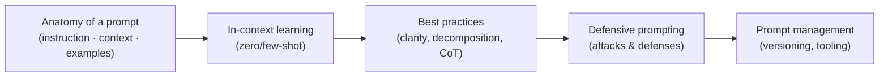
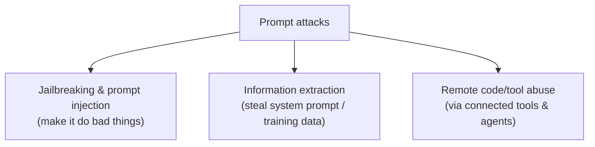

# Module 13 — Prompt Engineering

> A summary of **Chapter 5, "Prompt Engineering"** (Chip Huyen, *AI Engineering*).
>
> Modules 10–12 covered how a foundation model is built and how to evaluate it. This module
> starts the **adaptation** half of the book: how to make a model do what *you* want. Prompt
> engineering is the **first and cheapest** technique to try — it adapts a model **without
> changing its weights**, purely by crafting the input. Try it thoroughly before reaching for
> RAG (Module 14) or finetuning (Module 15).

> **The core mindset:** prompt engineering is *communication* — the clearer you explain what
> you want, the better the outcome. It requires **less engineering than experimentation**, and
> its low cost is exactly why it's the starting point. But "easy to start" is not "easy to
> master": small wording changes can cause large output changes, so treat prompting as a
> **rigorous, tracked experiment**, not guesswork.

---

## 13.1 What a prompt is

A **prompt** is the instruction you give a model to perform a task. A well-constructed prompt
generally contains up to three parts:

| Part | Role | Example |
|------|------|---------|
| **Task description** | What you want the model to do, including **role/persona** and **output format** | *"You are a helpful support agent. Answer in ≤3 sentences."* |
| **Example(s)** | Demonstrations of how to behave (few-shot) | *Q: … A: …* pairs |
| **The task / context** | The concrete input to process | The user's actual question + retrieved documents |

How much prompt engineering a model needs is a measure of **how robust** it is: a robust model
behaves well across small prompt perturbations, so you spend less effort chasing the "magic"
wording. Stronger models generally need **less** prompt engineering, which is more productive
than fiddling to coax a weaker model into working.

### System prompt vs user prompt

Most model APIs split the prompt into two roles:

- **System prompt** — the developer's instructions, persona, rules, and context. Usually placed
  **first**, and models are often trained to give it **higher priority**.
- **User prompt** — the end-user's actual input.

The API concatenates them into a final prompt using a **chat template**. Getting the template
wrong (wrong tokens, wrong order) silently degrades performance — always match the model's
expected format.

### Context length and the "lost in the middle" effect

Context windows have exploded (from a few thousand tokens to hundreds of thousands / millions),
enabling whole books in a prompt. But **not all positions are equal**: models understand
instructions at the **beginning and end** of a prompt far better than those buried in the
**middle** ("lost in the middle"). Put the most important instructions where the model pays
most attention.

---

## 13.2 In-context learning: zero-shot and few-shot

**In-context learning (ICL)** lets a model learn a desired behavior **from examples in the
prompt**, without any weight updates. It was a landmark shift: models can learn new tasks at
**inference time**.

- **Zero-shot** — no examples, just the instruction.
- **Few-shot** — a handful of demonstrations (**shots**) in the prompt.

> As models get stronger, they follow instructions better, so the **marginal value of few-shot
> examples shrinks** — modern models often do zero-shot nearly as well. But examples still help
> for **formatting**, **edge cases**, and **niche tasks**. Weigh the benefit against the added
> **token cost** each example adds to every call.

---

## 13.3 Best practices for prompt engineering

### Write clear and explicit instructions

- **Explain, without ambiguity, what you want.** The model can't read your mind — state the
  persona, the audience, the constraints, and what to do with ambiguous input.
- **Ask the model to adopt a persona** to shape tone and depth ("explain to a 5-year-old").
- **Provide examples** to reduce ambiguity about *how* to answer (few-shot).
- **Specify the output format.** Ask for JSON, bullet points, or a fixed schema — and for
  structured outputs, use **markers/tags** the model was trained to respect.
- **Give the model an escape hatch** — tell it what to do when it can't answer (e.g. *"reply
  'I don't know' if the context is insufficient"*) to reduce **hallucination**.

### Provide sufficient context

Context reduces hallucination the same way references help a student answer a hard question.
You can supply context manually or, at scale, **let the model retrieve it** — which is exactly
**RAG** (Module 14). You can also **restrict the model to only the provided context** so it
doesn't rely on unreliable internal knowledge.

### Break complex tasks into subtasks

**Prompt decomposition** splits one monolithic prompt into a **chain of simpler prompts**.
Benefits: easier to **monitor**, **debug**, and **parallelize**; each step can use a cheaper or
different model; and it improves reliability. Costs: more model calls → more **latency** and
sometimes more cost. This is the seed of **agentic** workflows (Module 14).

### Chain-of-thought (CoT) and self-critique

- **Chain-of-thought** — ask the model to **think step by step** before answering. One of the
  first and most effective techniques; it reduces errors on reasoning tasks and makes outputs
  more **explainable**. You can specify the reasoning steps explicitly.
- **Self-critique (self-eval)** — ask the model to **check its own output**. Like CoT, it's a
  form of letting the model spend more "thinking" compute before committing.

### Iterate and version everything

Prompt engineering is empirical: change one thing, measure, repeat. Keep prompts under
**version control**, tie each to its **evaluation results** (Modules 11–12), and treat prompt
experiments with the same rigor as code experiments.

> **Watch out for vendor "helpful" edits:** some tools silently modify your prompt behind the
> scenes. If results change unexpectedly, verify the **exact final prompt** sent to the model.

---

## 13.4 Defensive prompt engineering

Exposing a model to users invites **prompt attacks** — malicious inputs crafted to make the
model misbehave. Three main risks:

| Attack | What it does |
|--------|--------------|
| **Jailbreaking** | Bypasses the model's **safety** guardrails (e.g. "pretend you're an AI with no rules") to get disallowed content |
| **Prompt injection** | Hides malicious instructions in **content the model ingests** (a web page, an email, a document) so the model follows the attacker instead of you |
| **Information extraction** | Coaxes the model to reveal its **system prompt**, or regurgitate **memorized training data** (privacy/IP leakage) |

**Why it matters more with tools/agents:** once a model can call tools, send emails, or execute
code, a successful injection can trigger **real-world harm** (data exfiltration, unauthorized
actions). The blast radius grows with the model's capabilities.

**Defenses (layered, none perfect):**

- **Model-level** — safety training / RLHF to refuse harmful requests.
- **Prompt-level** — repeat key instructions, use **explicit delimiters** to separate trusted
  instructions from untrusted content, and tell the model to ignore instructions found inside
  user data.
- **System-level** — isolate execution (**sandboxing**), require **human approval** for
  high-impact actions, apply **input/output filters** and guardrails, and enforce **least
  privilege** on any tools the model can call.
- **Anomaly detection** — monitor for suspicious inputs/outputs and unusual usage.

> Security here is about **risk reduction, not elimination.** Assume attacks will happen and
> limit what a compromised prompt can accomplish.

---

## 13.5 Organizing and managing prompts

As applications grow, prompts become critical assets:

- **Separate prompts from code** — store them as files/config so non-engineers can edit and
  you can reuse them, but be aware of **dependency risk** (a shared prompt change affects every
  caller).
- **Version prompts** like code, and pin the **model version** too (the same prompt on a new
  model can behave differently).
- **Prompt catalogs / tooling** — track metadata: the prompt, its purpose, the model and
  sampling settings, and its evaluation metrics.
- **Test on every change** — a prompt edit is a behavior change; re-run your evaluation pipeline
  before shipping.

---

## 13.6 Key takeaways

- Prompt engineering adapts a model **without training** — always the **first** thing to try.
- A good prompt = **clear instruction + sufficient context + (optional) examples + explicit
  output format**.
- **In-context learning** (zero/few-shot) teaches behavior at inference time; its value falls
  as base models get stronger.
- **Decomposition** and **chain-of-thought** trade extra calls/latency for reliability and
  explainability — and lead naturally into **agents**.
- Treat prompting as **rigorous experimentation**: version, evaluate, and track everything.
- **Defensive prompting** is mandatory once users (and tools) are in the loop — layer model,
  prompt, and system defenses to *reduce* risk.

---

## 13.7 Compact glossary

- **Prompt** — the input instructing a model; up to three parts: task description, examples,
  the task/context.
- **System vs user prompt** — developer instructions/persona (higher priority) vs the
  end-user's input.
- **Chat template** — the format that assembles system/user messages into the final prompt.
- **Context length** — max tokens a model can attend to; positions matter ("lost in the
  middle").
- **In-context learning (ICL)** — learning a task from prompt examples, no weight updates.
- **Zero-shot / few-shot** — no examples vs a few example "shots" in the prompt.
- **Prompt decomposition** — splitting one prompt into a chain of simpler prompts.
- **Chain-of-thought (CoT)** — prompting the model to reason step by step before answering.
- **Self-critique / self-eval** — the model checking its own output.
- **Jailbreaking** — bypassing a model's safety guardrails.
- **Prompt injection** — hidden malicious instructions inside ingested content.
- **Information extraction** — attacks that leak the system prompt or memorized training data.
- **Sandboxing / least privilege** — system-level defenses that limit what a compromised
  prompt can do.

---

⬅️ Back to the [guide index](README.md)
