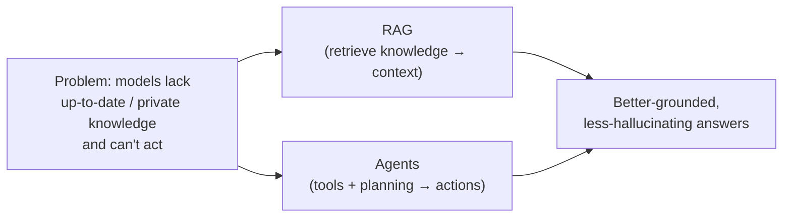
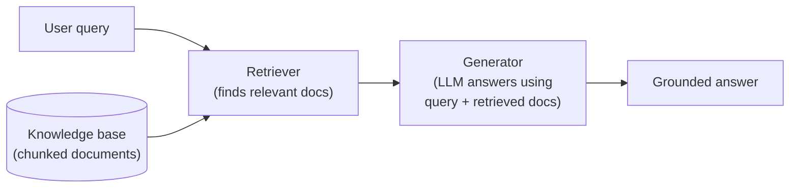
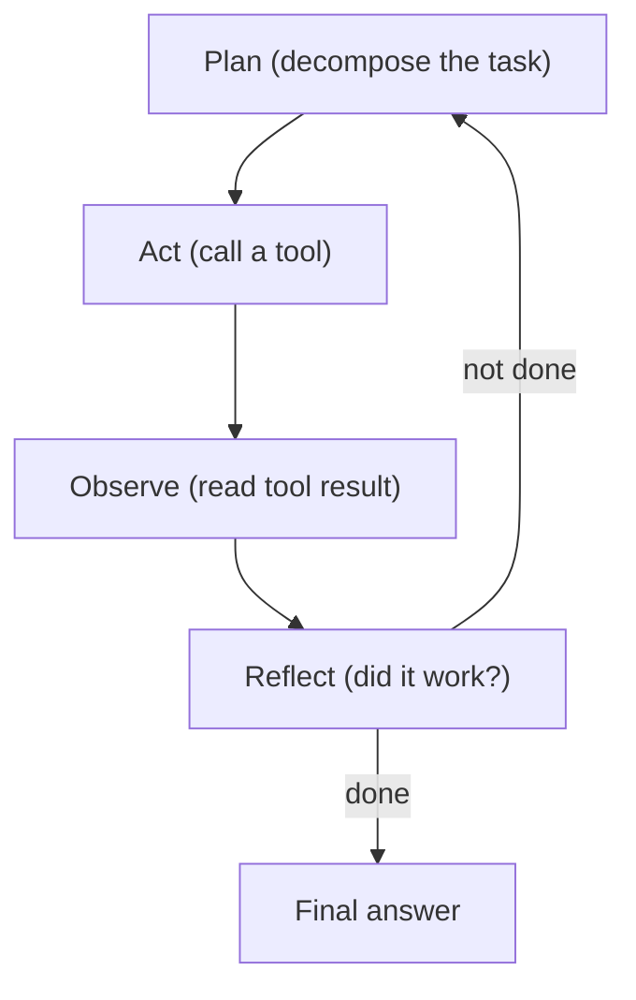

# Module 14 — RAG and Agents

> A summary of **Chapter 6, "RAG and Agents"** (Chip Huyen, *AI Engineering*).
>
> Module 13 adapted a model by crafting the prompt. But a prompt can only work with the
> information it's *given*. This module is about **constructing the right context**
> automatically: **RAG** pulls in the *knowledge* a model needs, and **agents** let a model
> *act* — using tools and planning multi-step workflows. Both are ways to overcome the
> limits of a model's frozen internal knowledge and single-shot reasoning.

> **The unifying idea — context construction.** Prompt engineering *arranges* context; RAG and
> agents *build* it. RAG gathers relevant information from external sources; agents gather
> information (and cause effects) by using tools. Both make the model's context richer and more
> current than its training data alone.

---

## Part A — Retrieval-Augmented Generation (RAG)

## 14.1 What RAG is and why it exists

**RAG** enhances generation by **retrieving relevant information from external sources** and
adding it to the prompt. It solves several core limitations at once:

- **Stale knowledge** — a model only knows what it was trained on; RAG injects **fresh** data.
- **Private/proprietary data** — the model never saw your internal docs; RAG supplies them at
  query time.
- **Hallucination** — grounding answers in retrieved evidence reduces made-up facts.
- **Context limits & cost** — instead of stuffing *everything* into the prompt, retrieve only
  the **most relevant** pieces. Even with million-token context windows, RAG stays useful:
  feeding only relevant context is **cheaper, faster, and often more accurate** than dumping
  everything in.

A RAG system has two components:

> **The retriever is the heart of RAG.** The generator is just an LLM; the quality of a RAG
> system is dominated by **how good the retrieval is**. Retrieval is not new — it powers search
> engines, recommenders, and log analytics — and RAG borrows those decades of techniques.

## 14.2 Retrieval algorithms

Documents are first split into **chunks** and indexed. At query time the retriever ranks chunks
by relevance. Two families:

| Approach | How it works | Strengths | Weaknesses |
|----------|-------------|-----------|------------|
| **Term-based (sparse / lexical)** — e.g. **BM25**, TF-IDF, Elasticsearch | Match **keywords**; score by term frequency × inverse document frequency | Fast, cheap, no training, great for exact terms/rare words | Misses **synonyms** and meaning ("car" vs "automobile") |
| **Embedding-based (dense / semantic)** | Encode query and chunks into **vectors**; retrieve nearest neighbors by similarity (cosine) | Captures **meaning**, handles paraphrase | Needs an embedding model + **vector DB**; can miss exact keywords |

- **Vector search** finds nearest neighbors in embedding space. Exact search is slow at scale,
  so systems use **Approximate Nearest Neighbor (ANN)** indexes (e.g. HNSW, IVF, product
  quantization) that trade a little accuracy for big speedups.
- **Hybrid search** combines both: use a cheap term-based pass to get candidates, then rerank
  with embeddings (or the reverse). Often the best of both worlds.

**Evaluating retrieval** uses classic IR metrics:

- **Recall / context recall** — did we fetch the relevant chunks?
- **Precision / context precision** — what fraction of fetched chunks are relevant?
- **NDCG, MRR, MAP** — reward putting relevant results **higher** in the ranking.

## 14.3 Retrieval optimization

- **Chunking strategy** — the biggest knob. Chunk **size** trades context vs precision (too big
  = noisy/expensive; too small = fragmented meaning). Options: fixed-length, by sentence/
  paragraph, recursive, or overlapping chunks. Always match chunk size to the embedding model's
  and generator's context limits.
- **Reranking** — retrieve a larger candidate set cheaply, then use a stronger (cross-encoder)
  **reranker** to reorder the top results by true relevance. Can also reorder for **recency**.
- **Query rewriting / expansion** — reformulate the user's query (resolve pronouns, add
  context, split into sub-queries) to improve retrieval.
- **Contextual retrieval** — augment each chunk with metadata or a short summary of its source
  so an isolated chunk still carries enough context to be found and used.

## 14.4 Beyond text: RAG over structured data and the web

RAG isn't limited to unstructured documents:

- **Tabular / structured data** → **text-to-SQL**: the model generates a **SQL query**, the
  database executes it, and results become context. (Popular for analytics assistants.)
- **Knowledge graphs** → retrieve **entities and relationships**; the graph structure guides
  multi-hop retrieval.
- **The web** → treat a **search engine / web API** as the retriever for open-domain, real-time
  questions.

> **RAG vs long context:** longer context windows don't kill RAG — they complement it. Retrieval
> decides *what's worth putting* in that context. Even huge windows suffer "lost in the middle"
> and rising cost/latency, so relevance-filtering still pays off.

---

## Part B — Agents

## 14.5 What an agent is

An **agent** is anything that **perceives its environment and acts upon it**. An AI agent is
defined by two things:

1. Its **environment** — what it operates in (a codebase, the web, a game, a database).
2. Its **tools (actions)** — the set of things it can do in that environment.

The more capable the model, the more complex the environments and tools it can handle — and the
**higher the stakes of failure**, since agents take *real actions*.

## 14.6 Tools

Tools extend a model beyond text generation. Three categories:

| Tool type | Purpose | Examples |
|-----------|---------|----------|
| **Knowledge augmentation** | Bring in information | web search, RAG retriever, SQL query, calculators, calendars |
| **Capability extension** | Do things the model can't | code interpreter, image generation, unit converters |
| **Write actions** | Change the world | send an email, place an order, update a database, run code |

> **Read vs write actions.** Read-only tools are relatively safe. **Write actions** — which
> modify state — are powerful but dangerous: combined with **prompt injection** (Module 13), an
> agent can be tricked into destructive actions. Gate write actions behind **human approval** and
> **least privilege**.

**Tool selection matters:** more tools = more power but a harder decision problem and a longer
prompt. Give the agent the **fewest, clearest** tools it needs, with good descriptions.

## 14.7 Planning

Planning is what separates an agent from a single model call. A robust agent **decouples
planning from execution**: generate a plan, (optionally **validate** it before acting), then
execute — so you don't waste expensive actions on a bad plan.

- **Plan generation** — decompose the goal into ordered steps (often via prompting, function
  calling, or a dedicated planner).
- **Reflection & error correction** — after each step, evaluate the result and **replan** if it
  failed. Reflection (e.g. **ReAct** = *reason + act*, **Reflexion**) markedly improves
  reliability.
- **Tool use paradigms** — the model outputs a tool name + arguments (**function calling**);
  the framework runs it and feeds the result back.

**Failure modes to evaluate:**

| Failure | Description |
|---------|-------------|
| **Planning failures** | Invalid tool, wrong arguments, wrong/goal-violating plan, or never stopping |
| **Tool failures** | The tool returns wrong/empty results, or the wrong tool was chosen |
| **Efficiency failures** | Solves it but with too many steps, too much cost, or too much latency |

> Agents **compound errors**: a 95%-reliable step run 10 times in sequence yields only
> ~60% overall success ($0.95^{10}$). More steps = more chances to fail, which is why
> reflection, validation, and limiting step count matter so much.

## 14.8 Memory

Agents need **memory** to persist information across a long task or across sessions:

- **Internal knowledge** — what's baked into the model's weights.
- **Short-term (context) memory** — the current conversation/context window.
- **Long-term memory** — an external store (often a **vector DB**, i.e. RAG over the agent's
  own history) it can read from and write to, overcoming the finite context window.

Memory lets an agent recall earlier facts, maintain state, and learn user preferences over time.

---

## 14.9 Key takeaways

- **RAG** and **agents** both solve the same underlying problem — **giving the model the right
  context** — one by retrieving knowledge, the other by using tools and planning.
- RAG quality is dominated by the **retriever**; combine **term-based** and **embedding-based**
  retrieval (**hybrid**), tune **chunking**, and add **reranking**.
- RAG extends to **SQL, knowledge graphs, and the web**, and stays valuable even with long
  context windows.
- An **agent** = environment + tools + planning; **write actions** raise both power and risk.
- **Planning, reflection, and memory** are what make agents work; beware **compounding errors**
  over many steps.

---

## 14.10 Compact glossary

- **RAG** — Retrieval-Augmented Generation: retrieve external info and add it to the prompt.
- **Retriever / generator** — the component that finds relevant chunks vs the LLM that answers.
- **Chunking** — splitting documents into indexable pieces; size trades context vs precision.
- **Term-based (sparse) retrieval / BM25** — keyword matching via TF-IDF-style scoring.
- **Embedding-based (dense) retrieval** — vector similarity search over semantic embeddings.
- **ANN (approximate nearest neighbor)** — fast, slightly-approximate vector search (HNSW, IVF).
- **Hybrid search** — combining term-based and embedding-based retrieval.
- **Reranking** — reordering candidate chunks with a stronger model for relevance/recency.
- **Context precision / recall** — retrieval quality metrics.
- **Text-to-SQL** — generating SQL to retrieve from structured/tabular data.
- **Agent** — a system that perceives an environment and acts on it via tools.
- **Tool types** — knowledge augmentation, capability extension, write actions.
- **Function calling** — the model emitting a tool name + arguments for the framework to run.
- **Planning / reflection** — decomposing a task and evaluating/correcting after each step
  (ReAct, Reflexion).
- **Compounding errors** — per-step failure rates multiplying over a multi-step task.
- **Long-term memory** — an external store (often a vector DB) an agent reads/writes across a
  task.

---

⬅️ Back to the [guide index](README.md)
