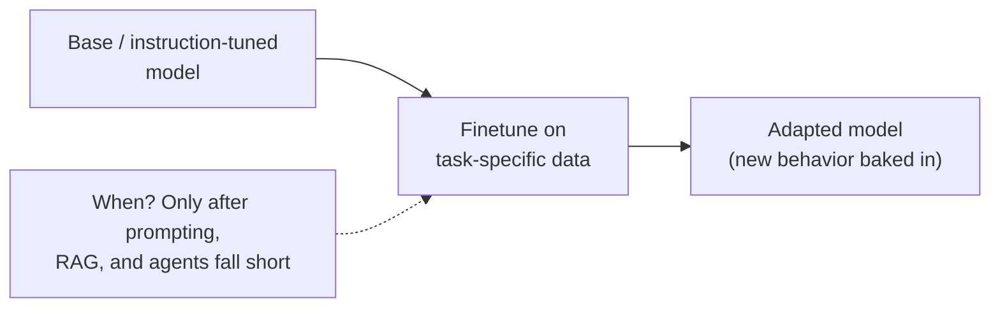
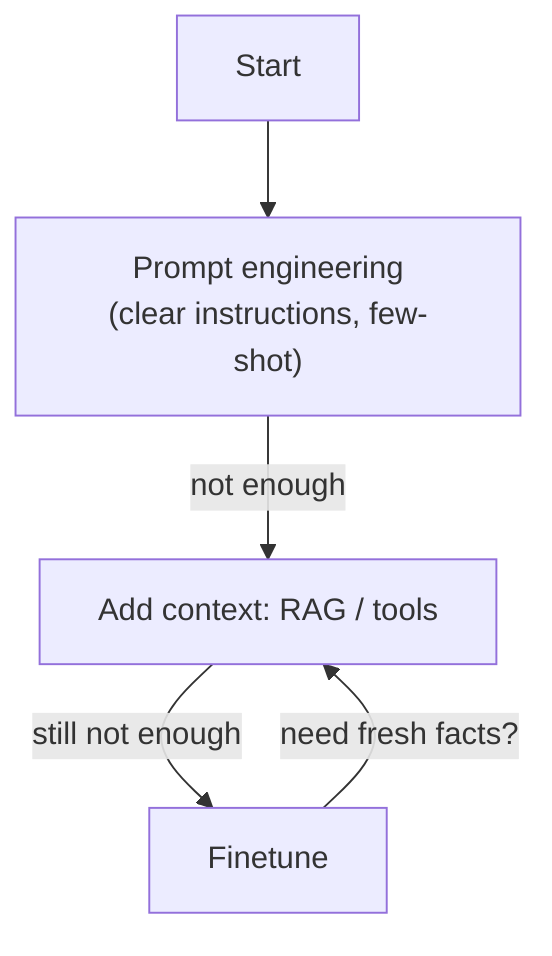
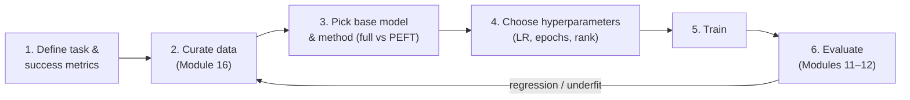

# Module 15 — Finetuning

> A summary of **Chapter 7, "Finetuning"** (Chip Huyen, *AI Engineering*).
>
> Modules 13–14 adapted a model **without touching its weights** (prompting, RAG, agents). This
> module covers the heavier hammer: **finetuning** — continuing to train a model on your own
> data to change the weights themselves. It's more powerful but far more costly, so the guiding
> question of the chapter is **when finetuning is worth it**, and how to do it affordably with
> **PEFT** techniques like **LoRA**.

> **The central trade-off.** Prompt-based methods (Modules 13–14) change the *input*;
> finetuning changes the *model*. Finetuning can teach behavior that no prompt can (new format,
> tone, domain skill, or squeezing a small model up to a big model's quality on a narrow task),
> but it demands **data, compute, and ML expertise**, and creates a model you must **host and
> maintain**. Reach for it **last**, not first.

---

## 15.1 When to finetune — and when not to

### Reasons to finetune

- **Quality** — improve a model's performance on a specific task beyond what prompting achieves,
  including **domain-specific** capabilities the base model handles poorly.
- **Format / behavior** — reliably produce a **structured output**, a house style, or a
  consistent persona that's hard to enforce by prompt.
- **Efficiency / cost** — finetune a **small** model to match a big model's quality on your
  narrow task, then serve the small model cheaply (**model distillation** is a form of this).
- **Bias / safety** — reduce undesirable behaviors baked into the base model.

### Reasons *not* to finetune (try these first)

- Prompt engineering, few-shot examples, and RAG are **cheaper, faster to iterate**, and require
  no training data or ML ops.
- Finetuning can cause **regressions** — improving your task while **degrading** unrelated
  capabilities the base model had ("**catastrophic forgetting**").
- You take on the burden of **data curation, training infrastructure, and hosting**.

> **RAG vs finetuning — a useful heuristic.** If the problem is **missing information**, use
> **RAG** (add knowledge). If the problem is **missing behavior/skill/format**, use
> **finetuning**. They're **complementary**: you can finetune a model *and* give it RAG.
> Because RAG is usually easier and updates instantly, **try RAG before finetuning**.

---

## 15.2 Finetuning is transfer learning

Finetuning continues training a **pre-trained** model, reusing everything it already learned —
this is **transfer learning**. Common stages you can finetune at:

| Type | What it does |
|------|--------------|
| **Continued pre-training (self-supervised)** | Keep training on raw domain text (e.g. legal/medical) to inject domain knowledge |
| **Supervised finetuning (SFT)** | Train on **(input, desired output)** pairs — instruction tuning, task adaptation |
| **Preference finetuning** | Align to human preferences via **RLHF / DPO** (reward model or direct preference optimization) |
| **Long-context finetuning** | Extend the context window (often needs architectural tweaks and is hard to do well) |

The base you start from matters: finetuning an **instruction-tuned** model for a new task is
usually easier than starting from a raw base model.

---

## 15.3 Memory math: why finetuning is expensive

The barrier to finetuning is **memory**. You must understand where it goes:

- **Number of parameters** — billions of weights.
- **Precision / bytes per value** — FP32 = 4 bytes, FP16/BF16 = 2 bytes, INT8 = 1, INT4 = 0.5.
  **Quantization** (Module 17) lowers this.
- **Optimizer states dominate** — training (unlike inference) must store **gradients** and
  optimizer state. With **Adam**, you keep two extra values (momentum + variance) per parameter,
  so full finetuning needs memory for **weights + gradients + optimizer states + activations** —
  often **3–4× the weights alone**.

> This is why **full finetuning** of a large model needs many high-end GPUs. The field's answer
> is to train **far fewer parameters**.

---

## 15.4 Parameter-Efficient Finetuning (PEFT)

**PEFT** methods update only a **small subset** of parameters (or a small number of *added*
parameters), keeping the huge base model **frozen**. This slashes memory and storage while
retaining most of the quality of full finetuning.

- **Adapter-based (additive)** — insert small trainable modules; freeze the rest.
- **LoRA (Low-Rank Adaptation)** — the dominant method (see below).
- **Soft prompts / prefix tuning** — learn continuous "virtual token" vectors prepended to the
  input instead of editing weights.

### LoRA (Low-Rank Adaptation)

Instead of updating a big weight matrix $W$ directly, LoRA **freezes $W$** and learns a small
**low-rank** update:

$$W' = W + \Delta W = W + \frac{\alpha}{r}\, B A$$

where $A$ and $B$ are small matrices of **rank $r$** (with $r \ll$ the matrix dimension). Only
$A$ and $B$ are trained.

**Why LoRA is a big deal:**

- **Tiny trainable footprint** — often **<1%** of parameters, so it fits on a single GPU.
- **Cheap to store & swap** — each adapter is a few MB; keep **one frozen base model** and swap
  **many task adapters** on top (multi-tenant serving).
- **No inference latency** — the update can be **merged** back into $W$ (it's just addition), so
  a served LoRA model is as fast as the original.
- **QLoRA** — combine LoRA with a **4-bit quantized** frozen base to finetune very large models
  on a **single consumer GPU**, with minimal quality loss.

> **Choosing the rank $r$:** higher $r$ = more capacity but more memory; small $r$ (e.g. 8–64)
> is often enough. LoRA is typically applied to the attention projection matrices.

---

## 15.5 Model merging and multi-task finetuning

You don't always finetune one model for one task. **Model merging** combines multiple models
(or adapters) into one, useful for **multi-task** models and **on-device** deployment:

| Technique | Idea |
|-----------|------|
| **Summing / weight averaging** | Add or average weights (or task vectors) of several finetuned models |
| **Task vectors (task arithmetic)** | (finetuned − base) weights = a "direction" for a skill; add/subtract these to compose or remove skills |
| **Layer stacking (frankenmerging)** | Assemble layers from different models into a new one |

Merging can create a multi-capability model **without retraining from scratch**, and is popular
in the open-source community.

---

## 15.6 The finetuning workflow

**Key hyperparameters:**

- **Learning rate** — most important; too high diverges, too low underfits. Watch the loss curve.
- **Epochs** — how many passes over the data; too many → **overfitting** (memorizing the small
  finetuning set) and forgetting.
- **Batch size** — larger is more stable but needs more memory.
- **LoRA rank $r$ / $\alpha$** — capacity of the adapter.

> **Start small and iterate:** begin with a **small model** and a **small, high-quality dataset**
> to validate the approach cheaply, then scale up. **Data quality beats quantity** — a few
> thousand clean examples often outperform a huge noisy set. (Dataset engineering is Module 16.)

---

## 15.7 Key takeaways

- Finetuning **changes the weights** — more powerful than prompting/RAG, but costlier; try it
  **last**.
- **RAG for missing knowledge, finetuning for missing behavior** — and they combine.
- Training memory is dominated by **gradients + optimizer states**, not just weights.
- **PEFT** (especially **LoRA / QLoRA**) makes finetuning affordable by training **<1%** of
  parameters, with **no added inference latency** and cheap, swappable adapters.
- **Model merging / task vectors** compose skills without full retraining.
- Success hinges on **high-quality data** and disciplined **evaluation** to catch regressions
  and overfitting.

---

## 15.8 Compact glossary

- **Finetuning** — continuing to train a pre-trained model on your data to change its weights.
- **Transfer learning** — reusing knowledge from pre-training for a new task.
- **SFT (supervised finetuning)** — training on (input, desired-output) pairs.
- **Preference finetuning / RLHF / DPO** — aligning a model to human preferences.
- **Catastrophic forgetting** — finetuning degrading previously-learned capabilities.
- **Precision / quantization** — bytes per parameter (FP32/FP16/INT8/INT4); lowering it saves
  memory.
- **Optimizer states** — extra per-parameter values (e.g. Adam's momentum/variance) stored
  during training.
- **PEFT** — parameter-efficient finetuning; train a small subset of parameters.
- **LoRA** — low-rank weight update $W + \frac{\alpha}{r}BA$ on a frozen base; mergeable, tiny.
- **QLoRA** — LoRA on a 4-bit quantized base model; finetune huge models on one GPU.
- **Rank $r$** — the capacity dimension of a LoRA adapter.
- **Soft prompt / prefix tuning** — learned continuous "virtual tokens" instead of weight edits.
- **Model merging / task vectors** — combining models/adapters to compose or remove skills.
- **Epoch / overfitting** — one pass over data; too many passes memorize the small set.

---

⬅️ Back to the [guide index](README.md)
