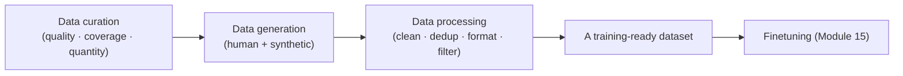
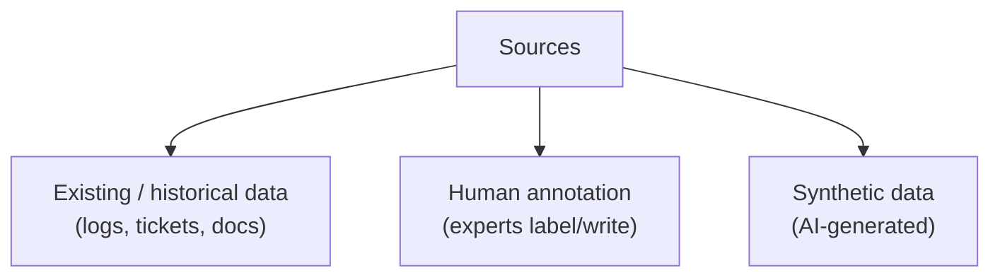
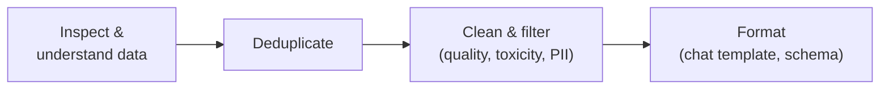
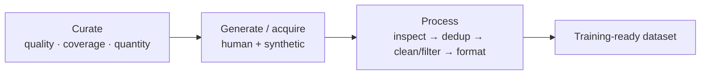

# Module 16 — Dataset Engineering

> A summary of **Chapter 8, "Dataset Engineering"** (Chip Huyen, *AI Engineering*).
>
> Module 15 showed that finetuning lives or dies by its **data**. This module is entirely about
> that data: how to **design, create, clean, and curate** the datasets that power finetuning
> (and evaluation). The chapter's thesis is blunt — as models and techniques commoditize, **data
> becomes the main differentiator**. Better data, not a fancier algorithm, is usually what moves
> the needle.

> **The mindset shift.** "Dataset engineering" treats data as an **engineered artifact**, not a
> given. You decide what the data should look like, how to acquire it, and how to verify it — and
> you iterate on the *data* as deliberately as you iterate on the *model*.

---

## 16.1 Data curation: what "good data" means

Curation is deciding **what data to train on**. Three properties matter, roughly in order:

| Property | Question | Why it matters |
|----------|----------|----------------|
| **Quality** | Is each example correct, relevant, well-formatted, and non-toxic? | The #1 factor — *"a small amount of high-quality data can outperform a large amount of noisy data."* |
| **Coverage / diversity** | Does the data span the **range of inputs** the model will see (topics, styles, edge cases)? | Gaps become blind spots in production |
| **Quantity** | Is there **enough** data for the technique? | Needs scale with the method (see below) |

**What high-quality data looks like** — it is **relevant** (to your task), **consistent**
(annotators agree, formatting is uniform), **correct** (accurate labels/answers), **complete**
(covers the needed behaviors), and **compliant/safe** (no PII, no toxic or copyrighted content
you can't use).

> **Quality over quantity.** Studies like **LIMA** ("Less Is More for Alignment") showed that
> **~1,000 carefully curated** examples can produce a strong instruction-tuned model. Prioritize
> cleaning and curating over collecting more.

## 16.2 How much data do you need?

The right quantity depends heavily on the **technique** and the **starting point**:

- **Full finetuning** needs **much more** data than **PEFT/LoRA** (Module 15).
- **Instruction tuning** from a good base can work with **thousands**, not millions, of examples.
- **Continued pre-training** for a new domain needs **large** raw corpora.
- Diminishing returns are real — plot a **data-size vs performance** curve on a small scale first
  to estimate how much more data will help before you invest in collecting it.

**A practical approach:** start with a **small, high-quality set**, measure, and only scale the
data if the curve says it'll pay off. This mirrors the finetuning advice in Module 15.

---

## 16.3 Data generation and acquisition

Where does the data come from?

### Human-generated data

The gold standard for quality, but **slow, expensive, and hard to scale**. Requires **clear
annotation guidelines** (the same rubric discipline as evaluation in Module 12) and
**inter-annotator agreement** checks to ensure consistency.

### Synthetic data (AI-generated)

Using **AI to generate training data** is one of the chapter's biggest themes. It's **cheap,
fast, scalable**, and can be steered to cover **rare edge cases** or **privacy-sensitive**
scenarios (no real user data). Uses include:

- **Data augmentation** — expand or paraphrase real examples to add diversity.
- **Instruction generation** — have a strong model write (instruction, response) pairs
  (e.g. **Self-Instruct**, **Evol-Instruct**).
- **Distillation** — a strong **teacher** model generates outputs to train a smaller **student**
  (ties back to Module 15's efficiency goal).

**Verification is essential.** Synthetic data can be wrong, biased, or low-diversity ("model
collapse" if you train repeatedly on a model's own output). Filter it with:

- **AI verifiers / AI-as-a-judge** (Module 11) to score and drop bad samples.
- **Functional checks** — for code, run the tests; for math, check the answer.
- **Human spot-checks** on a sample.

> **Two cautions with synthetic data.** (1) **Legal/licensing** — many model licenses forbid
> using outputs to train competing models (Module 12's "data lineage"). (2) **Quality drift** —
> a model trained too much on synthetic data can **degrade and lose diversity**. Mix synthetic
> with real data and always verify.

### AI-powered data curation

Beyond generating data, models can **curate** it: score examples for quality, deduplicate
semantically, classify topics for coverage analysis, and flag toxic/PII content — automating
much of the work below.

---

## 16.4 Data processing

Raw data is never training-ready. The processing pipeline:

1. **Inspect the data first.** Understand distributions, sources, and obvious problems before
   processing — you can't fix what you haven't looked at.
2. **Deduplicate.** Duplicate (and near-duplicate) examples **bias** the model, waste compute,
   and cause **test-set leakage** (Module 12's data contamination). Use exact, fuzzy, and
   semantic (embedding) dedup.
3. **Clean and filter.** Remove low-quality, irrelevant, toxic, or non-compliant examples; strip
   or mask **PII**; fix formatting; handle broken encodings.
4. **Format correctly.** Convert to the exact **chat template / schema** the target model
   expects (Module 13). A formatting mismatch silently wrecks finetuning results.

> **Garbage in, garbage out — amplified.** Because finetuning sets are small, a few bad or
> mislabeled examples have outsized impact. Cleaning is not optional busywork; it's often the
> highest-leverage step in the whole finetuning project.

---

## 16.5 Key takeaways

- As algorithms commoditize, **data is the differentiator** — treat datasets as engineered
  artifacts.
- Optimize for **quality first**, then **coverage/diversity**, then **quantity**; a small clean
  set often beats a large noisy one (**LIMA**).
- Estimate needed data with a **small-scale size-vs-performance curve** before scaling up.
- **Synthetic data** (augmentation, instruction generation, distillation) is powerful and
  cheap — but must be **verified**, mixed with real data, and checked for **licensing** issues.
- The processing pipeline — **inspect → deduplicate → clean/filter → format** — is where most of
  the quality is won or lost.

---

## 16.6 The one-page recap

**Thesis:** as models and algorithms commoditize, **data is the differentiator** — treat it as an
**engineered artifact** and iterate on it as deliberately as on the model.

**Curation — good data (priority order):**

| Property | Question |
|----------|----------|
| **Quality** (#1) | Correct, relevant, consistent, complete, compliant/safe |
| **Coverage / diversity** | Spans the inputs (topics, styles, edge cases) the model will face |
| **Quantity** | Enough for the technique |

**Quality over quantity** — **LIMA** ("Less Is More for Alignment"): ~1,000 curated examples make a
strong instruction model.

**How much:** full finetuning ≫ PEFT; instruction tuning = **thousands**; continued pre-training =
**large** corpora. Plot a **size-vs-performance** curve on a small scale before collecting more.

**Generation & acquisition:**

| Source | Detail |
|--------|--------|
| **Human** | Gold standard; needs guidelines + **inter-annotator agreement**; slow, costly |
| **Synthetic (AI)** | Cheap, scalable — augmentation, **instruction gen** (Self-Instruct / Evol-Instruct), **distillation** (teacher→student) |

**Verify synthetic data** (AI judges, functional checks, human spot-checks). Two cautions:
**licensing** (data lineage — many licenses forbid training on outputs) and **model collapse**
(quality/diversity drift) → mix synthetic with real. AI can also **curate** (score, dedup,
classify, flag PII/toxicity).

**Processing pipeline:** **inspect** (look first) → **deduplicate** (exact/fuzzy/semantic — avoid
bias & test-set leakage) → **clean & filter** (quality, toxicity, **PII**) → **format** to the exact
chat template/schema. *Garbage in, garbage out — amplified* on small finetuning sets, so cleaning
is often the highest-leverage step.

**Through-line:** you decide what the data should look like, acquire it, and verify it — data work,
not a fancier algorithm, usually moves the needle.

---

## 16.7 Compact glossary

- **Dataset engineering** — deliberately designing, creating, and curating training data.
- **Data curation** — selecting what to train on, judged by quality, coverage, quantity.
- **Coverage / diversity** — how well the data spans the inputs the model will face.
- **Inter-annotator agreement** — consistency between human labelers.
- **Synthetic data** — AI-generated training data (augmentation, instruction generation,
  distillation).
- **Self-Instruct / Evol-Instruct** — methods for a model to generate instruction data.
- **Distillation** — a strong teacher model generating data to train a smaller student.
- **Model collapse** — quality/diversity degradation from training too much on model-generated
  data.
- **AI verifier / AI-as-a-judge** — using a model to score and filter (synthetic) data.
- **Deduplication** — removing exact/near/semantic duplicates to avoid bias and leakage.
- **PII** — personally identifiable information that must be masked or removed.
- **Chat template / schema** — the exact format the target model expects for training examples.
- **LIMA ("Less Is More for Alignment")** — result showing ~1k high-quality examples suffice.

---

⬅️ Back to the [guide index](README.md)
