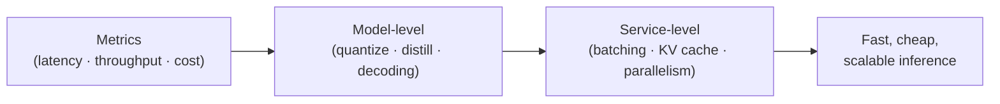
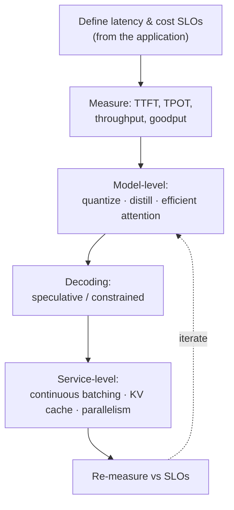
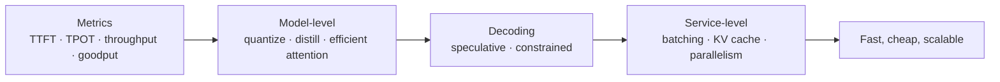

# Module 17 — Inference Optimization

> A summary of **Chapter 9, "Inference Optimization"** (Chip Huyen, *AI Engineering*).
>
> Modules 13–16 made a model **behave** the way you want. This module makes it **run** the way
> you need — **fast** and **cheap** enough to ship. Inference (serving predictions) is where the
> ongoing cost lives, so optimizing latency, throughput, and cost is what turns a working
> prototype into a viable product. The techniques span the **model**, the **hardware**, and the
> **serving service**.

> **The trilemma.** You want **low latency**, **high throughput**, and **low cost** — but they
> pull against each other. Bigger batches raise throughput and cut cost/token but *increase*
> individual latency; smaller/quantized models are faster but may lose quality. Optimization is
> about picking the right point on this frontier **for your application's requirements**.

---

## 17.1 Understanding the bottleneck: compute-bound vs memory-bound

To optimize, first know **what's limiting you**:

- **Compute-bound** — limited by raw arithmetic (FLOPs). Example: the **prefill** phase, which
  processes the whole input prompt in parallel.
- **Memory-bandwidth-bound** — limited by how fast you can move data (weights) from memory to
  the compute units. Example: the **decode** phase, which generates **one token at a time** and
  must re-read the model weights every step.

> **LLM generation is usually memory-bound, not compute-bound.** Autoregressive decoding
> produces tokens one by one, and each step is dominated by **loading weights**, not math. This
> is why techniques that **reduce data movement** (quantization, KV caching, batching) give the
> biggest wins.

### Prefill vs decode

| Phase | What it does | Bottleneck |
|-------|-------------|-----------|
| **Prefill** | Process all input/prompt tokens in parallel to build the initial state | **Compute-bound** |
| **Decode** | Generate output tokens **one at a time**, autoregressively | **Memory-bound** |

Because these two phases have different profiles, some serving systems **disaggregate** them
onto different resources.

---

## 17.2 Inference metrics

You can't optimize what you don't measure. The key metrics:

| Metric | Meaning | Who cares |
|--------|---------|-----------|
| **Time to first token (TTFT)** | Delay before the first output token appears | User's perceived responsiveness (streaming) |
| **Time per token / inter-token latency (TPOT/ITL)** | Delay between subsequent tokens | Smoothness of streaming output |
| **Total latency** | End-to-end time for the full response | Overall UX; grows with output length |
| **Throughput** | Tokens (or requests) served per second across all users | **Cost efficiency** at scale |
| **Goodput** | Throughput that **meets latency SLOs** — useful requests/sec | The metric that actually matters |
| **Utilization / MFU** | How much of the hardware's peak you're actually using | Cost per token |

> **Latency vs throughput trade-off.** Batching more requests together raises throughput (lower
> cost/token) but each user waits longer. **Goodput** captures the real goal: maximize useful
> throughput **without violating** your latency targets.

**Cost** is ultimately **per token** (API) or **per unit of compute-time** (self-hosted, Module
12). Every optimization below aims to lower one of these while holding quality.

---

## 17.3 Model-level optimization

Change the **model itself** to make it cheaper to run.

### Quantization

Represent weights (and/or activations) in **fewer bits** — FP16 → INT8 → INT4. This is the
**most impactful, general-purpose** technique:

- **Smaller** → less memory, so bigger models fit on smaller/cheaper GPUs.
- **Faster** → less data to move (remember: memory-bound), so decoding speeds up.
- **Post-training quantization (PTQ)** applies after training (easy, common);
  **quantization-aware training** bakes it in during training (better quality, more work).
- Modern methods (e.g. **GPTQ, AWQ, INT4**) keep quality loss small. Very low bit-widths start
  to hurt accuracy — measure the trade-off.

### Distillation

Train a small **student** model to mimic a large **teacher** (Modules 15–16). The student is
cheaper and faster to serve while retaining much of the teacher's quality on the target task.

### Pruning and sparsity

Remove weights/structures that contribute little, yielding a smaller model. Effective but often
needs retraining and specialized hardware/kernels to realize the speedup.

### Attention & architecture optimizations

- **Efficient attention** (e.g. **FlashAttention**) computes attention with far less memory
  movement — a large speedup with no quality loss.
- **Multi-query / grouped-query attention (MQA/GQA)** share key/value heads, shrinking the **KV
  cache** and speeding decode.

---

## 17.4 Decoding optimizations

How you **generate tokens** can be sped up without changing the model's outputs:

- **Speculative decoding** — a small, fast **draft** model proposes several tokens; the big
  model **verifies them in one parallel pass**, accepting the correct prefix. Produces the
  **same** output as the big model alone, but faster (turns several sequential decode steps into
  one verification step).
- **Parallel / lookahead decoding, Medusa, etc.** — related tricks to generate more than one
  token per step.
- **Structured / constrained decoding** — restrict outputs to a grammar/JSON schema; improves
  reliability of structured outputs and can reduce wasted tokens.

---

## 17.5 Service-level optimization

Optimize the **serving system**, not the model — no quality change.

### Batching

Process multiple requests together to amortize the cost of loading weights:

| Batching type | Idea |
|---------------|------|
| **Static batching** | Wait to fill a fixed batch, then run — simple but adds latency and wastes slots when requests finish at different times |
| **Dynamic batching** | Group requests that arrive within a time window |
| **Continuous (in-flight) batching** | Add/remove requests **every step** as sequences finish — the standard for LLM serving; keeps the GPU busy and maximizes throughput |

### KV cache

Autoregressive decoding recomputes attention over all previous tokens each step. The **KV cache**
stores the **key/value tensors** of past tokens so each new token only computes against the
cache — **essential** for practical generation. But the cache **grows with sequence length and
batch size** and can dominate memory.

- **PagedAttention (vLLM)** manages the KV cache like OS **virtual memory paging** — non
  contiguous "pages" eliminate fragmentation, enabling far larger batches and higher throughput.
- **Prefix caching** reuses the KV cache of a **shared prompt prefix** (e.g. a long system
  prompt) across requests, saving repeated prefill work.

### Parallelism

Spread a model or workload across multiple devices:

- **Tensor parallelism** — split individual layers/matrices across GPUs (for models too big for
  one GPU).
- **Pipeline parallelism** — put different layers on different GPUs, stream batches through.
- **Data / replica parallelism** — run copies to serve more requests.

---

## 17.6 Putting it together

Most real deployments **stack** these: a quantized model with GQA, served with continuous
batching, a paged KV cache, prefix caching, and speculative decoding — each layer compounding
the savings.

---

## 17.7 Key takeaways

- LLM decoding is typically **memory-bound**, so the biggest wins come from **reducing data
  movement** (quantization, KV cache, batching).
- Distinguish **prefill (compute-bound)** from **decode (memory-bound)** — they optimize
  differently.
- Track the right metrics: **TTFT, TPOT, throughput, and especially goodput** (throughput that
  meets SLOs).
- **Quantization** is the highest-leverage model-level lever; **distillation, efficient
  attention (FlashAttention), and GQA** help too.
- **Speculative decoding** speeds generation with **identical** outputs.
- **Continuous batching + paged/prefix KV cache + parallelism** are the core service-level wins.
- Optimization is navigating the **latency ↔ throughput ↔ cost** frontier for *your*
  requirements.

---

## 17.8 The one-page recap

**The trilemma:** low latency ↔ high throughput ↔ low cost pull against each other.

**Bottleneck first** — know what limits you:

| Phase | Bottleneck |
|-------|-----------|
| **Prefill** (process prompt in parallel) | **Compute-bound** |
| **Decode** (one token at a time) | **Memory-bound** ← biggest wins **reduce data movement** |

| Metric | Meaning |
|--------|---------|
| **TTFT** | Time to first token (perceived responsiveness) |
| **TPOT / ITL** | Time per output token (streaming smoothness) |
| **Throughput** | Tokens/sec overall (cost efficiency) |
| **Goodput** | Throughput **meeting latency SLOs** ← what actually matters |
| **MFU / utilization** | Fraction of peak hardware used |

**Model-level:** **quantization** (FP16→INT8→INT4; PTQ, GPTQ, AWQ — highest leverage) ·
**distillation** · pruning/sparsity · efficient attention (**FlashAttention**) · **MQA / GQA**
(smaller KV cache, faster decode).

**Decoding (same output, faster):** **speculative decoding** (small draft model proposes tokens,
big model **verifies in parallel**) · parallel/lookahead/Medusa · constrained/structured decoding.

**Service-level (no quality change):**

| Lever | Detail |
|-------|--------|
| **Batching** | static → dynamic → **continuous (in-flight)** = the LLM-serving standard |
| **KV cache** | store past key/value tensors; **PagedAttention** (vLLM) · **prefix caching** (shared prompt) |
| **Parallelism** | **tensor** (split layers/matrices) · **pipeline** (layers across GPUs) · data/replica |

Real deployments **stack** these (quantized + GQA + continuous batching + paged/prefix KV +
speculative decoding), each layer compounding the savings.

**Through-line:** navigate the latency ↔ throughput ↔ cost frontier for *your* SLOs; **goodput**
(throughput meeting latency targets) is the real objective.

---

## 17.9 Compact glossary

- **Compute-bound vs memory-bound** — limited by arithmetic (FLOPs) vs by data movement
  (bandwidth).
- **Prefill / decode** — parallel prompt processing (compute-bound) vs one-token-at-a-time
  generation (memory-bound).
- **TTFT / TPOT (ITL)** — time to first token / time per output token.
- **Throughput / goodput** — tokens per second overall vs tokens per second that meet latency
  SLOs.
- **MFU / utilization** — fraction of peak hardware performance actually used.
- **Quantization (PTQ, GPTQ, AWQ)** — representing weights/activations in fewer bits.
- **Distillation** — training a small student to mimic a large teacher for cheaper serving.
- **Pruning / sparsity** — removing low-value weights to shrink the model.
- **FlashAttention** — memory-efficient attention computation.
- **MQA / GQA** — multi-query / grouped-query attention; smaller KV cache, faster decode.
- **Speculative decoding** — a draft model proposes tokens the big model verifies in parallel.
- **Constrained / structured decoding** — restricting outputs to a grammar or schema.
- **Batching (static / dynamic / continuous)** — grouping requests; continuous adds/removes per
  step.
- **KV cache** — stored key/value tensors of past tokens to avoid recomputation.
- **PagedAttention / prefix caching** — virtual-memory-style KV management / reusing a shared
  prefix's cache.
- **Tensor / pipeline / data parallelism** — ways to split a model or workload across devices.

---

⬅️ Back to the [guide index](README.md)
