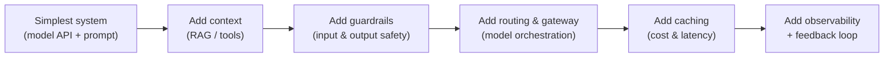
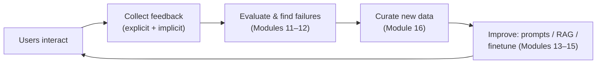

# Module 18 — AI Engineering Architecture and User Feedback

> A summary of **Chapter 10, "AI Engineering Architecture and User Feedback"** (Chip Huyen,
> *AI Engineering*).
>
> The previous modules covered individual techniques — prompting, RAG, agents, finetuning, data,
> and inference. This final module **assembles them into a complete production system** and
> closes the loop with the most valuable long-term asset an AI product has: **user feedback**.
> It answers: *what does the whole architecture look like, and how do you make it better over
> time?*

> **Build incrementally.** Don't start with the full diagram. Begin with the **simplest thing
> that works** (a model call with a good prompt), then add each component **only when a real
> problem demands it**. Every box below is a response to a specific limitation.

---

## 18.1 The AI application architecture, step by step

### Step 1 — Enhance context

The first upgrade to a bare model call is **giving it the right context**: **RAG** for knowledge
and **tools** for actions (Module 14). This is usually the highest-value first addition because
most failures come from the model **lacking information**, not lacking intelligence.

### Step 2 — Put in guardrails

Guardrails protect the system and its users. They come in two directions:

| Guardrail | Guards against | Examples |
|-----------|---------------|----------|
| **Input guardrails** | Leaking private info **out**, and malicious inputs coming **in** | PII detection/redaction, **prompt-injection** and jailbreak filters (Module 13) |
| **Output guardrails** | Bad responses reaching the user | block toxic/unsafe content, catch **hallucinations/format errors**, enforce brand/compliance rules |

> **Guardrails add reliability but also latency and cost.** Decide which checks are worth the
> overhead, and whether to run them **inline** (blocking) or **async** (monitoring only). Output
> guardrails are trickier with **streaming** — you may show tokens before you've finished
> checking them.

### Step 3 — Add model router and gateway

As systems grow they use **multiple models**:

- **Router** — direct each query to the **right model/pipeline**: an **intent classifier** sends
  simple queries to a cheap model and hard ones to a strong model, saving cost and improving
  quality. Routing is central to multi-model and agentic systems.
- **Gateway** — a unified, secure interface to all models (self-hosted and API). It centralizes
  **access control, key management, rate limiting, fallbacks, logging, and cost tracking**, and
  lets you **swap model providers** without changing app code.

### Step 4 — Reduce latency and cost with caches

Caching reuses past work:

- **Exact / prompt cache** — identical request → return the stored response (great for repeated
  or deterministic queries).
- **Semantic cache** — return a cached answer for a **semantically similar** query (uses
  embeddings; risk of false matches — tune the similarity threshold carefully).
- **KV / prefix cache** — the inference-level cache from Module 17 (reuse shared prompt prefixes).

> Caching can dramatically cut cost and latency, but adds **complexity and staleness risk** —
> a cached answer may become wrong when underlying data changes. Set sensible **invalidation**.

### Step 5 — Add agent patterns

For complex tasks, orchestrate **multi-step, tool-using agent** workflows (Module 14) — with
**write-action safeguards** and **human-in-the-loop** approval for high-impact actions.

### The observability layer (cutting across everything)

You can't operate what you can't see. **Observability** = **monitoring + logging + tracing**:

- **Metrics** — track quality (Modules 11–12), latency (TTFT/TPOT), throughput, **cost**, and
  business KPIs; alert on drift and failures.
- **Logs** — record inputs, outputs, prompts, model versions, and errors (with privacy care).
- **Traces** — follow a request through **every component** (retrieval → router → model →
  guardrail) so you can pinpoint *where* it failed — critical for multi-step/agentic systems.

### The orchestrator

An **orchestrator** (e.g. LangChain, LlamaIndex, or an in-house one) wires these components into
pipelines. Useful, but evaluate frameworks carefully — they add **dependencies and abstraction
overhead**; sometimes plain code is clearer.

---

## 18.2 User feedback — the AI product's moat

> **Feedback is a competitive advantage.** In AI, **user feedback creates a data flywheel**:
> more users → more feedback → better model/data → better product → more users. Designing the
> right feedback system is a core AI-engineering skill, not an afterthought.

### Explicit vs implicit feedback

| Type | What it is | Examples |
|------|-----------|----------|
| **Explicit** | User **deliberately** rates the output | thumbs up/down, star rating, "regenerate", bug report, corrections |
| **Implicit** | Inferred from **behavior** | did they **copy/accept** the answer? edit it? ask a follow-up? abandon the session? early stopping? conversation length? |

Implicit signals are **abundant and honest** (users don't bother to rate, but their actions
reveal satisfaction) — but **ambiguous** (a copy might mean success *or* that the user is fixing
it elsewhere). Explicit signals are clear but **sparse and biased** (usually only very happy or
very angry users respond).

### Designing the feedback loop

- **When to collect** — at **natural moments**: after a response, on regeneration, at task
  completion, or on error. Don't nag; excessive prompts hurt UX.
- **How to collect** — make it **low-friction** (one click) and, where possible, **passive**
  (log behavior). Ask for **corrections**, which double as **high-quality training data**.
- **Guard against bias** — **degenerate feedback loops**: the model influences user behavior
  (e.g. recommendations), whose feedback then reinforces the model, amplifying bias. Watch for
  **position/presentation bias** and unrepresentative responders.

### Closing the loop

Feedback feeds directly back into the earlier modules:

This is the **data flywheel**: production feedback becomes the evaluation set and the training
set that make the next version better — the entire book's techniques, running in a loop.

---

## 18.3 Key takeaways

- Build the architecture **incrementally**: start simple, add **context → guardrails → router/
  gateway → caches → agents**, each in response to a real problem.
- **Guardrails** (input and output) trade latency/cost for safety and reliability; mind
  streaming.
- A **router** cuts cost/raises quality by sending each query to the right model; a **gateway**
  centralizes access, security, and cost control and enables provider swaps.
- **Caching** (exact, semantic, KV/prefix) slashes cost and latency but risks staleness.
- **Observability** (metrics, logs, **traces**) is mandatory for multi-component systems.
- **User feedback** is the product's **moat** — design explicit *and* implicit collection, avoid
  **degenerate feedback loops**, and feed it into the **data flywheel** that continuously
  improves the system.

---

## 18.4 Compact glossary

- **Context construction** — enhancing a model call with RAG and tools (Module 14).
- **Input / output guardrails** — safety checks on what goes into and comes out of the model.
- **Prompt injection / jailbreak filter** — input guardrails against malicious prompts.
- **Model router / intent classifier** — routes each query to the appropriate model or pipeline.
- **Model gateway** — unified, secure interface to all models (access, keys, rate limits,
  fallbacks, logging).
- **Prompt cache / semantic cache** — reuse responses for identical / semantically similar
  queries.
- **Observability (monitoring, logging, tracing)** — visibility into system behavior and
  failures.
- **Trace** — the end-to-end path of a request through all components.
- **Orchestrator** — framework/code that wires components into pipelines (e.g. LangChain).
- **Explicit vs implicit feedback** — deliberate ratings vs behavior-inferred signals.
- **Data flywheel** — feedback → better data/model → better product → more feedback.
- **Degenerate feedback loop** — the model shaping user behavior that then reinforces the model's
  bias.

---

⬅️ Back to the [guide index](README.md)

---

### 🎉 You've reached the end

Modules 10–18 walk through the entire arc of Chip Huyen's *AI Engineering* — from
**understanding** foundation models, through **evaluating** and **adapting** them (prompting,
RAG, agents, finetuning, data), to **serving** them efficiently and **improving** them with user
feedback. Together with Modules 0–9 on the evolution of language models, you now have an
end-to-end mental model spanning **how these models work** and **how to build products with
them**.
