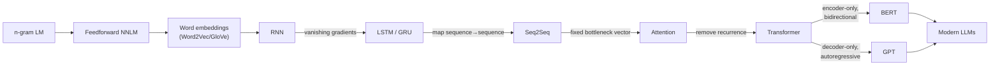

# The Evolution of Language Models — A Complete Study Guide

This guide walks through the evolution of neural language models in the order in which
each idea solved a limitation of the previous one. Every chapter follows the same
structure so you can build a clear mental model:

1. **What it is** — the core idea in plain language.
2. **Why it appeared** — the limitation of the previous model it fixes.
3. **Complete architecture** — a diagram plus every component explained.
4. **How it does language modelling** — the math and the data flow, step by step.
5. **Training** — loss functions and how learning happens.
6. **Limitations** — what it still cannot do well.
7. **How it gave rise to the next model** — the bridge to the following chapter.

## Reading order

| # | Chapter | Key idea introduced |
|---|---------|---------------------|
| 0 | [Foundations](01-foundations.md) | What a language model is; n-grams → neural LMs → word embeddings |
| 1 | [RNN](02-rnn.md) | A hidden state that carries memory across a sequence |
| 2 | [LSTM & GRU](03-lstm-gru.md) | Gates that preserve long-range memory |
| 3 | [Seq2Seq](04-seq2seq.md) | Encoder–decoder for mapping one sequence to another |
| 4 | [Attention](05-attention.md) | Let the decoder look back at all encoder states |
| 5 | [Transformer](06-transformer.md) | Self-attention only — remove recurrence entirely |
| 6 | [BERT](07-bert.md) | Bidirectional pre-training (encoder-only) |
| 7 | [GPT](08-gpt.md) | Autoregressive pre-training (decoder-only) |
| 8 | [Beyond](09-beyond.md) | Scaling, T5, instruction tuning, RLHF, modern LLMs |
| 10 | [Understanding Foundation Models](10-foundation-models.md) | Training data, modeling, post-training, sampling (Chip Huyen, Ch. 2) |
| 11 | [Evaluation Methodology](11-evaluation-methodology.md) | Perplexity, exact/similarity eval, AI-as-a-judge, comparative ranking (Chip Huyen, Ch. 3) |

## The one-picture summary

## The single thread that connects everything

Every model in this guide is trying to answer one question well:

> Given some context of words, what is the probability of the next (or a missing) word?

$$P(w_1, w_2, \dots, w_T) = \prod_{t=1}^{T} P(w_t \mid w_1, \dots, w_{t-1})$$

The entire history below is a series of better and better ways to model that conditional
probability $P(w_t \mid \text{context})$ — first with counts, then with recurrence, then
with gates, then with attention, and finally with pure self-attention at massive scale.
