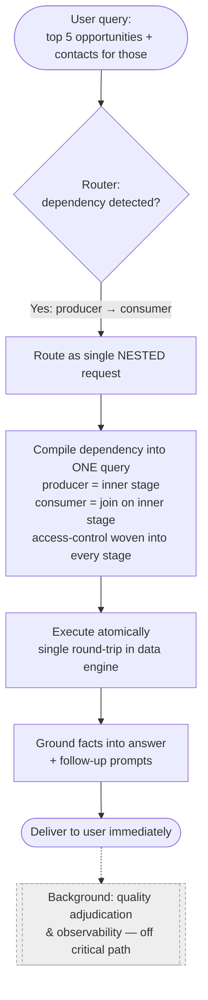
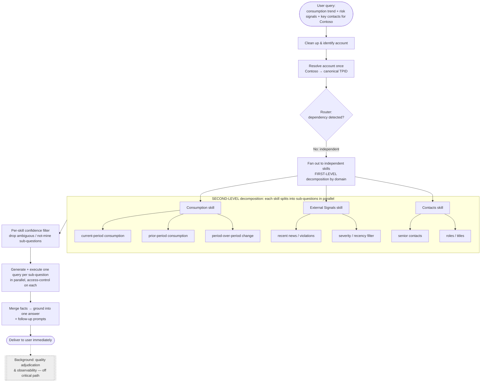

# Account Researcher — Novel Machine Logic & Technical Workflow

**Question — 1. Please describe the specific sequence of machine-executed steps that you believe is novel. In particular:**

---

## Subquestion — What are the exact runtime steps performed by the orchestrator versus the skill?

- **Two levels of decomposition** — The system understands a question at two very different altitudes. At **Level 1**, the orchestrator's single skill-detection inference decides *which domains of data* the question touches, emitting either a set of independent skill names or the single `Nesting` signal. At **Level 2**, each skill separately runs its own question splitter to break the same question into fine-grained sub-questions that only make sense inside its own domain, working from its bounded domain metadata, business rules, worked examples, and interpretation guidance. Neither level knows how the other one decomposed the work, which is a deliberate design choice, not an accident.

- **Routing that also judges dependency in one step** — When a question arrives, the orchestrator does two things in a single skill-detection inference: it picks the relevant specialist skills, and it decides whether those skills can run side by side or whether one actually depends on another's output. That dependency judgment is built directly into the routing decision — surfaced as either a set of independent skill names or the single `Nesting` signal — instead of being worked out later by a separate planning stage.

- **Entity resolved once, then broadcast** — Before anything is handed off, the orchestrator turns any real-world entity in the question (say, a company name) into a single canonical identifier — the canonical `AccountDetails`, including the TPID — and it does this exactly once. That resolved identity is passed down to every skill unchanged, so no skill ever has to guess at or re-resolve who the user meant.

- **Clean packages instead of shared memory** — The orchestrator and the skills never share state or talk to each other directly. The orchestrator sends each skill a clean, structured request package — the rephrased question plus the frozen canonical `AccountDetails` (including the resolved TPID) — and receives a clean, structured result package back, carrying status, facts, timing, and trailing prompts. There is no free-form chatter and no shared scratchpad.

- **In-skill filtering before any work is done** — Each skill doesn't blindly answer every sub-question it can imagine. It keeps only the ones that match its own domain knowledge and discards anything ambiguous or anything that its overlapping-scope ("not mine") metadata marks as belonging to a neighboring skill — a domain-relevance and exclusion judgment rather than a numeric confidence score — and it does this *before* generating any SQL or DAX, so effort is never wasted on branches that were never its job.

- **Answer delivery separated from quality judgment** — The decision about whether an answer "passed" or "failed" is deliberately decoupled from delivering it. The user gets their response immediately, while the more careful quality check — background telemetry and, when configured, an optional validator — happens afterward in the background, where it is recorded without ever slowing down or altering what the user already received.

---

## Subquestion — How does the system exchange cross-skill metadata?

- **No direct channel between skills** — The skills are intentionally kept unaware of one another. They never message each other and never read or write shared state, which removes an entire class of coordination problems.

- **A fixed, one-directional flow** — Everything a skill needs moves through the orchestrator in a fixed shape: resolved entity information travels *down* to the skills in one identical request package (the rephrased question plus the frozen canonical `AccountDetails`, including the resolved TPID), and retrieved facts travel back *up* in a uniform result package (status, facts, timing, and trailing prompts).

- **Each skill knows what isn't its job** — Every skill carries its own machine-readable overlapping-scope metadata describing the sub-intents that *look* like they belong to it but actually belong to a neighboring skill. When it breaks a question down, it checks its candidates against that "not mine" list and quietly drops the ones that aren't its responsibility, before any query is generated.

- **De-duplication decided locally, not negotiated** — Because each skill resolves ownership on its own against that list — reasoning only over its own bounded per-skill context, not the whole catalog — overlapping requests get de-duplicated in a distributed way with no back-and-forth. The end result is that any given sub-intent is answered by exactly one skill, decided cleanly at the boundary.

---

## Subquestion — How are recursive sub-intent graphs generated and expanded?

- **The shape of the work is decided at routing time** — Whether a question is a set of independent tasks or a chain of dependent ones is decided the moment it is routed, not discovered later by a planner. The router's single skill-detection inference raises one of two signals: a set of independent domains that can run in parallel, or the single `Nesting` marker meaning "this is nested — one part feeds another." This is the first (domain-level) of the two decomposition levels; the second (sub-question level) happens inside each skill.

- **Independent questions simply fan out** — When the parts don't depend on each other, each domain is asked its piece concurrently (with bounded fan-out), each skill's own sub-questions also run concurrently, and the pieces are recombined afterward.

- **Dependent questions are compiled into one query** — For a `Nesting` request the nested skill intentionally keeps splitting disabled so the compound producer→consumer intent stays intact. Instead of running the first part, capturing its results, feeding them back through the model, and then running the second part, its NL2SQL stage compiles the entire dependency into a single query: the part that produces the intermediate result becomes an inner CTE, and the part that consumes it is expressed as a join against that CTE, with the canonical-account join and RLS predicate carried through the applicable stages. The whole dependency is resolved atomically, inside the data engine, in one round-trip.

---

## Subquestion — How are confidence scores calculated, branches pruned, and fallbacks triggered?

- **Confidence judged where the knowledge lives** — Rather than a single central scorer that has to know everything, each skill judges relevance for itself. This is domain-relevance and exclusion-guided pruning, not a universal numeric confidence formula: each skill compares its candidate sub-questions against its own domain description, worked examples, business rules, interpretation guidance, and overlapping-scope metadata, and only admits the ones that match cleanly and unambiguously.

- **Pruning happens before any cost is incurred** — Anything ambiguous, or belonging to a neighboring skill, is dropped *before* a query is generated or run, so the pruning saves both a model call and a data lookup.

- **A deterministic fallback at every stage** — The system is built to keep working when pieces stumble, with a fixed plan B at each stage rather than model improvisation: if the question can't be cleanly reformulated it proceeds with the original wording; if it can't be split sensibly it's treated as one whole question; if a provider is throttled or rate-limited (e.g. HTTP 429) the request is retried and re-routed to the configured secondary endpoint; if one branch fails the others carry on and successful results are preserved; and on no-data or terminal failure it returns a controlled result rather than fabricating one. No single hiccup takes down the whole request.

- **Quality judgment kept off the critical path** — Clear, terminal failures fall back to a defined safe response immediately, while the nuanced "did this actually answer the question" check — background telemetry and, when configured, an optional validator — runs out of band. Its verdict is recorded for later but never delays or rewrites the answer the user already has.

---

## Subquestion — Which portions of the workflow differ from existing planner-based multi-agent systems?

- **Two-level decomposition** — It decomposes intent at two altitudes (Level 1 by domain via the skill-detection inference, Level 2 by sub-question inside each skill's own splitter), rather than once into a single flat task list the way a conventional planner does. This coupling of two-level decomposition with distributed exclusion under bounded per-skill context is one of the two principal independent claim candidates (**Claim B**).

- **Dependencies compiled, not sequenced** — It turns a dependency between tasks into one atomic query — producer as an inner CTE, consumer as a join against it — rather than a sequence of tool calls whose intermediate results must be passed from step to step. Coupled with routing-time topology selection, this atomic governed dependency compilation is the other principal independent claim candidate (**Claim A**).

- **Topology chosen at routing time** — It commits to the *shape* of the work in the same step it decides *what* the work is: one skill-detection inference emits both the relevant domains and how they relate — a flat parallel set of skill names, or the distinct `Nesting` signal when one part feeds another. The execution path is fixed before any tool runs. A conventional planner instead builds a task graph that an agent loop must hold, interpret, re-evaluate after each step, and walk node by node. Here there is no such loop and no evolving graph — the branch is picked once and executed, which makes the flow deterministic and inspectable, removes per-step re-planning latency, and avoids failure modes like stalled loops and mis-scheduled dependencies.

- **Identity resolved once** — It resolves entity identity a single time — to the canonical `AccountDetails`/TPID — and broadcasts it unchanged, rather than resolving it again inside each tool.

- **Distributed de-duplication** — It avoids overlapping work through each skill's own overlapping-scope exclusion metadata, rather than relying on a planner's reasoning or a shared memory. This also keeps token usage low: no single model call ever has to ingest every domain's full metadata at once to work out who owns what. Instead, each skill carries only its own limited slice of metadata (its domain description plus its "not mine" exclusion list) and reasons over just that slice, and the skills do this in parallel. Splitting a large context into small per-skill contexts that run concurrently means far fewer tokens per call, which sidesteps the token-limit ceiling and the rate/throughput throttling that a single monolithic, all-metadata prompt would run into.

- **Security woven into the query** — In the nested SQL route it builds access control into the applicable stages of the compiled query — the allowed-account predicate and canonical account join carried through intermediate and final stages — rather than applying it separately at each individual tool call.

- **Asynchronous quality checking** — It runs quality checking in the background, off the critical path, rather than placing a validator in the middle of the response flow. This avoids response latency. 

- **Nested query answering** — When a multi-domain question involves a dependency, the system recognizes that dependency at routing time and compiles it into one uniformly-governed query that runs atomically — collapsing what a conventional planner would run as several separate, individually-secured steps into a single governed execution.

---

## Subquestion — A step-by-step example using a representative user query would be helpful.

**Representative query (nested dependency query):** *"Show me the top 5 open opportunities for an account by qualified pipeline, and the key contacts for those opportunities."* The second half clearly depends on the first — the contacts wanted are the contacts for *those* top opportunities.

- **Recognize the dependency at routing** — The single skill-detection inference sees that the contacts are wanted *for those* opportunities and, because one part depends on another, emits the `Nesting` signal — routing the whole thing as a single nested request rather than two independent lookups. The nested skill keeps splitting disabled so the compound intent stays intact.

- **Compile the dependency into one query** — The "top opportunities" part becomes an inner CTE and the "contacts for those opportunities" part is expressed as a join against that CTE, with the canonical-account join and RLS predicate carried through the applicable stages.

- **Execute atomically** — That compiled query runs in a single round-trip, so the link between opportunities and their contacts is resolved inside the data engine itself, with nothing pulled back out and fed through the model a second time.

- **Ground and deliver** — The retrieved facts are summarized into a grounded answer with suggested follow-up questions and returned to the user right away.

- **Adjudicate in the background** — Separately and out of band, the system judges the quality of that answer and records observability data, without ever holding up the response.

- **The contrast** — A conventional planner would have planned two tasks, run the opportunities tool, fed its results back through the model to shape the contacts query, run the contacts tool, re-applied security at each hop, and only then stitched it all together. This system folds all of that into one recognized route, one compiled and uniformly-governed query, and one execution.

---

## Subquestion : A step-by-step example using a representative user query would be helpful.

**Representative query (compound, but independent across domains):** *"For Contoso, what's the current consumption trend, any recent external risk signals, and who are the key executive contacts?"* Here one account is mentioned, but the three asks don't depend on each other — they can all be answered side by side. This shows the two-level decomposition end to end: the orchestrator splits by *domain*, and each skill then splits again by *sub-question*.

- **Clean up and identify** — The system rewrites the question into a canonical form and identifies the single account being referred to ("Contoso").

- **Resolve the account once** — It turns "Contoso" into one canonical identifier (TPID or Top-Parent ID that is recognised by Microsoft) and carries that identity forward, so all three domains reason about exactly the same account without re-resolving it.

- **Route into multiple independent skills (first level of decomposition)** — The skill-detection inference recognizes there is no dependency between the parts and emits a flat set of independent skill names — for example a **Consumption** skill, an **External Signals** skill, and a **Contact & Org** skill in this question's case — to run concurrently rather than a single `Nesting` route.

- **Each skill decomposes into its own sub-questions (second level of decomposition)** — Working only against its own bounded domain metadata, business rules, and worked examples, and in parallel with the others:
  - The **Consumption** skill splits "current consumption trend" into sub-questions like *current-period consumption*, *prior-period consumption*, and *period-over-period change*.
  - The **External Signals** skill splits "recent external risk signals" into *recent news/violations* and *severity or recency filtering*.
  - The **Contacts** skill splits "key executive contacts" into *who the senior contacts are* and *their roles/titles*.

- **Filter each sub-question before doing work** — Every skill keeps only the sub-questions that match its own domain and drops anything ambiguous or owned by a sibling (via its overlapping-scope "not mine" metadata) — a domain-relevance and exclusion judgment made before query generation — so no two skills answer the same slice and no wasted queries are generated.

- **Generate and execute per sub-question, in parallel** — Each surviving sub-question is turned into its own executable query and run concurrently (with bounded fan-out), each carrying the mandatory access-control rules. The account identity is identical across all of them because it was resolved once up front.

- **Gather, ground, and deliver** — The facts from all skills flow back up in the same uniform result shape, are merged, and are summarized into one grounded answer (consumption trend + risk signals + key contacts) with suggested follow-ups, returned to the user right away.

- **Adjudicate in the background** — Quality scoring and observability are recorded out of band, without holding up the response.

- **The contrast** — Because the parts are independent, there is no producer→consumer compilation here; the novelty on display is the *two-level fan-out* — one account resolved once, split across domains, and each domain independently split into confidence-filtered sub-questions running in parallel — versus a single planner trying to reason over all domains' metadata in one large, throttling-prone pass.

---

**Question — 2. Technical improvement. Please identify any measurable technical improvements provided by the approach, such as:**

---

## Subquestion — Reduced token consumption or LLM inference costs

- **Bounded per-skill context instead of one giant prompt** — Every call an LLM makes costs money in proportion to how much text (tokens) you send it. A common design mistake is to stuff *all* the information about *every* skill into one enormous prompt and ask the model to figure everything out at once — that prompt gets huge, expensive, and slow, and it eventually bumps into the model's size limit. This system never does that. The router is shown only short, one-line descriptions of each skill (just enough to pick the right ones), and each skill then works with only its *own* small pocket of information — its own domain notes, a few worked examples, and its short "these things aren't mine" list. So the amount of text in any single call depends on *one* skill, not on how many skills exist in total. Practically, that means you can keep adding new skills to the system and the cost per question barely moves, instead of creeping up every time the catalog grows.

- **Compilation removes re-feed round-trips** — When one part of a question depends on another (e.g. "find the top opportunities, then get contacts for *those*"), a typical agent runs the first part, takes the rows that come back, and *pastes them back into the model* to build the next step. Those pasted-in results can be large and unpredictable in size, and you pay tokens for them every time. This system avoids that entirely: it expresses the whole dependency as a single query, so the intermediate results stay inside the database and are never sent back through the model. That removes the biggest and most variable chunk of token cost that multi-step agents rack up. Both effects are quantified with Qual Beat champion-challenger runs — same model family, permissions, data, and question set — recording input/output tokens, model-call count, and cost per request across single-domain, independent multi-domain, and nested requests; the numerical reduction remains **TBD until measured**.

## Subquestion — Reduced latency

- **One reasoning pass + one execution, not N serial hops** — Latency is mostly about how many things have to happen *one after another* before the user sees an answer. A typical planner works like a relay race: think about the next step, call a tool, wait for it, read the result, think again, call the next tool — and each of those "think" steps is a full round-trip to the model that must finish before the next one can start. So the more parts a question has, the longer the chain and the longer the user waits. This system flattens that chain. Deciding what to do (routing) is a single model call; independent parts of the question are then run parallely rather than one-by-one; and when one part depends on another, the whole thing is answered by a single query to the database instead of a back-and-forth loop. The net effect is that the time to answer stays roughly the same whether the question has two parts or six — it doesn't stack up hop after hop.

- **Quality checking off the critical path** — Checking whether an answer is actually good normally means running *another* model call, and if you do that before showing the answer, the user waits for it. Here that check is moved out of the way: the answer is delivered to the user right away, and the quality check runs afterward in the background just for monitoring and record-keeping. Because it happens after the fact, it adds nothing to the time the user actually experiences. These gains are reported as p50/p95 end-to-end and component latency, and latency versus the number of selected domains, against a controlled ReAct/LLMCompiler-style planner baseline (same model, data, permissions, and questions); the qualitative claims are not converted to percentages until those runs complete (**TBD**).

## Subquestion — Reduced duplicate processing across skills

- **Declarative ownership at the boundary** — When a question touches several domains, there's a real risk that two skills both think a certain piece is theirs to answer — for example, a question about "key contacts and their opportunities" could have both the Contacts skill and the Opportunity skill trying to pull contact information. If that happens, you pay for the same work twice: two skills query overlapping data, and then something has to notice the overlap and merge the duplicate answers. This system prevents that up front. Every skill carries a short exclusion ("these things aren't mine") list that spells out the look-alike asks that actually belong to a neighboring skill, and it quietly drops anything on that list before doing any work. Because each skill makes that call on its own — with no negotiation or messaging between skills — any given piece of the question ends up being handled by exactly one skill. The result is no repeated queries, no wasted compute, and no messy step later to reconcile two versions of the same answer. The measurable outcome is the duplicate sub-intent/query rate per request — target zero known overlap on a curated overlap test set, with baseline and achieved values **TBD**.

## Subquestion — Improved scalability of large skill ecosystems

- **Add domains without enlarging a central prompt** — In many agent systems, everything the model can do is described in one big central prompt. Every time you add a new capability, that prompt gets longer — and a longer prompt is slower, more expensive, more likely to hit the model's size limit, and, importantly, harder for the model to reason over accurately (with more options crammed in, it starts picking the wrong one more often). This system doesn't have that single growing prompt. A new skill is added simply by shipping its *own* small bundle of information — its domain notes and its short exclusion list. Because the router only ever sees short one-line summaries and each skill only reads its own bundle, adding a new skill doesn't make any single call bigger. So both the accuracy of picking the right skill and the cost per question stay steady as the catalog grows, instead of slowly degrading the entire agent call.

- **Independent, horizontally scalable skills** — Because the skills don't share any memory and never depend on each other mid-flight, they can all run at the same time and can be scaled independently. If one domain suddenly gets a lot of traffic, you can add more copies of just that skill without touching the rest. In infrastructure terms, the system grows by adding more parallel workers ("scaling out") rather than by needing one ever-bigger, ever-more-powerful central component ("scaling up") — which is cheaper, more resilient, and far easier to operate as demand increases. To validate, measure prompt tokens and routing accuracy as the registered catalog grows, plus throughput and p95 latency under uneven per-skill load (**TBD**).

## Subquestion — Improved security, permissions isolation, or governance

- **Row-level access woven into the compiled query stages** — In enterprise data, who is allowed to see which rows matters enormously — a seller should only see the accounts they're entitled to, not the whole company's data. In a step-by-step agent, that permission check has to be re-applied at every individual skill call, and if even one step forgets it or applies it slightly differently, private data can leak. In the verified nested SQL route this system removes that risk by building the permission rule — the allowed-account predicate and canonical account join — directly into the applicable intermediate and final stages of the single compiled query, so every part of it is filtered to only the data the user is allowed to see. This is narrower and more accurate than claiming that all AR backends implement RLS identically; the patent claim should center on the verified nested SQL mechanism and the resolve-once identity discipline rather than a blanket per-backend guarantee.

- **Resolve-once identity reduces the attack/error surface** — Because the account is identified and locked to a single canonical identifier one time at the very start, every downstream step works off that same trusted identity. There's no repeated "which account/ entity did the user mean?" resolution happening separately inside each skill — which is exactly the kind of place where things can drift (one tool resolves it slightly differently) or be permissioned inconsistently (one skill checks access, another forgets). Doing it once, up front, and passing it down means there are far fewer places where a mistake or an exploit could creep in.

## Subquestion — Improved reliability through partial-completion handling

- **Deterministic fallback at every stage** — Real systems fail in small ways all the time — a model call times out, a step returns something garbled, a service is momentarily overloaded. In many agents, any one of those hiccups can bring the whole request down. This system is built so that every stage has a simple, pre-defined "plan B" that doesn't rely on the model to improvise: if the question can't be cleanly rewritten, it just uses the original wording; if it can't be sensibly split into sub-questions, it treats the whole thing as one question; if a service is overloaded, it quietly re-routes to a backup. Because each of these fallbacks is fixed and predictable, a single stumble never derails the request — it just quietly takes the safe path and keeps going.

- **Failure isolation across independent branches** — When a question fans out across several skills (or several sub-questions), each one runs on its own. If one of them fails — say the External Signals lookup errors out — it doesn't drag down the others. The parts that succeeded are still gathered up and returned, and the user gets a useful, mostly-complete answer with a clear picture of what came back, rather than a blank error because one piece went wrong. In other words, the system degrades gracefully to "here's what I could find" instead of failing all-or-nothing. Reliability is quantified as the Full/Degraded/Failed distribution, useful partial-answer rate, terminal-failure rate, and 429 recovery rate under injected component failures (**TBD**).

---

**Question — 3. Prior art awareness. Please identify any known prior art, products, papers, frameworks, or internal systems that are similar to this approach, and explain how the proposed solution differs. Examples may include:**

---

## Subquestion — Planner-based agent architectures

- **What they are** — Architectures where a central planner (e.g. ReAct, Plan-and-Solve, LLMCompiler, Tree-of-Thoughts-style planners) reads the user request and emits an explicit multi-step plan or task graph, which a runtime then executes step by step, re-invoking the model to decide the next action after each observation.
- **How this differs** — Here the plan is not an artifact the system walks; decomposition happens at two fixed altitudes (domain, then sub-question) and the *dependency topology is chosen at routing time* as a single signal rather than iteratively discovered. There is no per-step re-planning loop, no evolving task graph held in memory, and dependent work is compiled into one atomic query instead of being run as a sequence of separately-executed steps. Concretely, this yields measurable advantages over classic planner-based architectures:
  - **Latency & response time** — A planner pays for a model round-trip *at every step* (plan → observe → re-plan → act), so its wall-clock time grows with the number of hops, and dependent steps are inherently serial (step B can't start until step A's rows return and are re-fed to the model). This architecture collapses those hops: routing is one inference, independent domains fan out fully in parallel, and a dependency is compiled into a **single atomic query executed in one database round-trip** — turning an N-hop serial chain into essentially one reasoning pass plus one execution. Fewer model calls also means lower token spend and far less exposure to per-call rate/throughput throttling.
  - **Determinism & reproducibility** — Because the control topology is fixed the moment routing happens (rather than emerging from a loop that re-decides after each observation), the same question follows the same path every time. Planner loops are non-deterministic by nature — a slightly different intermediate "thought" can send execution down a different branch — which makes them hard to test, cache, and certify. Here the path is stable and cacheable.
  - **Explainability & auditability** — The chosen topology is an explicit, inspectable signal, and for dependent work the entire logic is a *single readable query* whose stages map directly to the user's sub-intents. An auditor can look at one artifact and see exactly what was asked and how it was answered. A planner's behavior, by contrast, is spread across a transcript of intermediate reasoning steps and tool outputs that must be reconstructed to understand what actually happened.
  - **Quality control** — Correctness of a dependency is guaranteed by the database's join semantics inside one atomic execution, rather than depending on the model faithfully copying step A's rows into step B's next call — a common failure point in planner loops (dropped rows, truncated context, mis-parameterized follow-ups). Final answer-quality checking is then run **off the critical path**, so quality assurance adds zero latency to what the user receives while still being recorded for monitoring.
  - **Reliability & failure isolation** — With no long-lived, mutating task graph there are no stalled loops, no mis-scheduled steps, and no dependencies the loop wrongly believes are ready. Independent branches fail in isolation (one skill's failure doesn't sink the others), and every stage has a deterministic fallback — so partial failures degrade gracefully instead of derailing the whole request.
  - **Scalability of the skill ecosystem** — Adding a new domain doesn't enlarge a central planner prompt or its search space; each skill reasons only over its own bounded metadata in parallel. The system scales to many domains without the token-blow-up and quality decay that planner-based approaches suffer as the tool/task space grows.
  - 
## Subquestion — LangGraph, CrewAI, AutoGen, Semantic Kernel, OpenAI Agents, Bedrock Agents, Vertex AI Agents, etc.

- **What they are** — General-purpose agent frameworks and SDKs for building LLM applications. They differ in style but share the same core execution model — a runtime that either traverses an explicit graph of steps or loops a set of agents/tools until the task is done:
  - **LangGraph** — a stateful graph of nodes that the runtime walks, re-evaluating state at each node.
  - **CrewAI** — multiple role-playing agents that collaborate and hand work off to one another.
  - **AutoGen** — agents that solve a task through a back-and-forth conversational loop.
  - **Semantic Kernel** — a planner that sequences reusable plugins/skills into a plan.
  - **Hosted agent services (OpenAI / Bedrock / Vertex)** — managed tool-calling and orchestration where the model selects and invokes tools, often step by step.

- **How this differs** — All of the above run the task by *walking a mutable graph or conversation loop*, applying security at each node/tool call and often checking quality in-line. This approach differs from that model on six specific points:
  1. **Fixed topology instead of a traversed graph** — the control flow (parallel vs. nested) is decided once at routing time and then simply executed, rather than being discovered and re-evaluated step by step.
  2. **Resolve identity once, not per tool** — the entity is resolved to a canonical identifier a single time and broadcast to every skill, instead of each tool re-resolving it.
  3. **Compile dependencies, don't sequence them** — a cross-domain dependency becomes one atomic, uniformly-governed query executed in a single round-trip, rather than a chain of tool calls passing results between them. LLMCompiler in particular supports parallel/dependent function calls but ordinarily retains a graph of function executions; here the nested route replaces that cross-domain tool chain with one governed data-engine query.
  4. **Bounded per-skill reasoning, not one giant prompt** — domain-relevance and exclusion-based pruning happen inside each domain's small metadata slice in parallel, avoiding the monolithic, throttling-prone reasoning pass that a single all-tools prompt incurs.
  5. **Quality checking off the critical path** — answer adjudication runs in the background so it never adds latency, instead of sitting in-line in the response flow.
  6. **Coupled combination, not a bare CTE (text-to-SQL obviousness defense)** — generating a CTE is known in isolation; the invention is the coupled combination that additionally detects a cross-skill dependency during routing, selects a distinct topology, carries canonical identity and RLS through the compiled stages, and coexists with distributed skill-local ownership under bounded per-skill context. These coupled constraints — not a CTE by itself — are what differ from ordinary NL2SQL.

**References:**
- **ReAct** — Yao et al., *ReAct: Synergizing Reasoning and Acting in Language Models* (ICLR 2023). arXiv:2210.03629 — https://arxiv.org/abs/2210.03629
- **Plan-and-Solve** — Wang et al., *Plan-and-Solve Prompting: Improving Zero-Shot Chain-of-Thought Reasoning by Large Language Models* (ACL 2023). arXiv:2305.04091 — https://arxiv.org/abs/2305.04091
- **LLMCompiler** — Kim et al., *An LLM Compiler for Parallel Function Calling* (ICML 2024). arXiv:2312.04511 — https://arxiv.org/abs/2312.04511
- **Tree of Thoughts** — Yao et al., *Tree of Thoughts: Deliberate Problem Solving with Large Language Models* (NeurIPS 2023). arXiv:2305.10601 — https://arxiv.org/abs/2305.10601

## Subquestion — Multi-agent orchestration frameworks

- **What they are** — Frameworks that coordinate several agents/tools that converse, hand off, or share a blackboard/scratchpad to solve a task collaboratively.
- **How this differs** — Skills here never talk to each other, never share mutable state, and never negotiate ownership. Coordination is strictly one-directional through the orchestrator (canonical entities down, uniform facts up), and cross-skill overlap is resolved *locally and declaratively* by each skill's own "not-mine" overlapping-scope metadata before execution — eliminating inter-agent chatter, shared-state failure modes, and the token cost of a shared, all-context reasoning step, and reducing the amount of cross-domain context any one model call must ingest.

---

**Question — 4. Strategic value. Please describe the strategic importance of this invention to Microsoft products and services, including:**

---

## Subquestion — Target products or platforms

- **Seller and account-research Copilots** — Directly targets Microsoft's sales/account-intelligence experiences (e.g. MSX / Copilot for Sales-style scenarios) where a seller asks compound, cross-domain questions about an account and expects one grounded answer. It is already live in Account Researcher via its shipped Sales Agent integration.
- **Copilot and agent platforms** — Applicable to Microsoft 365 Copilot, Copilot Studio, and Azure AI agent/skill ecosystems as a reusable orchestration pattern over governed enterprise data.
- **Governed enterprise-data NL interfaces** — Any product that puts natural language over Fabric / Power BI semantic models / Azure SQL with row-level security benefits from the compile-dependency-into-one-governed-query approach.

## Subquestion — Expected competitive differentiation

- **Atomic, governed multi-hop answers** — Answering dependent multi-domain questions in a single uniformly-secured query is a latency and correctness advantage over competitors that chain tool calls and re-apply security per hop; validated by p95 latency and golden-set correctness.
- **Scales metadata without token blow-up** — Per-skill bounded metadata reasoning in parallel avoids the token-limit/throttling ceiling that monolithic all-tool prompts hit, so new domains can be onboarded without degrading routing; validated by tokens versus number of skills.
- **Deterministic, inspectable control flow** — Topology chosen at routing time yields predictable, auditable execution (important for enterprise trust/compliance) versus opaque agent loops; validated by route repeatability.
- **Security-first by construction** — Row-level access woven into the applicable stages of the compiled nested query is a strong enterprise differentiator over tool-call-site security.
- **Resolve-once canonical identity** — One canonical account/TPID broadcast to every skill gives consistent account context and permission behavior; validated by resolution-mismatch rate.
- **Distributed exclusion ownership** — Per-skill "not-mine" metadata means less duplicated generation and query work; validated by duplicate-work rate.
- **Partial completion and fallback** — Useful answers survive isolated failure; validated by degraded-success and terminal-failure rates. All of these values should be populated from Qual Beat rather than estimated.

## Subquestion — Whether the approach could become a foundational pattern across Copilot, agent, or skill ecosystems

- **Yes — as a reusable orchestration contract** — The resolve-once-broadcast account name/entity discipline, the declarative per-skill "not-mine" exclusion metadata, and the dependency-compilation step, trailing prompt or follow up prompt recommendation generation step are generic and could standardize how skills/agents are registered and composed.
- **Onboarding model for new skills** — New domains plug in by shipping only their own bundle — a short routing descriptor, bounded domain metadata, business rules, a question splitter, generation prompts, overlapping-scope exclusions, and a uniform invocation/result contract — without the central orchestrator having to absorb that domain's detailed reasoning, making it a scalable pattern for a growing skill marketplace/ecosystem.
- **Cross-Copilot applicability** — The two-altitude decomposition + off-critical-path adjudication pattern is domain-agnostic and could underpin many Copilot verticals beyond account research.

---

**Question — 5. Commercial use / disclosure timeline. Please provide the earliest known date (actual or anticipated) of:**

---

## Subquestion — Production deployment

- **Status / date** — 1 June 2026 deployed in production, integrated into Sales Agent. Counsel should confirm whether this deployment constitutes public use or another statutory disclosure event, and the exact deployment evidence/date should be recorded.

## Subquestion — Customer preview

- **Status / date** — 1 June 2026 (for consumption by sellers — ATUs, CSUs, STUs). Counsel should classify whether this access was confidential/internal or potentially public for US and non-US filing purposes.

## Subquestion — Public demonstration

- **Status / date** — Not yet done. Avoid a public demonstration until counsel confirms the filing strategy if foreign rights are desired.

## Subquestion — Conference presentation

- **Status / date** — Not yet done. Coordinate any future presentation with patent counsel before disclosure.

## Subquestion — Publication, blog post, paper, patent disclosure, or open-source release

- **Status / date** — Not yet done. The original internal submission deck was created in March 2026; its exact submission date, recipients, and confidentiality should be confirmed. The expanded technical write-up adds routing-time topology, governed nested compilation, resolve-once broadcast, distributed exclusion ownership, and off-path adjudication; counsel should determine whether these belong in the same filing, an amended disclosure, or a continuation/CIP.
