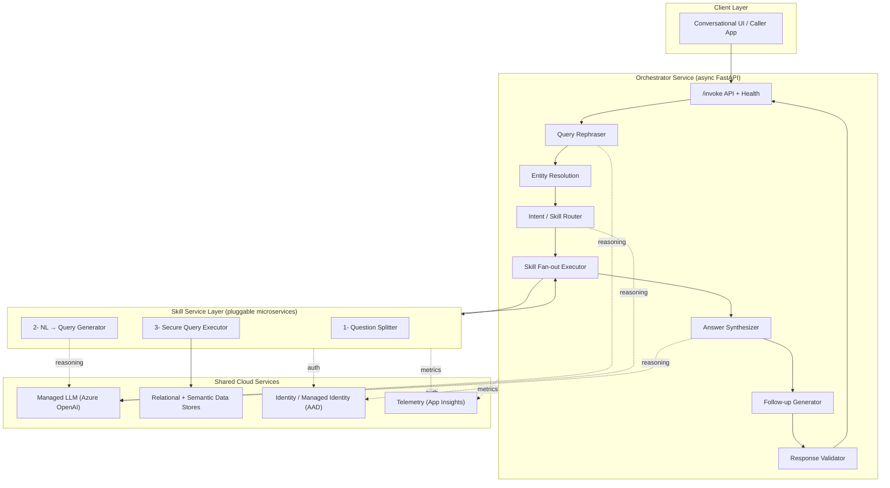
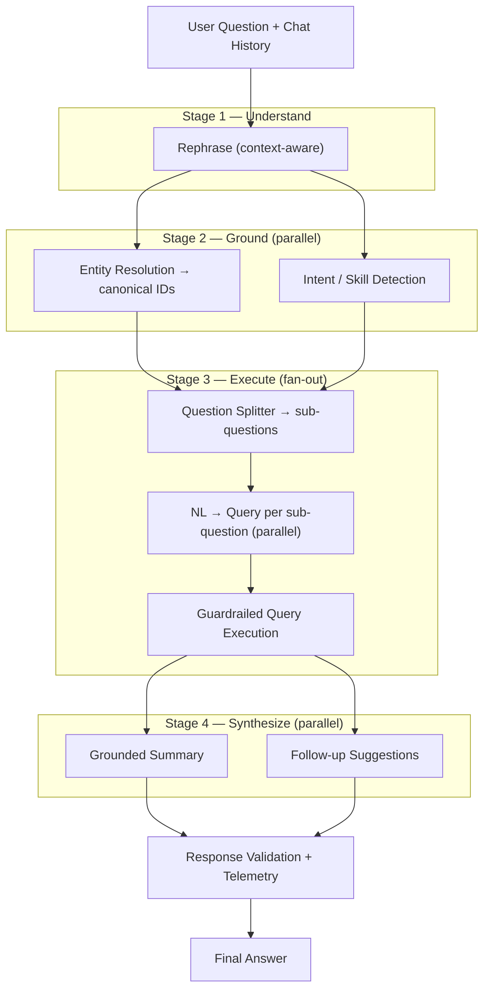
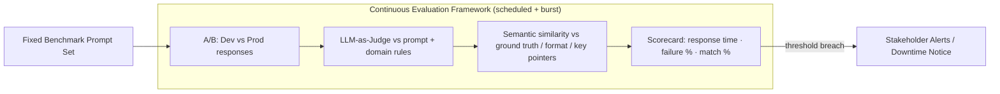

# Account Researcher Agent

> A cloud-native, **multi-agent conversational analytics platform** that turns plain-English business questions into governed, data-backed answers — orchestrating LLM reasoning, natural-language-to-query generation, live database execution, and automated summarization behind a single API.

- **Architecture style:** Two-tier agentic microservices (orchestrator + pluggable skill services)
- **Core stack:** Python · FastAPI (async) · Azure OpenAI (GPT-class LLMs) · Azure SQL / semantic models · Managed-Identity auth · Application Insights
- **Deployment:** Azure App Service (Linux) · gunicorn + Uvicorn workers · CI/CD pipelines

---

## What Is It?

The Account Researcher Agent is an **end-to-end natural-language interface over enterprise data**. A user asks a question in conversational language (e.g., *"How is this account trending this quarter and who owns the open items?"*) and the system autonomously:

1. **Understands and reformulates** the intent (context-aware rephrasing over chat history),
2. **Resolves real-world entities** (mapping fuzzy account names to canonical identifiers - similarity based),
3. **Routes** the request to the relevant data domain(s),
4. **Generates executable queries** from natural language (NL→SQL / NL→analytical query),
5. **Executes them safely** against live data stores,
6. **Synthesizes a grounded, human-readable answer** and proposes intelligent follow-up questions (Trailing prompts module).

Architecturally it is split into two independently deployable, horizontally scalable services:

- **Orchestrator service** — the "brain" that owns the conversation lifecycle, LLM reasoning steps, parallel coordination, resilience, and observability.
- **Skill service(s)** — specialized, pluggable microservices (one per data domain) that own the natural-language-to-query translation and secure data execution for their domain.

This **separation of orchestration from execution** lets new data domains be onboarded as new skill services without touching the core reasoning loop.

---

## Why It Matters & Highlights

- **Democratizes data access** — non-technical users query complex relational and semantic data models in plain English, with no SQL knowledge required.
- **Agentic, not monolithic** — a coordinating orchestrator delegates to autonomous skill agents, mirroring modern multi-agent LLM design patterns (planner → tools → synthesizer).
- **Grounded answers, not hallucinations** — every answer is backed by a query that actually ran against live data; the LLM summarizes *retrieved facts* rather than inventing them.
- **Query decomposition (Query Splitter Module)** — compound questions are automatically split into independent sub-questions, answered in parallel, and recombined — enabling multi-part analytical reasoning.
- **Security-first data execution (Row Level MSSales Security)** — generated queries pass through a **read-only allow-list guardrail** before touching any database; all auth is **passwordless** via Managed Identity.
- **Engineered for latency** to drive down end-to-end response time— 
    - aggressive **async parallelism across all skill calls** and then the summariser at orchestrator provides a coherent summary from all skills
    - provider-side **prompt caching** using FSLs to return deterministic analytical queries if similar/ same prompt fired
    - staggered **warm-up** to keep the underlying semantic Model/ Hyperscale model warm with deterministic pings for the user at the start of user login itself, so that the backend is warm enough by the time user finishes typing the question
    - **deterministic** decoding and no hallucinations via prompts/ subquestion splitter/ FSLs/ ground truth rules
    - **connection pooling** of SQL Hyperscale.
- **Production-grade resilience** — the system is built to keep working even when parts of it fail or slow down:
  - **Smart retries** — if a call to the LLM or another service fails temporarily (a blip, a timeout), the system automatically tries again a few times. Each retry waits a little longer than the last (and adds a small random delay) so it doesn't hammer a struggling service all at once.
  - **Backup endpoint on overload** — if the primary LLM endpoint returns a rate-limit response ("too many requests"), the request is automatically re-routed to a secondary endpoint instead of failing.
  - **Geo-redundant BCDR** — the LLM endpoints and SQL servers are replicated across paired geographic regions for Business Continuity and Disaster Recovery. **Azure Front Door + API Management** sit in front to load-balance and route traffic across both geos in parallel, delivering fault tolerance, automatic failover, and controlled traffic distribution. BCDR (Business Continuity and Disaster Recovery) is also set up for the endpoints + SQL servers on parallel geo location to make it fault tolerant / load balanced and managed via Frontdroor + APIM to route users to both geos parallely to control traffic
  - **Graceful degradation** — if a non-essential step fails (for example, generating follow-up questions), the request doesn't crash; it skips that piece, records the issue quietly, and still returns a useful answer to the user.
- **Full observability** — correlation-ID propagation, per-module latency tracking, and structured telemetry to Application Insights for every request.
- **Presented for Patent:** *"Recursive Skill-Level Decomposition of User Intent, in Contrast to Monolithic Intent Processing, for multi level task Execution and Context-Aware Response Generation in Multi-Agent System"*
---

## Architecture

### System Architecture

The platform is a **layered, multi-service architecture**. A stateless API layer fronts an **orchestration layer** that coordinates a set of **LLM reasoning steps** and fans out to independently deployed **skill services**, all backed by shared **cloud services** (identity, LLM, data, telemetry).

### Request Lifecycle Pipeline

A single request flows through a deterministic pipeline in which **independent stages are executed concurrently** and every stage degrades gracefully on failure.

### What Each Module Does (Technical Deep-Dive)

Every stage is an independently testable unit; the orchestrator threads a **correlation ID** and a **latency tracker** through all of them.

**Stage 1 — Understanding**

1. **Query Rephraser**
   - An LLM call that rewrites the raw utterance into a **self-contained, context-resolved question** using the prior chat history (resolves pronouns, carries forward entity names (account names), expands abbreviations).
   - Emits a **structured payload** (via a delimiter protocol) carrying the clean question, extracted entity (account name) references, and feature flags (e.g., PPT-generation intent, comprehensive-summary-generation intent) that downstream stages branch on.

**Stage 2 — Grounding (executed concurrently via `asyncio.gather`)**

2. **Entity Resolution**
   - Maps free-text entity names (Account names) to **canonical identifiers** by calling a dedicated semantic-search based (from deterministic list of Microsoft Accounts) resolution API. Each entity is resolved **in parallel**, with per-entity error isolation (one failed lookup never fails the batch).

3. **Intent / Skill Router**
   - An LLM classifier that inspects the reformulated question against a set of **domain metadata descriptors** and returns the set of relevant skills (data domains) to invoke — supporting **multi-skill fan-out** for cross-domain questions.
   - Supports an optional **allow-list filter** so callers can constrain which domains are eligible.

**Stage 3 — Execution (per-skill, with internal fan-out)**

4. **Question Splitter**
   - An LLM step inside each skill service that **decomposes a compound question into atomic sub-questions**, each independently answerable by a single query. Robust parsing tolerates JSON arrays, quoted lists, or comma-separated output, and falls back to the whole question if decomposition is unusable.

5. **Natural-Language → Query Generator**
   - Converts each sub-question into an executable query (SQL for relational stores; DAX analytical query language for semantic models) using a prompt assembled from a **data-model description**, injected **business rules**, and **few-shot exemplars** retrieved from a per-skill registry.
   - **Prompt-caching optimization:** the large, static system prompt is split from the small per-sub-question user message on a sentinel boundary, so the LLM provider can **cache the identical system prefix** across all parallel calls — dramatically cutting token cost and latency.
   - **Determinism + throughput:** calls use a **fixed decoding seed** (reproducible output + server-side cache hits), a **token cap** to prevent runaway generation, and **staggered dispatch** (the first call warms the prompt cache before the rest fire).

6. **Secure Query Executor**
   - **Read-only guardrail:** before execution, every generated statement is validated by an allow-list parser — only `SELECT` / `WITH` / `DECLARE` prefixes are permitted and any `INSERT/UPDATE/DELETE/MERGE/DROP/ALTER/CREATE/TRUNCATE/EXEC/GRANT/REVOKE` is **hard-blocked** (SQL-injection / destructive-statement defense).
   - **Passwordless data auth:** connects using an **AAD access token injected as an ODBC connection attribute** — no stored credentials.
   - **Connection pooling:** a thread-safe pool reuses warm connections (skipping repeated TCP + TLS + token negotiation), with **liveness probes** and **staleness eviction** to keep the pool healthy.
   - **Result governance:** row caps + truncation flags keep payloads bounded; results are serialized for both the answer path and telemetry.

**Stage 4 — Synthesis (executed concurrently)**

7. **Answer Synthesizer**
   - An LLM call that composes a **grounded natural-language answer** from the executed query results. Raw generated queries are **stripped** from the model input to reduce tokens and avoid leaking implementation detail; one layer of JSON escaping is removed to further shrink the prompt.
   - Supports pluggable summarizer personas (e.g., a specialized summarizer for specific agent modes. Checks the user login against Microsoft HR data to check business role and summariser LLM prompt used for decicated fixed personas accordingly) and a **fallback answer** if synthesis fails.

8. **Follow-up Generator**
   - Produces a ranked list of **suggested next questions** from the aggregated skill outputs, based on domain rules, key metrics, persona specific metrics, frequently asked questions by the logged in person in past (retrieved from telemetry).

**Stage 5 — Continuous Evaluation Framework (Automated Quality Gate)**

A standalone, scheduled harness that continuously guards response quality and platform health by replaying a **fixed, curated set of benchmark prompts** against the live system and scoring the outputs. It is the automated regression + quality-assurance layer that sits outside the request path.

9. **A/B Environment Comparison**
    - Fires the **same benchmark prompt set** against both the **development** and **production** deployments and diffs their agentic responses — surfacing regressions, drifts, or unintended behavior changes **before** a release is promoted (dev-vs-prod A/B testing).

10. **LLM-as-Judge Validation**
    - Uses an **LLM as an automated judge** to grade each response against the originating prompt and the applicable **domain/business rules** — checking factual grounding, rule compliance, tone, and completeness — producing a pass/fail verdict plus a rationale for every case.

11. **Ground-Truth & Format Scoring (Semantic Similarity)**
    - Compares each response against a curated **ground-truth answer set**, expected **metric lists**, **response-format expectations**, and required **key pointers**.
    - Rather than brittle exact-string matching, it embeds both the response and the reference and computes a **semantic similarity** score (document/embedding cosine similarity) — so a correct answer phrased differently still passes, while a semantically wrong one fails.

12. **Scheduled Runs, Load/Burst Testing & Alerting**
    - Runs on a **daily cadence**, with **burst ("test-storm") fires** that hammer the system with concurrent requests to double as a **load test**.
    - Tracks a rolling scorecard of **response time**, **failure percentage**, and **match percentage** (against both the previous batch and the ground-truth references), detecting regressions batch-over-batch.
    - On threshold breach (elevated latency, rising failures, dropping match rate), it **auto-issues downtime/failure notifications to stakeholders** — closing the loop from detection to alerting without human polling.

**Cross-cutting — Validation & Observability**

13. **Response Validator + Telemetry**
   - Assembles the final response, computes an overall pass/fail status, and fires **two structured telemetry payloads** (a metrics/"without-response" event and a content/"with-response" event) to Application Insights — including **per-module timings** rendered as precise timespans and accumulated non-fatal error detail.

---

## Modules & Key Components

### Orchestration Layer

| Capability | What It Does | Technical Approach |
| --- | --- | --- |
| Query Rephraser | Context-resolved question rewriting | LLM call over chat history + delimiter-encoded structured output |
| Entity Resolution | Fuzzy name → canonical ID | Parallel API calls with per-entity error isolation |
| Intent / Skill Router | Select relevant data domains | LLM classifier over domain metadata, multi-select + allow-list |
| Skill Fan-out Executor | Invoke skills concurrently | Async HTTP fan-out with bearer-token propagation |
| Answer Synthesizer | Grounded final answer | LLM summarization over stripped, de-escaped skill results |
| Follow-up Generator | Suggested next questions | LLM generation with resilient parsing |
| Validator / Telemetry | Status + observability | Dual App Insights payloads, per-module latency tracking |

### Skill (Execution) Layer

| Capability | What It Does | Technical Approach |
| --- | --- | --- |
| Question Splitter | Decompose compound questions | LLM decomposition + tolerant multi-format parsing |
| NL → Query Generator | Natural language to executable query | Prompt assembly (schema + rules + few-shot), prompt-cache split, seeded decoding |
| Secure Query Executor | Safe live data execution | Read-only allow-list, AAD-token ODBC auth, pooled connections |

### Continuous Evaluation Layer

| Capability | What It Does | Technical Approach |
| --- | --- | --- |
| A/B Environment Comparison | Catch regressions before promotion | Replay fixed benchmark prompts on dev vs prod, diff responses |
| LLM-as-Judge Validation | Grade responses for quality & rule compliance | LLM judge scores against prompt + domain rules, verdict + rationale |
| Ground-Truth & Format Scoring | Validate correctness & format | Embedding-based semantic similarity vs ground truth, metric lists, key pointers |
| Scheduled Runs & Load/Burst Testing | Continuous QA + load testing | Daily cadence + burst fires, rolling scorecard (latency, failure %, match %) |
| Automated Alerting | Notify stakeholders on degradation | Threshold-breach detection → downtime/failure notifications |

---

## Technology Stack

- **Language / Framework:** Python, FastAPI (async)
- **Serving:** gunicorn + Uvicorn workers on Azure App Service (Linux)
- **LLM:** Azure OpenAI (GPT-class chat models) — NL→SQL / NL→DAX generation, rephrasing, routing, query splitter, follow-up prompts recommendation, summarization
- **Data:** Azure SQL Hyperscale (relational), semantic / analytical models (DAX)
- **Data access:** `pyodbc` + ODBC Driver 18, AAD-token connection attribute, pooled connections
- **Identity:** `azure-identity` (`DefaultAzureCredential`), Managed Identity, per-scope token cache
- **Resilience & traffic:** Azure Front Door + API Management (geo-redundant BCDR)
- **Evaluation:** LLM-as-judge, embedding-based semantic similarity, scheduled A/B + load testing in bust fire mode
- **Observability:** Application Insights telemetry
- **Delivery:** CI/CD pipelines, infrastructure-as-config app settings
