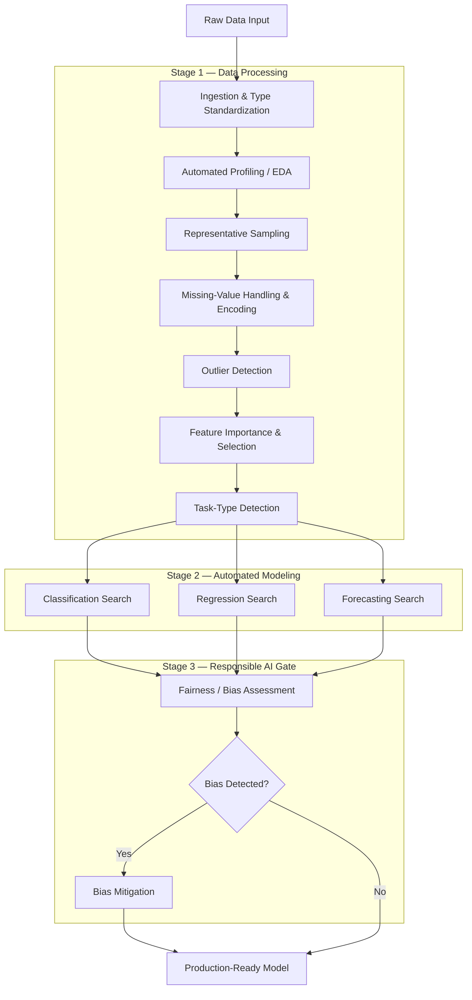

# AutoBrewML

> An automated machine learning (AutoML) framework built to democratize AI development while keeping **Responsible AI** and **data quality** at its core.

- **Documentation:** [DeepWiki – AutoBrewML Overview](https://deepwiki.com/microsoft/AutoBrewML/1-overview)
- **Distribution:** 
    - **Microsoft Open Source:** [microsoft/AutoBrewML](https://github.com/microsoft/AutoBrewML) 
    - **PyPI Package:** [PyPi](https://pypi.org/project/AutoBrewML/)
- **Presented at MLADS:** Presented a session on 'Democratizing Machine Learning' with the demo of AutoBrewML in Machine Learning, AI & Data Science Conference (MLADS) hosted by Microsoft in June'2020 as a speaker.
- **Presented for Patent:** *"Get representative subset of data to simulate complex processes & increase model accuracy,Quantitative analysis for all the samples & suggests best which is statistically closest to the original data"*
- **Cross-team adoption:** Co-developed with the **MCDS (Microsoft Cloud Data Science)** team to onboard AutoBrewML into their incident-management (ICM) workflow — applying the framework's automated data-quality and modeling pipeline to accelerate and improve **incident (ICM) resolution**.

### Adoption & Community Metrics

| Platform | Metric | Value |
| --- | --- | --- |
| PyPI | ⬇️ Total downloads | ~142,400 |
| PyPI | ⬇️ Downloads (last 30 days) | ~1,270 |
| GitHub | ⭐ Stars | 25 |
| GitHub | 🍴 Forks | 31 |
| GitHub | 👁️ Watchers | 5 |

> _Metrics as of July 2026; GitHub stats from the [repository](https://github.com/microsoft/AutoBrewML) and PyPI download counts via [pepy.tech](https://pepy.tech/project/AutoBrewML)._
---

## What Is It?

AutoBrewML is an end-to-end **automated machine learning framework** developed and open-sourced by Microsoft. It automates the full ML lifecycle — from data acquisition, profiling, cleansing, and sampling through automated model training, evaluation, and bias mitigation.

What sets AutoBrewML apart from other AutoML tools is its emphasis on **data quality assurance as a mandatory pre-step to modeling**. Rather than treating data cleaning as an afterthought, the framework enforces multiple preprocessing and validation stages before any model is trained, producing more reliable, production-ready models.

The framework ships with **two interchangeable interfaces** that share the same core functionality:

1. **Notebook Interface** — an Azure Databricks-native implementation using `AMLMasterNotebook` for core functions and `AMLMasterNotebook_Trigger` for orchestration.
2. **PyPI Package** — a standalone, modular Python package with individual functions plus a `MagicBrewer` function for full end-to-end automation.

---

## Project Highlights

- **Bridges the complexity gap** — Traditional ML requires deep expertise in data engineering, statistics, and modeling. AutoBrewML lowers the barrier so more people can build production-grade ML solutions.
- **Data quality first** — Most model failures stem from poor data, not poor algorithms. AutoBrewML makes data profiling, sampling, cleansing, and anomaly detection first-class, mandatory steps built into the pipeline.
- **Automated end-to-end ML pipeline** — from raw data to a deployable, production-ready model.
- **`MagicBrewer` one-call orchestration** — run the entire pipeline end-to-end with a single function.
- **Responsible AI by default** — built-in fairness evaluation and disparity mitigation (via Fairlearn) detect and reduce bias *before* models reach production — an increasingly critical requirement for trustworthy AI.
- **Democratization of AI** — by unifying best-in-class open-source tools (TPOT, Fairlearn, scikit-learn) behind a simplified interface, it makes advanced ML accessible to data scientists and analysts alike.
- **Dual interface** — Azure Databricks notebooks *and* a standalone PyPI package with equivalent functionality.
- **Best-in-class integrations** — TPOT (AutoML engine), Fairlearn, scikit-learn, pandas, pyod, imblearn.
- **Production readiness** — deep, Azure-native integration with Azure Databricks, Azure ML Services, and Power BI supports the journey from experiment to deployment and reporting.
- **Microsoft Open Source project**, distributed as a **PyPI package**, democratizing usage

---

## Architecture

### Core Framework Architecture

The framework follows a **layered, dual-interface architecture**. A thin presentation/orchestration layer exposes the same underlying capabilities through two entry points — an **interactive notebook interface** (for exploratory, cloud-native workflows) and a **standalone library interface** (for programmatic, embeddable use). Both delegate to a shared **core component layer**, which in turn depends on a **cloud services layer** (compute, model registry, reporting) and an **external library layer** (the open-source engines that do the heavy lifting).

The pipeline treats **data quality as the foundation** for reliable models: raw data flows through a series of preprocessing/validation stages, is routed to the appropriate automated modeling strategy, and is finally passed through a Responsible-AI gate before it can be promoted.

### What Each Stage Does (Technical Walkthrough)

The framework is a **sequential pipeline of interchangeable stages**. A key design principle: every stage consumes and returns the same standardized tabular structure (a DataFrame), so stages can be composed freely, swapped, or tested in isolation.

**Stage 1 — Data Processing**

1. **Ingestion & Type Standardization**
   - Reads the raw tabular source and coerces each column to an explicit, caller-declared type, so every downstream stage works on consistently typed data.
   - Attaches a stable row identifier (monotonic index) for traceability, and echoes the before/after schema for validation.

2. **Automated Profiling / EDA**
   - Produces an automated exploratory report: per-column statistics, distributions, correlation structure, missing-value counts, and cardinality.
   - Output is a self-contained report artifact that informs the cleansing and modeling decisions rather than altering the data.

3. **Cleansing & Encoding** — a multi-step data-quality stage:
   - **Missing-value policy:** compute the missing ratio per column; **drop columns above a high missing threshold** (e.g., >50%), otherwise impute.
   - **Type-aware imputation:** central tendency by type — **median** for numeric, **mode** (with neighbor forward/backward fill as fallback) for categorical.
   - **Categorical normalization:** text cleanup (casing, whitespace), encoding to numeric via either **label encoding** (map each category to a single integer code — compact but implies an ordinal ordering) or **one-hot encoding** (create a separate binary 0/1 column per category — order-free but widens the feature space), and **min–max scaling** to a common range.

4. **Representative Sampling**
   - Draws a smaller subset that provably resembles the full dataset, so experimentation stays fast without distorting the distribution.
   - Runs **several candidate strategies in parallel** — simple random, stratified (cluster-guided), systematic (ordered/interval), and oversampling for imbalanced classes (SMOTE-style synthetic minority generation).
   - Sizes the sample with a **confidence-based formula** (e.g., Slovin's formula) that answers "how many rows are *enough* to represent the whole dataset at a given confidence level":
     $$n = \frac{N}{1 + N e^{2}}$$
     where $n$ is the required sample size, $N$ is the total population (number of rows in the full dataset), and $e$ is the acceptable margin of error (e.g., $e = 0.05$ for a 95% confidence level). Intuitively, a larger tolerated error $e$ yields a smaller sample, while a smaller $e$ (tighter confidence) demands more rows; as $N$ grows very large, $n$ plateaus rather than growing linearly — so even huge datasets need only a bounded sample to stay representative. The framework plugs the dataset's row count into this formula to pick a statistically defensible sample size before validating the drawn sample with distribution tests.
   - **Validates each candidate statistically** — a distributional goodness-of-fit test for numeric columns (Kolmogorov–Smirnov) and a frequency test for categorical columns (Chi-square). A sample is accepted when a majority of columns pass at **p ≥ 0.05**, and the strategy with the strongest agreement is selected. Here the **p-value measures how likely the sample and the full dataset came from the *same* distribution**: the null hypothesis is "sample matches the population," so a **high p-value (≥ 0.05) means there's no significant evidence of a difference** — the sample is representative and is *kept*; a **low p-value (< 0.05) signals the sample's distribution diverges** from the original, so that column fails. Requiring most columns to clear the 0.05 threshold ensures the chosen subset faithfully mirrors the whole.

5. **Anomaly / Outlier Detection**
   - Flags anomalous records using unsupervised outlier detection so noise does not skew the trained model; flagged rows can be reviewed or removed.
   - **Unsupervised outlier-detection** means finding abnormal data points *without any labelled examples of "normal" vs. "anomalous"* — the algorithm learns the shape/density of the bulk of the data and scores each row by how far it deviates from that norm, treating the most deviant points as outliers.
   - **How it's implemented :**
     - It runs a **suite of `pyod` detectors** side by side rather than a single method: **ABOD** (Angle-Based Outlier Detection), **CBLOF** (Cluster-Based Local Outlier Factor), **HBOS** (Histogram-Based Outlier Score), **Isolation Forest**, **KNN**, and **Average KNN** — each capturing a different notion of "abnormal" (angle, cluster distance, histogram density, random-partition isolation, nearest-neighbour distance).
     - Every detector is configured with a **`contamination` / `outliers_fraction`** parameter — the analyst's prior estimate of *what proportion of the data is expected to be anomalous* — which sets the cutoff.
     - Each model is fit, then `decision_function()` produces a **continuous anomaly score** per row and `predict()` assigns a **binary label (1 = outlier, 0 = inlier)**. The score cutoff is derived with `scipy.stats.scoreatpercentile()` at the contamination percentile.
     - Results are appended back to the dataframe as per-detector outlier-flag and outlier-score columns, and a 2-D **decision-boundary plot** (inliers vs. outliers over a learned contour) is generated for visual inspection. Inlier/outlier counts are reported per detector.

6. **Feature Importance & Selection**
   - Scores feature relevance with a **tree-based estimator** (a Decision Tree — the *regressor* variant for continuous targets, the *classifier* variant for categorical ones). As the tree splits the data, it tracks how much each feature reduces prediction error/impurity; features that drive the biggest, most useful splits get higher **importance scores**, and the features are then ranked from most to least important. The "impurity" is essentially an entropy-style measure.** For classification, a split's quality is judged by how much it reduces node impurity, quantified via **entropy** (from information theory — how "mixed"/disordered the class labels are) or the closely related **Gini impurity**; the drop in impurity is the **information gain**. For regression the analogue is variance/mean-squared-error reduction. The framework also cross-checks importance with a direct **information-gain (mutual information)** ranking for classification tasks.
   - Applies **redundancy pruning**: builds a correlation matrix across features and, for any pair that is highly correlated (e.g., >0.9), drops one of them — because two near-identical features add noise and duplicate information without new signal. It also drops near-constant, **zero-variance** columns (same value everywhere) since they carry no discriminating information.
   - The result is a **ranked, trimmed feature set** — the most informative, non-redundant columns — which speeds up training and often improves model accuracy and interpretability.

7. **Task-Type Detection**
   - Inspects the target variable to decide the learning task (classification vs. regression vs. forecasting) and routes data to the matching modeling strategy.

**Stage 2 — Automated Modeling**

The modeling core is an **AutoML search engine** that uses evolutionary/genetic search to automatically assemble and tune full model pipelines (algorithm choice + hyperparameters + preprocessing). Data is first split into train/test with a fixed seed for reproducibility, and verbose search logging is suppressed for clean output.

- **Technology used:** the engine is **TPOT (Tree-based Pipeline Optimization Tool)**, an open-source AutoML library that uses genetic programming over scikit-learn pipelines, with **scikit-learn** providing the underlying estimators, cross-validation (`RepeatedKFold` / `RepeatedStratifiedKFold`), and metrics. In the Azure-native path this runs on **Azure Databricks** (Spark clusters for scalable compute) and is complemented by **Azure Machine Learning Services / Azure Automated ML** for managed model training, tracking, and deployment; trained results and reporting can be surfaced through **Power BI**.

8. **Classification Search** — evolves the best pipeline for categorical targets.

9. **Regression Search** — evolves the best pipeline for continuous targets. Search is governed by tunable knobs such as population size, number of generations, an error-based scoring metric, and repeated k-fold cross-validation. Accuracy is reported with a custom percentage-error metric:
   $$\text{Accuracy} = 1 - \frac{\sum \big(|y_{actual}| - |y_{pred}|\big)}{\sum y_{actual}}$$

10. **Forecasting Search** — fits and evaluates time-series models to project future values from historical patterns.

**Stage 3 — Responsible AI Gate**

A post-training quality gate built on Microsoft's open-source **Fairlearn** toolkit (`fairlearn.metrics`, `fairlearn.reductions`), applied before any model is promoted. It runs as an automated "assess → decide → mitigate → re-assess" loop over a declared sensitive attribute.

11. **Fairness / Bias Assessment**
    - Takes the trained model, the test set, the true labels, and a **declared sensitive/protected feature** (e.g., gender, age band). It generates predictions and computes a **grouped `MetricFrame`** — the chosen metric is measured both **overall** and **per cohort** of the sensitive feature. Classification uses **`accuracy_score`**; regression uses **`mean_absolute_error`**.
    - This exposes whether the model performs unevenly across groups (e.g., high accuracy for one cohort, low for another).

12. **Bias Decision Logic**
    - The framework compares the **best vs. worst cohort** accuracy and computes the **relative gap**: $\text{disparity\%} = \dfrac{acc_{max} - acc_{min}}{acc_{max}} \times 100$.
    - If this gap **exceeds 50%**, the model is flagged as **biased** and mitigation is triggered; otherwise it is deemed "unbiased" and passed through as-is.

13. **Bias Mitigation**
    - When bias is detected (classification path), it applies Fairlearn's **`ExponentiatedGradient`** reduction — an iterative, cost-reweighting wrapper around a base **`DecisionTreeClassifier`** — subject to a **`DemographicParity`** fairness constraint (which pushes prediction rates to be comparable across cohorts).
    - The mitigator is re-fit with the sensitive feature supplied, produces **mitigated predictions**, and the grouped `MetricFrame` is recomputed to **confirm the disparity dropped** before the model is returned/promoted.
    - **In plain terms:** think of it as retraining the model while holding it to a fairness rule. The goal (`DemographicParity`) is simply *"each group should receive positive predictions at roughly the same rate."* To enforce this, the technique (`ExponentiatedGradient`) trains the model over and over in a feedback loop: after each round it checks which group is being treated unfairly, then **increases the "penalty" (weight) on the mistakes for the disadvantaged group** so the next round tries harder to get them right. It keeps nudging these weights up and down until the model is both accurate *and* balanced across groups. The end product is a **re-balanced model** whose predictions no longer favor one cohort — and the framework re-measures the group scores to prove the gap actually shrank before letting the model ship.

**Orchestration & Interfaces**

- **Notebook interface** — a core-function library plus a trigger/orchestrator notebook that chains the stages into a pipeline in a managed cloud environment.
- **Standalone runner** — a single entry point that executes all of the above stages end-to-end in one call.

---

## Technology Stack

- **Language:** Python
- **AutoML engine:** TPOT (genetic-programming pipeline search)
- **Responsible AI:** Fairlearn (`fairlearn.metrics`, `fairlearn.reductions`)
- **ML / data libraries:** scikit-learn, pandas, numpy, scipy, imblearn (SMOTE / SMOTE-NC), pyod (anomaly detection), pandas-profiling (EDA)
- **Compute / cloud:** Azure Databricks (Spark clusters), Azure Machine Learning Services / Azure Automated ML
- **Visualization & reporting:** Power BI
- **Distribution:** PyPI package + Azure Databricks notebooks (dual interface)

