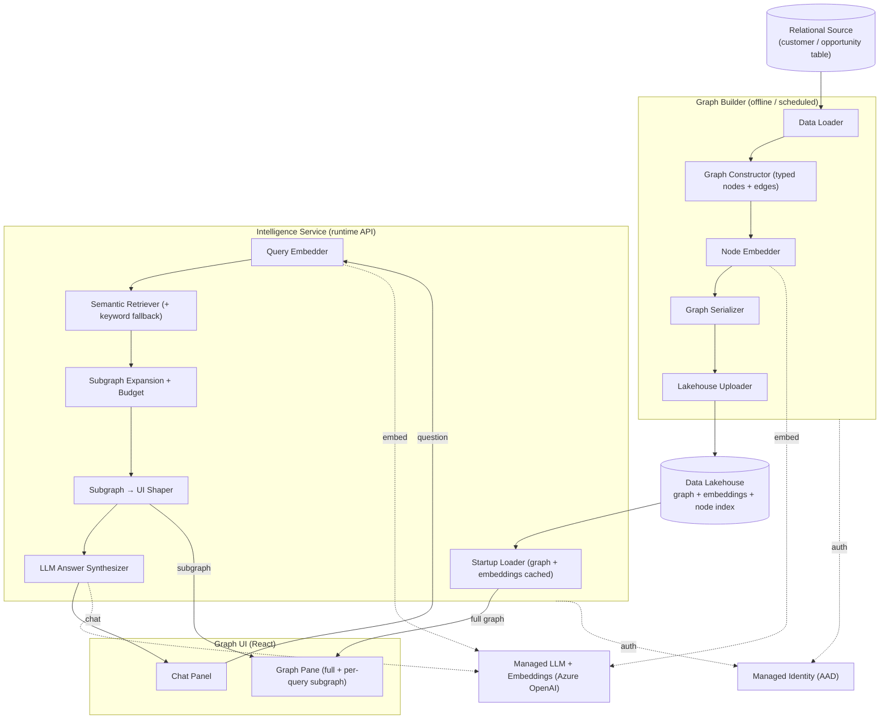
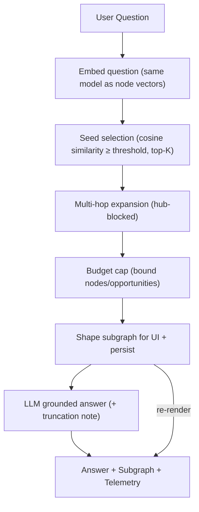

# Customer Graph

> A **GraphRAG (Graph Retrieval-Augmented Generation)** platform that turns flat relational customer data into a rich, navigable **knowledge graph**, then answers natural-language questions by retrieving a focused, semantically-relevant **subgraph** and grounding an LLM on it — with a live, side-by-side graph visualization that re-renders per question.

- **Architecture style:** Three-tier GraphRAG (offline graph builder · runtime semantic API · interactive graph UI)
- **Core stack:** Python · `networkx` · Azure OpenAI embeddings + chat · FastAPI (async) · React/TypeScript · Fabric OneLake / ADLS Gen2 · Managed-Identity auth
- **Pattern:** Knowledge-graph construction → vector embedding → semantic subgraph retrieval → LLM answer synthesis

---

## What Is It?

Customer Graph is an **end-to-end knowledge-graph question-answering system**. It ingests structured business data (accounts, contacts, cases, health signals, consumption, opportunities), assembles it into a typed graph, embeds every node into a vector space, and serves a chat experience where each question retrieves and visualizes the **most relevant slice of the graph** while an LLM composes a grounded answer.

Unlike classic RAG (which retrieves flat text chunks), this is **GraphRAG**: retrieval returns a *connected subgraph* — so the model reasons over relationships (who owns what, which cases affect which account, how consumption trends relate to health) rather than isolated snippets.

It is organized into three cleanly separated components:

1. **Graph Builder (offline)** — reads relational data, constructs the graph, computes node embeddings, and persists durable artifacts to a data lakehouse.
2. **Intelligence Service (runtime)** — a stateless API that loads the prebuilt graph + embeddings once, then runs the per-query **retrieve → expand → budget → answer** pipeline.
3. **Graph UI (browser)** — a React app that shows the full graph and a chat panel side by side, re-rendering a focused subgraph on every prompt.

This **build-once / serve-many** split means the expensive graph + embedding construction runs on a schedule, while the runtime stays fast and cheap.

---

## Why It Matters & Highlights

- **Relationships, not just facts** — modeling data as a graph lets the system answer *connected* questions ("show the lifecycle of this account and everyone touching it") that flat retrieval can't.
- **Semantic retrieval over keyword search** — questions and nodes live in the same embedding space, so retrieval matches on *meaning* (a differently-worded query still finds the right nodes), with a keyword retriever as an automatic fallback.
- **Focused, context-safe subgraphs** — multi-hop expansion is deliberately bounded with **hub-blocking** and **budget caps** so a broad question never drags the entire graph (or an entire mega-account) into the LLM context window.
- **Explainability of the agentic response via subgraph rendering** — the LLM only sees the retrieved subgraph; the exact nodes/edges that informed each answer are returned and **visualized**, making the reasoning transparent and auditable.
- **Live visual feedback** — the graph pane redraws the retrieved subgraph on every question, turning an opaque RAG call into an inspectable picture.
- **Build-once, serve-many** — heavyweight graph + embedding construction is offline; the runtime loads cached artifacts and answers in O(retrieval) time.
- **Cloud-native** — all data, embedding, and LLM access uses Managed Identity; artifacts live in a governed lakehouse.

---

## Architecture

### System Architecture

Three tiers connected by a **durable lakehouse** of prebuilt artifacts. The offline builder writes the graph + embeddings; the runtime loads them once and serves queries; the UI renders the graph and drives the chat.

### Per-Query Pipeline

Each prompt flows through a deterministic **embed → retrieve → expand → budget → shape → answer** pipeline, timed at every stage.

### What Each Module Does (Technical Deep-Dive)

**Phase A — Offline Graph Build**

1. **Data Loader**
   - Connects to the relational source over an **Entra-token-authenticated** database connection (no stored credentials) and reads the customer table into a dataframe, normalizing it to a stable column shape so downstream stages are decoupled from source changes.

2. **Graph Constructor**
   - Transforms each row into an **account-rooted `networkx` multi-directed graph**. Nested JSON sub-columns (contacts, cases, health signals, consumption trends) are expanded by dedicated parsers into **typed nodes** (Contact / Case / Health / Consumption), while categorical attributes (owner, partner, sales stage, product, region, …) fan out into **shared "hub" nodes** that interlink many records — this shared-node design is what makes cross-entity relationships queryable.

3. **Node Embedder**
   - Renders each node into a **canonical text string** (type + name + scalar attributes) and embeds it with a managed embedding model into an **`(N, D)` L2-normalized float32 matrix**. Normalization means cosine similarity later reduces to a simple dot product. Produces the embedding matrix plus an **ordered node-index** aligning each matrix row to its node id.

4. **Serializer + Lakehouse Uploader**
   - Serializes the graph to portable JSON (node-link format, preserving every attribute) and uploads the graph, a human-readable dump, the embedding matrix, and the node index to a **governed data lakehouse** (ADLS Gen2 / OneLake) via Managed Identity. After this, the durable prebuilt graph **and its vectors** live in the lakehouse.

**Phase B — Runtime Load (once at startup)**

5. **Startup Loader**
   - On API boot, downloads the prebuilt graph and the embedding matrix + index from the lakehouse, reconstructs the in-memory graph, and **pre-computes the full-graph UI payload once** so serving it per request is O(1). If embedding artifacts are absent, the service **degrades gracefully to keyword retrieval**.

**Phase C — Per-Query GraphRAG**

6. **Query Embedder**
   - Embeds the incoming question with the **exact same model** used to build node vectors and L2-normalizes it, so similarity against the node matrix is a plain dot product. (Skipped in keyword mode.)

7. **Semantic Retriever (+ keyword fallback)**
   - Computes `node_matrix · query_vec` (cosine similarity), sorts descending, and selects **seed nodes** above a similarity threshold up to a small cap — kept deliberately tight so a query seeds on a few highly-relevant nodes rather than dragging in loosely-related neighbors. Representative tuned defaults:
     - **top-K seeds = 6**, **cosine threshold = 0.25**, candidate scan window = `4 × K` (24 nodes) before cutoff.
   - A **keyword retriever** (stopword-filtered whole-word / quoted-phrase matching) transparently takes over if embeddings are unavailable or a semantic call fails mid-request.

8. **Subgraph Expansion (hub-blocked)**
   - Expands **N hops** (undirected, default **2**, clamped **1–4**) around the seeds to pull in connected context — but applies **hub-blocking**: high-degree shared nodes (region, stage, owner, partner, product, and the account root when reached incidentally) are kept **visible** in the subgraph but are **never traversed *through***. This prevents one seed from dragging in every sibling record attached to a popular hub — the key trick that keeps GraphRAG focused.

9. **Budget / Truncation**
   - Caps the subgraph so broad prompts don't blow the LLM context window: seeds are always kept; overflow records beyond a max (e.g. **60 primary records / 600 nodes**) are **ranked** (by staleness/age heuristics) and trimmed, then newly-isolated non-seed nodes are pruned. Emits truncation stats so the answer can state it reasoned over a **ranked sample**, not the full portfolio.

10. **Subgraph Shaper + Persistence**
    - Converts the retrieved subgraph into the **UI payload** the graph renderer expects (friendly type labels, cleaned numeric formatting, node degree, tooltips) and **best-effort persists** each query's `{question, mode, subgraph}` back to the lakehouse for audit/replay — wrapped so a storage hiccup never fails the user's prompt.

11. **LLM Answer Synthesizer**
    - Sends the retrieved nodes/edges as **grounded context** to a managed chat model under an analyst system prompt, passing the truncation note when applicable, and returns a natural-language answer. The model reasons **only over the retrieved subgraph** — no hallucinated facts.

**UI — Live Visualization**

12. **Graph Pane + Chat (side by side)**
    - The browser loads the full graph once, then on each prompt issues the query, renders the assistant answer with **matched terms + node/edge counts + timing telemetry**, and **re-renders the left graph pane with the returned subgraph** — so the visualization changes on every question.

---

## Modules & Key Components

### Graph Builder (Offline)

| Capability | What It Does | Technical Approach |
| --- | --- | --- |
| Data Loader | Read relational source | Entra-token DB auth, dataframe normalization |
| Graph Constructor | Build typed knowledge graph | `networkx` MultiDiGraph, JSON expansion, shared hub nodes |
| Node Embedder | Vectorize nodes | Canonical node-text → managed embeddings, L2-normalized `(N,D)` matrix |
| Serializer + Uploader | Persist durable artifacts | Node-link JSON + `.npy` matrix + index → lakehouse via Managed Identity |

### Intelligence Service (Runtime)

| Capability | What It Does | Technical Approach |
| --- | --- | --- |
| Startup Loader | Load + cache graph/vectors | One-time lakehouse fetch, precomputed full-graph payload |
| Query Embedder | Embed the question | Same embedding model, L2-normalized query vector |
| Semantic Retriever | Find relevant seed nodes | Cosine similarity (dot product), top-K + threshold, keyword fallback |
| Subgraph Expansion | Gather connected context | Bounded multi-hop with hub-blocking |
| Budget / Truncation | Fit LLM context window | Rank + cap records, prune isolated nodes, truncation note |
| Answer Synthesizer | Grounded NL answer | Managed chat model over retrieved subgraph only |

### Graph UI

| Capability | What It Does | Technical Approach |
| --- | --- | --- |
| Graph Pane | Visualize graph + subgraph | React renderer, per-query re-render |
| Chat Panel | Drive Q&A | POST query, render answer + telemetry |

## Technology Stack

- **Graph:** `networkx` (MultiDiGraph), node-link JSON serialization
- **Embeddings / LLM:** Azure OpenAI (embedding model + chat completions)
- **Runtime:** Python, FastAPI (async), cached in-memory graph + `numpy` vector matrix
- **UI:** React + TypeScript
- **Storage:** Fabric OneLake / ADLS Gen2 lakehouse
- **Identity:** `azure-identity` (`DefaultAzureCredential`), Managed Identity
- **Data access:** `pyodbc` + Entra-token connection for the relational source

