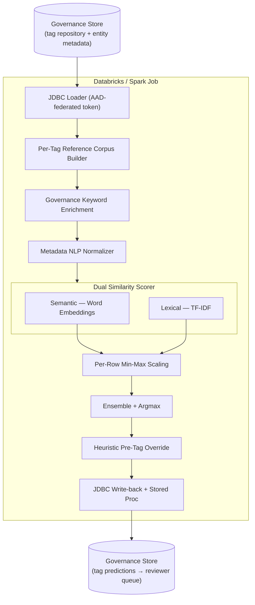
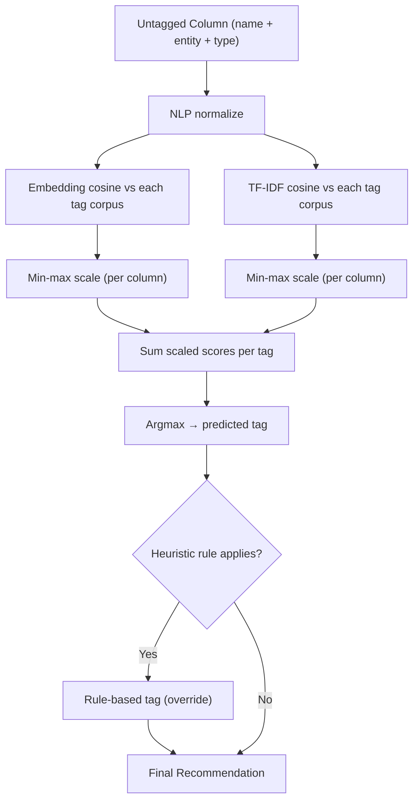

# Tagging Recommendation Engine

> An **automated data-classification engine** that recommends the correct compliance/business-data category tag for every column in an enterprise data catalog — combining **lexical (TF-IDF)** and **semantic (word-embedding)** similarity in an ensemble, backed by governance-keyword enrichment and rule-based heuristics, at Spark scale.

- **Problem domain:** Data governance · privacy & compliance metadata tagging · schema classification
- **Core stack:** Python · PySpark / Azure Databricks · NLTK · gensim (GloVe embeddings) · scikit-learn (TF-IDF) · Azure SQL (Spark JDBC)
- **Pattern:** Reference-corpus construction → NLP normalization → dual-similarity scoring → ensemble + heuristics → write-back

---

## What Is It?

The Tagging Recommendation Engine solves a core **data-governance** problem: in a large catalog, every column (attribute) must be labeled with a **data-category / compliance classification tag** (e.g., *Employee Data*, *Account Data*, *Customer Contact Data*, *Feedback & Ratings Data*, *Business Data*), so that privacy, retention, and access policies can be enforced. Doing this by hand across thousands of tables is slow, inconsistent, and error-prone.

This engine **learns from already-tagged columns** and automatically **recommends a tag for every untagged column**. It treats each tag as a "class" with an associated text corpus (drawn from the names of columns/entities already tagged with it, plus curated governance keywords), then scores each new column against every tag using two complementary similarity signals and an ensemble decision. Predictions are written straight back into the governance store for reviewer approval.

Conceptually it is a **weakly-supervised text classifier over metadata**: no hand-labeled training loop — the existing tag assignments *are* the supervision signal, distilled into per-tag reference documents.

---

## Why It Matters & Highlights

- **Automates a manual governance bottleneck** — turns thousands of hand-tagging decisions into reviewable machine recommendations, driving consistency and coverage.
- **Two complementary signals, ensembled** — a **lexical** matcher (TF-IDF: "does this column share *words* with columns already in this category?") and a **semantic** matcher (word embeddings: "does this column *mean* something similar even with different words?"), combined so each covers the other's blind spots.
- **Metadata-aware NLP normalization** — a purpose-built text pipeline that splits concatenated identifiers (`emailaddress` → `email address`), strips stopwords/numbers, and keeps only real dictionary words, because raw column names are not natural language.
- **Governance-keyword enrichment** — each category is augmented with curated keywords from data-handling guidelines, sharpening the signal for sparse categories.
- **Rule-based safety net with precedence** — deterministic heuristics (primary keys, timestamp/boolean/binary types, platform columns) override the statistical models where policy is unambiguous, following a clear precedence order.
- **Big-data scale** — runs on Spark/Databricks, reading and writing governed data via passwordless, federated Azure AD tokens.
- **Closed loop** — predictions are persisted back to the governance database and a stored procedure promotes them for reviewer workflow.

---

## Architecture

### System Architecture

An offline Spark job that reads governance metadata, runs an NLP + similarity pipeline in pandas, and writes recommendations back to the governance store.

### Scoring Pipeline

Each untagged column is scored against every candidate tag by two methods, scaled, summed, and resolved to a single recommendation.

### What Each Stage Does (Technical Deep-Dive)

1. **JDBC Loader (federated AAD auth)**
   - Reads the tag repository and entity metadata from Azure SQL over the **Spark SQL Server connector**. Authentication uses a **two-leg federated token exchange**: a workload identity acquires an initial Azure AD token, exchanges it via a **client-assertion credential** for a database-scoped token, and passes that as the `accessToken` — **no passwords or secrets** in the job. Separate reads pull the **already-tagged** attributes (the reference/training signal) and the **untagged** attributes (the prediction set).

2. **Per-Tag Reference Corpus Builder**
   - Groups the tagged attributes by their tag and **concatenates all associated column names and entity/table names** into a single reference document per tag. This turns "everything historically labeled *Account Data*" into one bag-of-context that new columns can be compared against.
   - **How the corpus is built:** a Spark `GROUP BY` over the already-tagged repository aggregates every column's `Attribute` and `Entity` name per tag using `collect_set` (de-duplicated), producing one row per tag whose text field is the space-joined union of all attribute + entity names ever assigned to that tag — the predetermined business definition of the tags are also appended to form the final per-tag reference corpus.

3. **Governance Keyword Enrichment**
   - Joins each tag to a curated set of **keywords derived from data-handling guidelines** (e.g., *account, contract, subscription* for account data; *email, name, phone, address* for contact data), appending them to the reference document — a lightweight knowledge injection that boosts recall for sparsely-tagged categories.

4. **Metadata NLP Normalizer** — because column names aren't prose, a bespoke cleaning pipeline runs on both corpus and query text:
   - **Lowercasing** (dictionary lookups are case-sensitive).
   - **Compound-word segmentation** via `wordninja` — splits run-together identifiers like `emailaddress` → `email address`, `approvedhours` → `approved hours`.
   - **Stopword & numeric removal** (NLTK stopwords).
   - **English-vocabulary filtering** — keeps only tokens present in the **NLTK `words` corpus**, discarding codes/abbreviations that carry no semantic signal.
   - Duplicate-word de-duplication on the reference side so a term counts once.

5. **Semantic Similarity (word embeddings)**
   - Loads pre-trained **GloVe / word2vec vectors** (e.g., `glove-wiki-gigaword-50`) via gensim. Each text is turned into a vector by **summing its word vectors**, and the score is the **cosine similarity** between the column vector and each tag's corpus vector. Vocabulary-miss and empty-vector cases are guarded (default score 0). This captures *meaning* — a column named `verbatim` scores toward *Feedback & Ratings* even without literal word overlap.

6. **Lexical Similarity (TF-IDF)**
   - Builds **TF-IDF vectors** (scikit-learn) over lemmatized, stopword-filtered tokens and computes **cosine similarity** between the column and each tag corpus. This captures *literal overlap* — powerful when a new column reuses wording seen in previously-tagged columns.

7. **Per-Row Min-Max Scaling**
   - Because the two methods live on different scales, each column's tag-score vector is independently **min-max normalized to [0, 1]** (with divide-by-zero protection), making the two signals comparable before combining.

8. **Ensemble + Argmax**
   - **Sums the scaled embedding and TF-IDF scores** per tag and selects the **argmax** as the predicted tag. An **all-zero guard** yields *no prediction* when neither signal fires (avoiding forced/false tags).

9. **Heuristic Pre-Tag Override**
   - A deterministic rule layer assigns a fixed category when policy is unambiguous — e.g., **primary keys**, **timestamp/datetime/boolean/binary/date** types, or known platform/system columns map straight to the general business-data tag.
   - **Precedence:** *rule-based pre-tag* → *lexical (previously-tagged wording)* → *semantic (meaning)*, so deterministic policy always wins, with the statistical models filling the gaps.

10. **Write-back + Stored Procedure**
    - The final recommendations are written back to the governance database via **Spark JDBC** and a **stored procedure** promotes them into the reviewer/approval workflow — closing the human-in-the-loop governance cycle.

---

## Modules & Key Components

| Stage | What It Does | Technical Approach |
| --- | --- | --- |
| JDBC Loader | Read governance metadata at scale | Spark SQL connector, two-leg federated AAD token (client assertion) |
| Reference Corpus Builder | Distill supervision from existing tags | Group-by tag → concatenated column/entity text |
| Keyword Enrichment | Strengthen sparse categories | Curated governance keywords joined per tag |
| NLP Normalizer | Clean non-prose metadata | Lowercase, `wordninja` segmentation, stopword/number strip, dictionary filter |
| Semantic Scorer | Meaning-based similarity | GloVe/word2vec summed vectors, cosine similarity |
| Lexical Scorer | Word-overlap similarity | TF-IDF vectors, cosine similarity |
| Score Scaling | Make signals comparable | Per-row min-max normalization |
| Ensemble | Combine signals → decision | Scaled-score summation + argmax, all-zero guard |
| Heuristic Override | Deterministic policy tags | Rule layer (PK, type, system columns) with precedence |
| Write-back | Close the loop | Spark JDBC write + stored-proc promotion |

---

## Technology Stack

- **Compute:** Azure Databricks / Apache Spark (Scala + Python cells)
- **NLP:** NLTK (stopwords, `words` corpus, lemmatization), `wordninja` (word segmentation)
- **Embeddings:** gensim pre-trained vectors (GloVe / word2vec)
- **Lexical model:** scikit-learn `TfidfVectorizer` + cosine similarity
- **Data:** Azure SQL Database via the Spark SQL Server JDBC connector
- **Identity:** Azure AD workload-identity federation (client-assertion credential, two-leg token exchange)
- **Orchestration:** Databricks notebook with parameterized widgets (env, DB, query)
